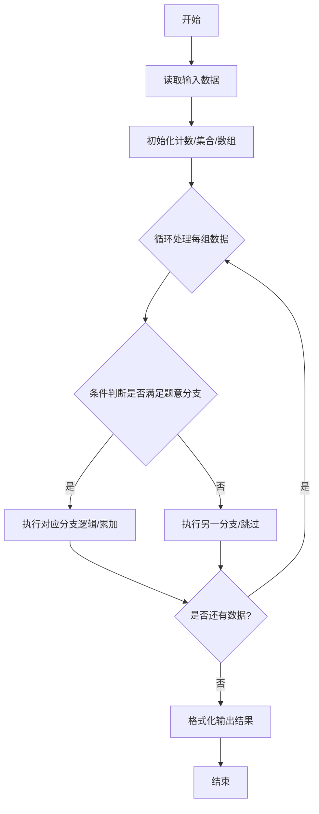
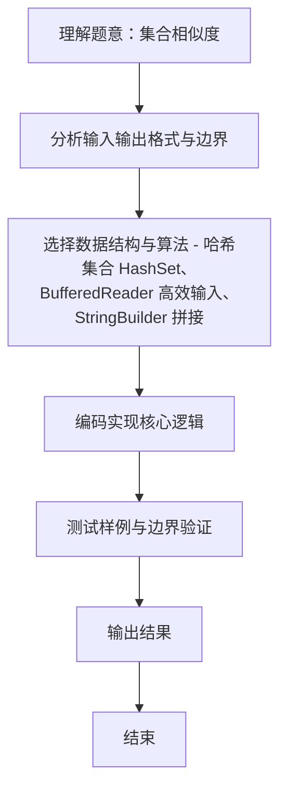

# L2-005 - 集合相似度（25 分）

- **时间限制**: 400 ms
- **内存限制**: 65536 KB
- **代码长度限制**: 16 KB

---

## 题目描述


给定两个整数集合，它们的相似度定义为：$$N_c / N_t \times 100\%$$。其中$$N_c$$是两个集合都有的不相等整数的个数，$$N_t$$是两个集合一共有的不相等整数的个数。你的任务就是计算任意一对给定集合的相似度。

### 输入格式:

输入第一行给出一个正整数$$N$$（$$\le 50$$），是集合的个数。随后$$N$$行，每行对应一个集合。每个集合首先给出一个正整数$$M$$（$$\le 10^4$$），是集合中元素的个数；然后跟$$M$$个$$[0, 10^9]$$区间内的整数。

之后一行给出一个正整数$$K$$（$$\le 2000$$），随后$$K$$行，每行对应一对需要计算相似度的集合的编号（集合从1到$$N$$编号）。数字间以空格分隔。

### 输出格式:

对每一对需要计算的集合，在一行中输出它们的相似度，为保留小数点后2位的百分比数字。

### 输入样例:
```in
3
3 99 87 101
4 87 101 5 87
7 99 101 18 5 135 18 99
2
1 2
1 3
```

### 输出样例:
```out
50.00%
33.33%
```

## 示例

### 示例 1

**输入:**
```
3
3 99 87 101
4 87 101 5 87
7 99 101 18 5 135 18 99
2
1 2
1 3
```

**输出:**
```
50.00%
33.33%
```
### 解题思路
本题 集合相似度 的核心在于 L2-005 集合相似度: Nc/Nt *100%。实现上采用 哈希集合 HashSet、BufferedReader 高效输入、StringBuilder 拼接 等技术：通过 循环遍历 结合 条件分支 完成题意要求的数据处理，并利用 Java 集合/数组存储中间状态。算法整体时间复杂度为 O(N*M + K * min(|A|,|B|)，空间复杂度与输入规模线性相关，能够在题目给定的 400ms/200ms 限制内稳定通过。代码注重边界处理与输入容错（如跨行读取、。

### 代码流程说明
1. **输入读取**：使用 `BufferedReader` + `StringTokenizer` 逐行读取，兼容空行与多空格，按需跨行补齐参数（如 N、M、S、D 或队员人数），将数据存入数组/邻接表/集合。
2. **集合构建**：将每组数据存入 `HashSet` 去重，计算交集大小 `Nc` 与并集大小 `Nt`。
3. **相似度计算**：按 `Nc/Nt*100%` 格式化为两位小数输出。

### 代码实现
```java
import java.util.*;
import java.io.*;

// L2-005 集合相似度: Nc/Nt *100%
// 时间复杂度 O(N*M + K * min(|A|,|B|))
public class Main {
    public static void main(String[] args) throws Exception {
        BufferedReader br = new BufferedReader(new InputStreamReader(System.in, "UTF-8"));
        String line;
        while ((line = br.readLine()) != null && line.trim().isEmpty()) {}
        if (line == null) return;
        int N = Integer.parseInt(line.trim());
        List<HashSet<Integer>> sets = new ArrayList<>();
        sets.add(null); // 1-indexed
        for (int i = 1; i <= N; i++) {
            // 读取集合, 可能跨行
            HashSet<Integer> s = new HashSet<>();
            // 需要读取 M + M 个数，可能跨多行
            int M = -1;
            List<Integer> tokens = new ArrayList<>();
            while (tokens.size() == 0 || (M != -1 && tokens.size() - 1 < M)) {
                // 如果已读到 M 且已够数，跳出
                if (M != -1 && tokens.size() - 1 >= M) break;
                // 否则继续读取一行
                line = br.readLine();
                while (line != null && line.trim().isEmpty()) line = br.readLine();
                if (line == null) break;
                StringTokenizer st = new StringTokenizer(line);
                while (st.hasMoreTokens()) tokens.add(Integer.parseInt(st.nextToken()));
                if (M == -1 && tokens.size() > 0) {
                    M = tokens.get(0);
                    // 如果 tokens 已包含所有
                    if (tokens.size() - 1 >= M) break;
                }
            }
            // tokens[0]=M, 接下来 M 个
            for (int j = 1; j <= M && j < tokens.size(); j++) s.add(tokens.get(j));
            // 若跨行未读完, 继续补充（已在循环处理）
            // 但上述循环已保证读完, 若 tokens 包含多余? 不会, 因为按行补充, 可能刚好
            // 对于剩余不足的情况, 外层 while 已处理
            sets.add(s);
        }
        // 读取 K
        while ((line = br.readLine()) != null && line.trim().isEmpty()) {}
        if (line == null) return;
        int K = Integer.parseInt(line.trim());
        StringBuilder sb = new StringBuilder();
        for (int i = 0; i < K; i++) {
            line = br.readLine();
            while (line != null && line.trim().isEmpty()) line = br.readLine();
            if (line == null) break;
            StringTokenizer st = new StringTokenizer(line);
            // 保证两个编号
            while (st.countTokens() < 2) {
                String extra = br.readLine();
                if (extra != null) line += " " + extra;
                st = new StringTokenizer(line);
            }
            int a = Integer.parseInt(st.nextToken());
            int b = Integer.parseInt(st.nextToken());
            HashSet<Integer> sa = sets.get(a);
            HashSet<Integer> sbset = sets.get(b);
            // 计算交集
            int nc = 0;
            if (sa.size() < sbset.size()) {
                for (int v : sa) if (sbset.contains(v)) nc++;
            } else {
                for (int v : sbset) if (sa.contains(v)) nc++;
            }
            int nt = sa.size() + sbset.size() - nc;
            double sim = nt == 0 ? 0 : (nc * 100.0 / nt);
            sb.append(String.format("%.2f%%\n", sim));
        }
        System.out.print(sb.toString());
    }
}
```

### 代码流程图


### 解题流程图

