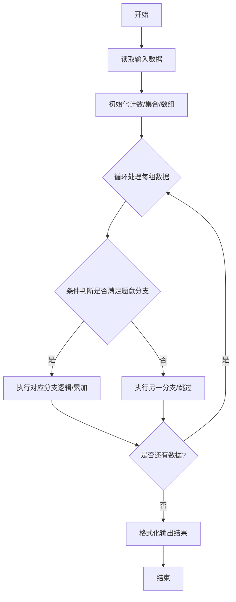
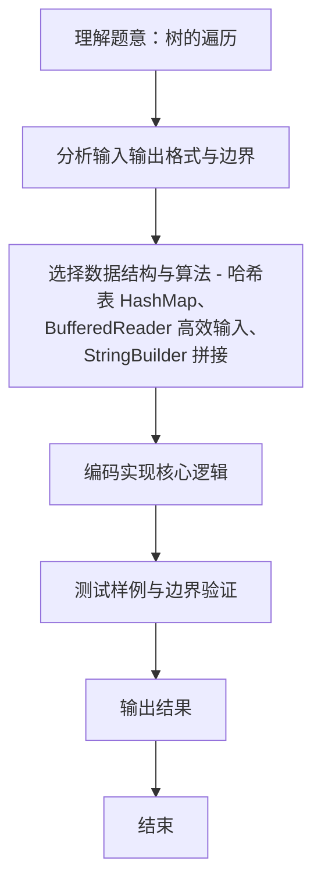

# L2-006 - 树的遍历（25 分）

- **时间限制**: 400 ms
- **内存限制**: 65536 KB
- **代码长度限制**: 16 KB

---

## 题目描述


给定一棵二叉树的后序遍历和中序遍历，请你输出其层序遍历的序列。这里假设键值都是互不相等的正整数。

### 输入格式:

输入第一行给出一个正整数$$N$$（$$\le 30$$），是二叉树中结点的个数。第二行给出其后序遍历序列。第三行给出其中序遍历序列。数字间以空格分隔。

### 输出格式:

在一行中输出该树的层序遍历的序列。数字间以1个空格分隔，行首尾不得有多余空格。

### 输入样例:
```in
7
2 3 1 5 7 6 4
1 2 3 4 5 6 7
```

### 输出样例:
```out
4 1 6 3 5 7 2
```

## 示例

### 示例 1

**输入:**
```
7
2 3 1 5 7 6 4
1 2 3 4 5 6 7
```

**输出:**
```
4 1 6 3 5 7 2
```
### 解题思路
本题 树的遍历 的核心在于 L2-006 树的遍历: 后序+中序 -> 层序。实现上采用 哈希表 HashMap、BufferedReader 高效输入、StringBuilder 拼接 等技术：通过 循环遍历 结合 条件分支 完成题意要求的数据处理，并利用 Java 集合/数组存储中间状态。算法整体时间复杂度为 O(N^2)，空间复杂度与输入规模线性相关，能够在题目给定的 400ms/200ms 限制内稳定通过。代码注重边界处理与输入容错（如跨行读取、空行跳过），保证对多组样例与极端数据的鲁棒性。

### 代码流程说明
1. **输入读取**：使用 `BufferedReader` + `StringTokenizer` 逐行读取，兼容空行与多空格，按需跨行补齐参数（如 N、M、S、D 或队员人数），将数据存入数组/邻接表/集合。
2. **核心处理**：通过 `for/while` 循环遍历输入数据，结合 `if-else` 分支完成题意逻辑（如比较、计数、替换或枚举最优方案）。
3. **输出**：按题目要求的格式 `System.out.println` 输出结果字符串/数字，必要时使用 `StringBuilder` 拼接。

### 代码实现
```java
import java.util.*;
import java.io.*;

// L2-006 树的遍历: 后序+中序 -> 层序
// 时间复杂度 O(N^2) N<=30
public class Main {
    static int[] post, in;
    static Map<Integer,Integer> inPos;
    static class Node { int val; Node left, right; Node(int v){val=v;} }
    static Node build(int postL, int postR, int inL, int inR) { // [l,r)
        if (postL >= postR || inL >= inR) return null;
        int rootVal = post[postR - 1];
        Node root = new Node(rootVal);
        int k = inPos.get(rootVal);
        int leftSize = k - inL;
        root.left = build(postL, postL + leftSize, inL, k);
        root.right = build(postL + leftSize, postR - 1, k + 1, inR);
        return root;
    }
    public static void main(String[] args) throws Exception {
        BufferedReader br = new BufferedReader(new InputStreamReader(System.in, "UTF-8"));
        String line;
        while ((line = br.readLine()) != null && line.trim().isEmpty()) {}
        if (line == null) return;
        int N = Integer.parseInt(line.trim());
        post = new int[N];
        in = new int[N];
        readArray(br, post, N);
        readArray(br, in, N);
        inPos = new HashMap<>();
        for (int i = 0; i < N; i++) inPos.put(in[i], i);
        Node root = build(0, N, 0, N);
        // 层序
        Queue<Node> q = new LinkedList<>();
        q.offer(root);
        List<Integer> lev = new ArrayList<>();
        while (!q.isEmpty()) {
            Node cur = q.poll();
            lev.add(cur.val);
            if (cur.left != null) q.offer(cur.left);
            if (cur.right != null) q.offer(cur.right);
        }
        StringBuilder sb = new StringBuilder();
        for (int i = 0; i < lev.size(); i++) {
            if (i > 0) sb.append(' ');
            sb.append(lev.get(i));
        }
        System.out.println(sb.toString());
    }
    static void readArray(BufferedReader br, int[] arr, int N) throws Exception {
        int idx = 0;
        String line;
        while (idx < N) {
            line = br.readLine();
            if (line == null) break;
            if (line.trim().isEmpty()) continue;
            StringTokenizer st = new StringTokenizer(line);
            while (st.hasMoreTokens() && idx < N) arr[idx++] = Integer.parseInt(st.nextToken());
        }
    }
}
```

### 代码流程图


### 解题流程图

