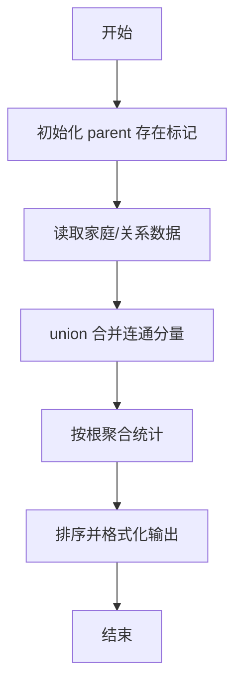
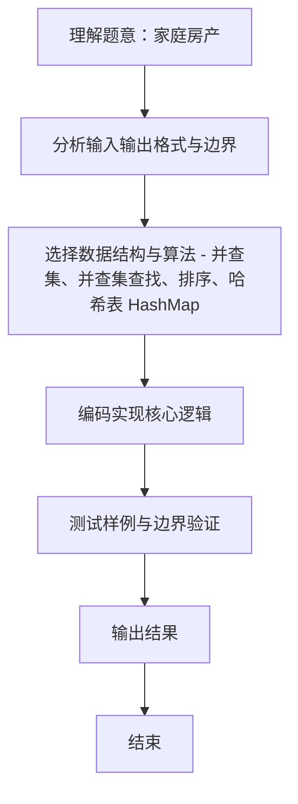

# L2-007 - 家庭房产（25 分）

- **时间限制**: 400 ms
- **内存限制**: 65536 KB
- **代码长度限制**: 16 KB

---

## 题目描述


给定每个人的家庭成员和其自己名下的房产，请你统计出每个家庭的人口数、人均房产面积及房产套数。

### 输入格式:

输入第一行给出一个正整数$$N$$（$$\le 1000$$），随后$$N$$行，每行按下列格式给出一个人的房产：
```
编号 父 母 k 孩子1 ... 孩子k 房产套数 总面积
```
其中`编号`是每个人独有的一个4位数的编号；`父`和`母`分别是该编号对应的这个人的父母的编号（如果已经过世，则显示`-1`）；`k`（$$0\le$$`k`$$\le 5$$）是该人的子女的个数；`孩子i`是其子女的编号。

### 输出格式:

首先在第一行输出家庭个数（所有有亲属关系的人都属于同一个家庭）。随后按下列格式输出每个家庭的信息：
```
家庭成员的最小编号 家庭人口数 人均房产套数 人均房产面积
```
其中人均值要求保留小数点后3位。家庭信息首先按人均面积降序输出，若有并列，则按成员编号的升序输出。

### 输入样例:
```in
10
6666 5551 5552 1 7777 1 100
1234 5678 9012 1 0002 2 300
8888 -1 -1 0 1 1000
2468 0001 0004 1 2222 1 500
7777 6666 -1 0 2 300
3721 -1 -1 1 2333 2 150
9012 -1 -1 3 1236 1235 1234 1 100
1235 5678 9012 0 1 50
2222 1236 2468 2 6661 6662 1 300
2333 -1 3721 3 6661 6662 6663 1 100
```

### 输出样例:
```out
3
8888 1 1.000 1000.000
0001 15 0.600 100.000
5551 4 0.750 100.000
```

## 示例

### 示例 1

**输入:**
```
10
6666 5551 5552 1 7777 1 100
1234 5678 9012 1 0002 2 300
8888 -1 -1 0 1 1000
2468 0001 0004 1 2222 1 500
7777 6666 -1 0 2 300
3721 -1 -1 1 2333 2 150
9012 -1 -1 3 1236 1235 1234 1 100
1235 5678 9012 0 1 50
2222 1236 2468 2 6661 6662 1 300
2333 -1 3721 3 6661 6662 6663 1 100
```

**输出:**
```
3
8888 1 1.000 1000.000
0001 15 0.600 100.000
5551 4 0.750 100.000
```
### 解题思路
本题 家庭房产 的核心在于 L2-007 家庭房产: 并查集统计家族。实现上采用 并查集、并查集查找、排序、哈希表 HashMap 等技术：通过 循环遍历 结合 条件分支 完成题意要求的数据处理，并利用 Java 集合/数组存储中间状态。算法整体时间复杂度为 O(N α(N)，空间复杂度与输入规模线性相关，能够在题目给定的 400ms/200ms 限制内稳定通过。代码注重边界处理与输入容错（如跨行读取、空行跳过），保证对多组样例与极端数据的鲁棒性。

### 代码流程说明
1. **输入读取**：使用 `BufferedReader` + `StringTokenizer` 逐行读取，兼容空行与多空格，按需跨行补齐参数（如 N、M、S、D 或队员人数），将数据存入数组/邻接表/集合。
2. **并查集初始化**：`parent[i]=i` 标记存在节点，记录额外属性（房屋套数/面积等）。
3. **合并操作**：遍历输入的家庭关系/朋友关系，调用 `union(a,b)` 合并连通分量，并标记存在性。
4. **统计与排序**：按根聚合统计成员数、平均值等，对结果按题意排序后格式化输出。

### 代码实现
```java
import java.util.*;
import java.io.*;

// L2-007 家庭房产: 并查集统计家族
// 时间复杂度 O(N α(N))
public class Main {
    static int[] parent = new int[10000];
    static boolean[] exists = new boolean[10000];
    static int[] houseCnt = new int[10000];
    static int[] houseArea = new int[10000];
    static int find(int x) {
        if (parent[x] != x) parent[x] = find(parent[x]);
        return parent[x];
    }
    static void union(int a, int b) {
        int ra = find(a), rb = find(b);
        if (ra != rb) parent[rb] = ra;
    }
    static class Family implements Comparable<Family> {
        int minId; int size; double avgSets; double avgArea;
        Family(int m,int s,double aS,double aA){minId=m;size=s;avgSets=aS;avgArea=aA;}
        public int compareTo(Family o) {
            if (Math.abs(o.avgArea - avgArea) > 1e-9) return Double.compare(o.avgArea, avgArea);
            return Integer.compare(minId, o.minId);
        }
    }
    public static void main(String[] args) throws Exception {
        BufferedReader br = new BufferedReader(new InputStreamReader(System.in, "UTF-8"));
        String line;
        while ((line = br.readLine()) != null && line.trim().isEmpty()) {}
        if (line == null) return;
        int N = Integer.parseInt(line.trim());
        for (int i = 0; i < 10000; i++) parent[i] = i;

        for (int i = 0; i < N; i++) {
            line = br.readLine();
            while (line != null && line.trim().isEmpty()) line = br.readLine();
            if (line == null) break;
            StringTokenizer st = new StringTokenizer(line);
            // 行可能分多次? 但按格式一行完整
            int id = Integer.parseInt(st.nextToken());
            int fa = Integer.parseInt(st.nextToken());
            int mo = Integer.parseInt(st.nextToken());
            int k = Integer.parseInt(st.nextToken());
            List<Integer> children = new ArrayList<>();
            for (int j = 0; j < k; j++) children.add(Integer.parseInt(st.nextToken()));
            int sets = Integer.parseInt(st.nextToken());
            int area = Integer.parseInt(st.nextToken());

            exists[id] = true;
            houseCnt[id] += sets;
            houseArea[id] += area;
            if (fa != -1) {
                exists[fa] = true;
                union(id, fa);
            }
            if (mo != -1) {
                exists[mo] = true;
                union(id, mo);
            }
            for (int c : children) {
                exists[c] = true;
                union(id, c);
            }
        }

        Map<Integer, List<Integer>> groups = new HashMap<>();
        for (int i = 0; i < 10000; i++) if (exists[i]) {
            int r = find(i);
            groups.computeIfAbsent(r, k -> new ArrayList<>()).add(i);
        }

        List<Family> fams = new ArrayList<>();
        for (List<Integer> g : groups.values()) {
            int min = Collections.min(g);
            int sz = g.size();
            int totalSets = 0, totalArea = 0;
            for (int id : g) { totalSets += houseCnt[id]; totalArea += houseArea[id]; }
            double avgS = totalSets * 1.0 / sz;
            double avgA = totalArea * 1.0 / sz;
            fams.add(new Family(min, sz, avgS, avgA));
        }
        Collections.sort(fams);
        StringBuilder sb = new StringBuilder();
        sb.append(fams.size()).append('\n');
        for (Family f : fams) {
            sb.append(String.format("%04d %d %.3f %.3f\n", f.minId, f.size, f.avgSets, f.avgArea));
        }
        System.out.print(sb.toString());
    }
}
```

### 代码流程图


### 解题流程图

