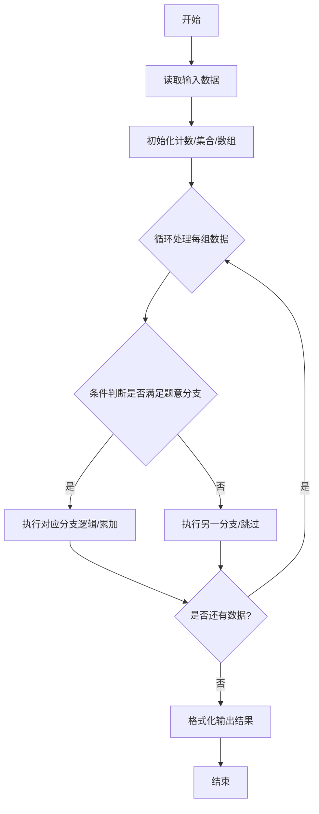
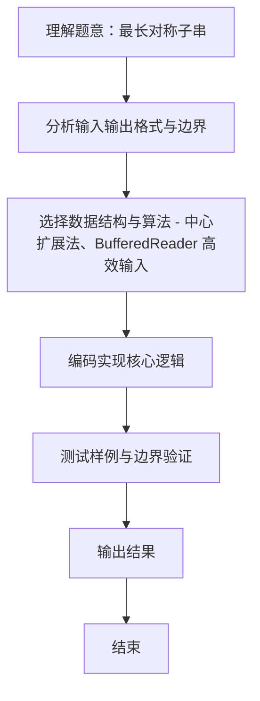

# L2-008 - 最长对称子串（25 分）

- **时间限制**: 200 ms
- **内存限制**: 65536 KB
- **代码长度限制**: 16 KB

---

## 题目描述


对给定的字符串，本题要求你输出最长对称子串的长度。例如，给定`Is PAT&TAP symmetric?`，最长对称子串为`s PAT&TAP s`，于是你应该输出11。

### 输入格式:

输入在一行中给出长度不超过1000的非空字符串。

### 输出格式:

在一行中输出最长对称子串的长度。

### 输入样例:
```in
Is PAT&TAP symmetric?
```

### 输出样例:
```out
11
```

## 示例

### 示例 1

**输入:**
```
Is PAT&TAP symmetric?
```

**输出:**
```
11
```
### 解题思路
本题 最长对称子串 的核心在于 L2-008 最长对称子串: 中心扩展法。实现上采用 中心扩展法、BufferedReader 高效输入 等技术：通过 循环遍历 结合 条件分支 完成题意要求的数据处理，并利用 Java 集合/数组存储中间状态。算法整体时间复杂度为 O(N^2)，空间复杂度与输入规模线性相关，能够在题目给定的 400ms/200ms 限制内稳定通过。代码注重边界处理与输入容错（如跨行读取、空行跳过），保证对多组样例与极端数据的鲁棒性。

### 代码流程说明
1. **输入读取**：使用 `BufferedReader` + `StringTokenizer` 逐行读取，兼容空行与多空格，按需跨行补齐参数（如 N、M、S、D 或队员人数），将数据存入数组/邻接表/集合。
2. **中心扩展**：枚举每个字符为中心，分别向两侧扩展奇数与偶数回文，维护最大长度 `max`。
3. **输出**：遍历结束后输出最长回文长度。

### 代码实现
```java
import java.io.*;

// L2-008 最长对称子串: 中心扩展法
// 时间复杂度 O(N^2) N<=1000
public class Main {
    public static void main(String[] args) throws Exception {
        BufferedReader br = new BufferedReader(new InputStreamReader(System.in, "UTF-8"));
        String s = br.readLine();
        if (s == null) s = "";
        // 注意题目输入是整行，可能包含空格，需读取完整一行；若为空再读
        // 但样例只有一行
        int n = s.length();
        if (n == 0) { System.out.println(0); return; }
        int max = 1;
        for (int center = 0; center < n; center++) {
            // 奇数
            int l = center, r = center;
            while (l >= 0 && r < n && s.charAt(l) == s.charAt(r)) {
                max = Math.max(max, r - l + 1);
                l--; r++;
            }
            // 偶数
            l = center; r = center + 1;
            while (l >= 0 && r < n && s.charAt(l) == s.charAt(r)) {
                max = Math.max(max, r - l + 1);
                l--; r++;
            }
        }
        System.out.println(max);
    }
}
```

### 代码流程图


### 解题流程图

