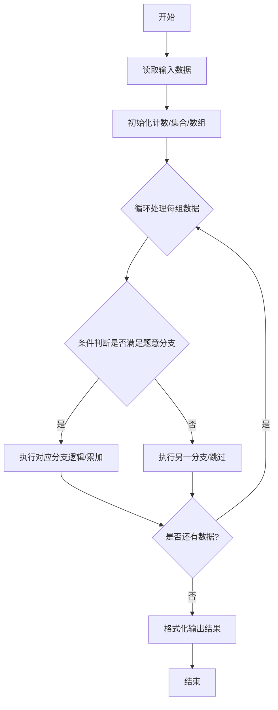
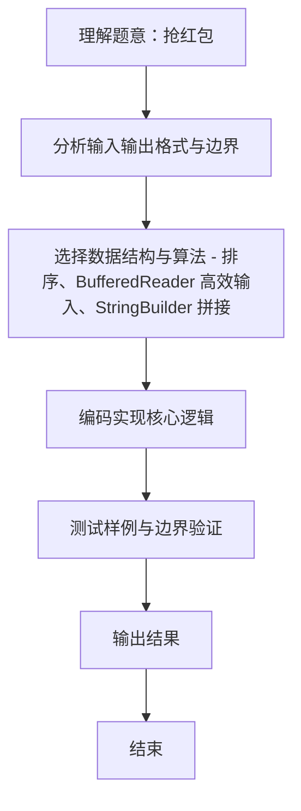

# L2-009 - 抢红包（25 分）

- **时间限制**: 300 ms
- **内存限制**: 65536 KB
- **代码长度限制**: 16 KB

---

## 题目描述


没有人没抢过红包吧…… 这里给出$$N$$个人之间互相发红包、抢红包的记录，请你统计一下他们抢红包的收获。

### 输入格式:

输入第一行给出一个正整数$$N$$（$$\le 10^4$$），即参与发红包和抢红包的总人数，则这些人从1到$$N$$编号。随后$$N$$行，第$$i$$行给出编号为$$i$$的人发红包的记录，格式如下：

$$K\quad N_1\quad P_1\quad \cdots\quad N_K\quad P_K$$

其中$$K$$（$$0 \le K \le 20$$）是发出去的红包个数，$$N_i$$是抢到红包的人的编号，$$P_i$$（$$>0$$）是其抢到的红包金额（以分为单位）。注意：对于同一个人发出的红包，每人最多只能抢1次，不能重复抢。

### 输出格式:

按照收入金额从高到低的递减顺序输出每个人的编号和收入金额（以元为单位，输出小数点后2位）。每个人的信息占一行，两数字间有1个空格。如果收入金额有并列，则按抢到红包的个数递减输出；如果还有并列，则按个人编号递增输出。

### 输入样例:
```in
10
3 2 22 10 58 8 125
5 1 345 3 211 5 233 7 13 8 101
1 7 8800
2 1 1000 2 1000
2 4 250 10 320
6 5 11 9 22 8 33 7 44 10 55 4 2
1 3 8800
2 1 23 2 123
1 8 250
4 2 121 4 516 7 112 9 10
```

### 输出样例:
```out
1 11.63
2 3.63
8 3.63
3 2.11
7 1.69
6 -1.67
9 -2.18
10 -3.26
5 -3.26
4 -12.32
```

## 示例

### 示例 1

**输入:**
```
10
3 2 22 10 58 8 125
5 1 345 3 211 5 233 7 13 8 101
1 7 8800
2 1 1000 2 1000
2 4 250 10 320
6 5 11 9 22 8 33 7 44 10 55 4 2
1 3 8800
2 1 23 2 123
1 8 250
4 2 121 4 516 7 112 9 10
```

**输出:**
```
1 11.63
2 3.63
8 3.63
3 2.11
7 1.69
6 -1.67
9 -2.18
10 -3.26
5 -3.26
4 -12.32
```
### 解题思路
本题 抢红包 的核心在于 L2-009 抢红包: 统计收支并排序。实现上采用 排序、BufferedReader 高效输入、StringBuilder 拼接 等技术：通过 循环遍历 结合 条件分支 完成题意要求的数据处理，并利用 Java 集合/数组存储中间状态。算法整体时间复杂度为 O(N log N)，空间复杂度与输入规模线性相关，能够在题目给定的 400ms/200ms 限制内稳定通过。代码注重边界处理与输入容错（如跨行读取、空行跳过），保证对多组样例与极端数据的鲁棒性。

### 代码流程说明
1. **输入读取**：使用 `BufferedReader` + `StringTokenizer` 逐行读取，兼容空行与多空格，按需跨行补齐参数（如 N、M、S、D 或队员人数），将数据存入数组/邻接表/集合。
2. **排序/贪心**：将对象按关键属性（如单价、余额、价格）降序/升序排序，必要时按次关键字稳定排序。
3. **遍历处理**：顺序扫描排序后序列，累计结果或按题意判断输出。

### 代码实现
```java
import java.util.*;
import java.io.*;

// L2-009 抢红包: 统计收支并排序
// 时间复杂度 O(N log N)
public class Main {
    static class Person implements Comparable<Person> {
        int id; int cnt; long balance; // 分
        Person(int id){this.id=id;}
        public int compareTo(Person o) {
            if (balance != o.balance) return Long.compare(o.balance, balance);
            if (cnt != o.cnt) return Integer.compare(o.cnt, cnt);
            return Integer.compare(id, o.id);
        }
    }
    public static void main(String[] args) throws Exception {
        BufferedReader br = new BufferedReader(new InputStreamReader(System.in, "UTF-8"));
        String line;
        while ((line = br.readLine()) != null && line.trim().isEmpty()) {}
        if (line == null) return;
        int N = Integer.parseInt(line.trim());
        Person[] p = new Person[N+1];
        for (int i = 1; i <= N; i++) p[i] = new Person(i);

        for (int i = 1; i <= N; i++) {
            line = br.readLine();
            while (line != null && line.trim().isEmpty()) line = br.readLine();
            if (line == null) break;
            StringTokenizer st = new StringTokenizer(line);
            // 这一行可能被分割多行? 按 K 对数可能跨行? 但一般一行完整
            // 为安全，持续读取直到满足 K*2 个数
            int K = 0;
            if (st.hasMoreTokens()) K = Integer.parseInt(st.nextToken());
            List<Integer> vals = new ArrayList<>();
            while (st.hasMoreTokens()) vals.add(Integer.parseInt(st.nextToken()));
            // 若还不够 2*K，则继续读行
            while (vals.size() < 2 * K) {
                String extra = br.readLine();
                if (extra == null) break;
                StringTokenizer st2 = new StringTokenizer(extra);
                while (st2.hasMoreTokens()) vals.add(Integer.parseInt(st2.nextToken()));
            }
            long outSum = 0;
            for (int j = 0; j < K; j++) {
                int nid = vals.get(2*j);
                int amt = vals.get(2*j+1);
                outSum += amt;
                p[nid].balance += amt;
                p[nid].cnt += 1;
            }
            p[i].balance -= outSum;
        }

        List<Person> list = new ArrayList<>();
        for (int i = 1; i <= N; i++) list.add(p[i]);
        Collections.sort(list);
        StringBuilder sb = new StringBuilder();
        for (Person pp : list) {
            sb.append(String.format("%d %.2f\n", pp.id, pp.balance / 100.0));
        }
        System.out.print(sb.toString());
    }
}
```

### 代码流程图


### 解题流程图

