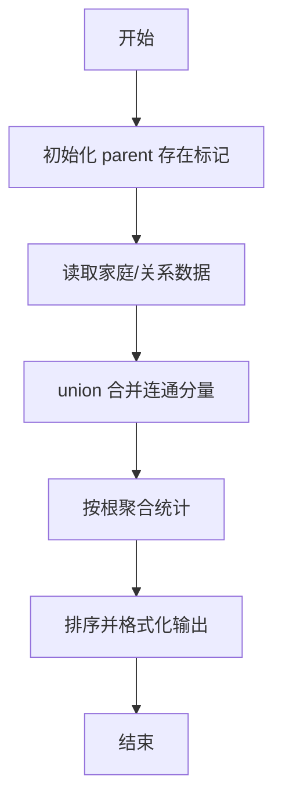
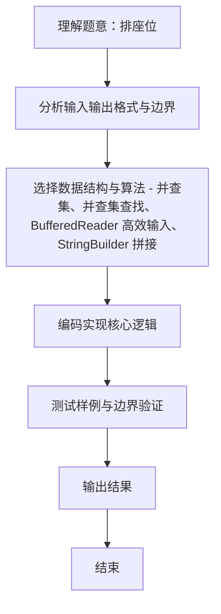

# L2-010 - 排座位（25 分）

- **时间限制**: 150 ms
- **内存限制**: 65536 KB
- **代码长度限制**: 16 KB

---

## 题目描述


布置宴席最微妙的事情，就是给前来参宴的各位宾客安排座位。无论如何，总不能把两个死对头排到同一张宴会桌旁！这个艰巨任务现在就交给你，对任何一对客人，请编写程序告诉主人他们是否能被安排同席。

### 输入格式:

输入第一行给出3个正整数：`N`（$$\le$$100），即前来参宴的宾客总人数，则这些人从1到`N`编号；`M`为已知两两宾客之间的关系数；`K`为查询的条数。随后`M`行，每行给出一对宾客之间的关系，格式为：`宾客1 宾客2 关系`，其中`关系`为1表示是朋友，-1表示是死对头。注意两个人不可能既是朋友又是敌人。最后`K`行，每行给出一对需要查询的宾客编号。

这里假设朋友的朋友也是朋友。但敌人的敌人并不一定就是朋友，朋友的敌人也不一定是敌人。只有单纯直接的敌对关系才是绝对不能同席的。

### 输出格式:

对每个查询输出一行结果：如果两位宾客之间是朋友，且没有敌对关系，则输出`No problem`；如果他们之间并不是朋友，但也不敌对，则输出`OK`；如果他们之间有敌对，然而也有共同的朋友，则输出`OK but...`；如果他们之间只有敌对关系，则输出`No way`。

### 输入样例:
```in
7 8 4
5 6 1
2 7 -1
1 3 1
3 4 1
6 7 -1
1 2 1
1 4 1
2 3 -1
3 4
5 7
2 3
7 2
```

### 输出样例:
```out
No problem
OK
OK but...
No way
```

## 示例

### 示例 1

**输入:**
```
7 8 4
5 6 1
2 7 -1
1 3 1
3 4 1
6 7 -1
1 2 1
1 4 1
2 3 -1
3 4
5 7
2 3
7 2
```

**输出:**
```
No problem
OK
OK but...
No way
```
### 解题思路
本题 排座位 的核心在于 L2-010 排座位: 并查集维护朋友圈，直接矩阵标记死对头。实现上采用 并查集、并查集查找、BufferedReader 高效输入、StringBuilder 拼接 等技术：通过 循环遍历 结合 条件分支 完成题意要求的数据处理，并利用 Java 集合/数组存储中间状态。算法整体时间复杂度为 O(N α(N)，空间复杂度与输入规模线性相关，能够在题目给定的 400ms/200ms 限制内稳定通过。代码注重边界处理与输入容错（如跨行读取、空行跳过），保证对多组样例与极端数据的鲁棒性。

### 代码流程说明
1. **输入读取**：使用 `BufferedReader` + `StringTokenizer` 逐行读取，兼容空行与多空格，按需跨行补齐参数（如 N、M、S、D 或队员人数），将数据存入数组/邻接表/集合。
2. **并查集初始化**：`parent[i]=i` 标记存在节点，记录额外属性（房屋套数/面积等）。
3. **合并操作**：遍历输入的家庭关系/朋友关系，调用 `union(a,b)` 合并连通分量，并标记存在性。
4. **统计与排序**：按根聚合统计成员数、平均值等，对结果按题意排序后格式化输出。

### 代码实现
```java
import java.util.*;
import java.io.*;

// L2-010 排座位: 并查集维护朋友圈，直接矩阵标记死对头
// 时间复杂度 O(N α(N) + K)
public class Main {
    static int[] parent;
    static int find(int x){ return parent[x]==x?x:(parent[x]=find(parent[x])); }
    static void union(int a,int b){ int ra=find(a),rb=find(b); if(ra!=rb) parent[rb]=ra; }
    public static void main(String[] args) throws Exception {
        BufferedReader br = new BufferedReader(new InputStreamReader(System.in, "UTF-8"));
        String line;
        while ((line = br.readLine()) != null && line.trim().isEmpty()) {}
        if (line == null) return;
        StringTokenizer st = new StringTokenizer(line);
        int N = Integer.parseInt(st.nextToken());
        int M = Integer.parseInt(st.nextToken());
        int K = Integer.parseInt(st.nextToken());
        parent = new int[N+1];
        for (int i = 1; i <= N; i++) parent[i]=i;
        boolean[][] enemy = new boolean[N+1][N+1];
        for (int i = 0; i < M; i++) {
            line = br.readLine();
            while (line != null && line.trim().isEmpty()) line = br.readLine();
            st = new StringTokenizer(line);
            int a = Integer.parseInt(st.nextToken());
            int b = Integer.parseInt(st.nextToken());
            int r = Integer.parseInt(st.nextToken());
            if (r == 1) union(a,b);
            else { enemy[a][b]=enemy[b][a]=true; }
        }
        StringBuilder sb = new StringBuilder();
        for (int i = 0; i < K; i++) {
            line = br.readLine();
            while (line != null && line.trim().isEmpty()) line = br.readLine();
            st = new StringTokenizer(line);
            int a = Integer.parseInt(st.nextToken());
            int b = Integer.parseInt(st.nextToken());
            boolean isFriend = find(a)==find(b);
            boolean isEnemy = enemy[a][b];
            if (isFriend && !isEnemy) sb.append("No problem\n");
            else if (!isFriend && !isEnemy) sb.append("OK\n");
            else if (isFriend && isEnemy) sb.append("OK but...\n");
            else sb.append("No way\n");
        }
        System.out.print(sb.toString());
    }
}
```

### 代码流程图


### 解题流程图

