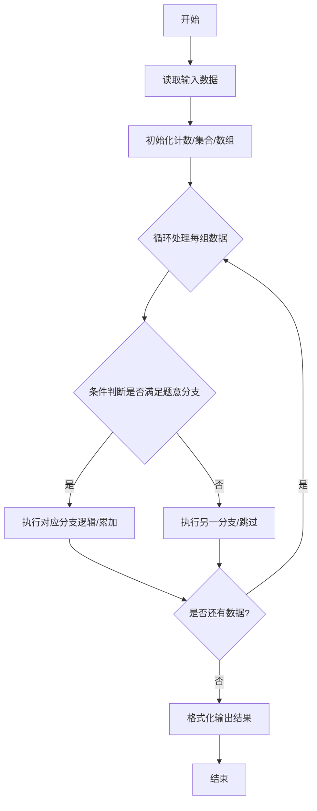
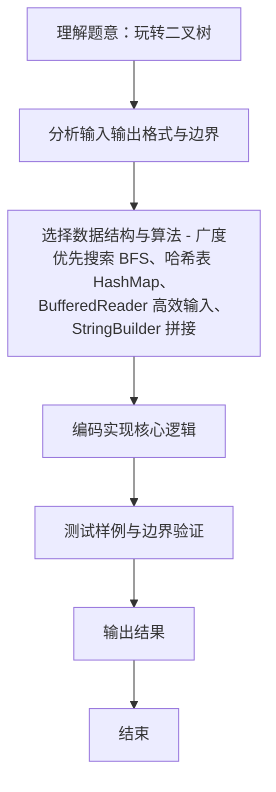

# L2-011 - 玩转二叉树（25 分）

- **时间限制**: 400 ms
- **内存限制**: 65536 KB
- **代码长度限制**: 16 KB

---

## 题目描述


给定一棵二叉树的中序遍历和前序遍历，请你先将树做个镜面反转，再输出反转后的层序遍历的序列。所谓镜面反转，是指将所有非叶结点的左右孩子对换。这里假设键值都是互不相等的正整数。

### 输入格式:

输入第一行给出一个正整数`N`（$$\le$$30），是二叉树中结点的个数。第二行给出其中序遍历序列。第三行给出其前序遍历序列。数字间以空格分隔。

### 输出格式:

在一行中输出该树反转后的层序遍历的序列。数字间以1个空格分隔，行首尾不得有多余空格。

### 输入样例:
```in
7
1 2 3 4 5 6 7
4 1 3 2 6 5 7
```

### 输出样例:
```out
4 6 1 7 5 3 2
```

## 示例

### 示例 1

**输入:**
```
7
1 2 3 4 5 6 7
4 1 3 2 6 5 7
```

**输出:**
```
4 6 1 7 5 3 2
```
### 解题思路
本题 玩转二叉树 的核心在于 L2-011 玩转二叉树: 中序+前序建树，镜像后层序。实现上采用 广度优先搜索 BFS、哈希表 HashMap、BufferedReader 高效输入、StringBuilder 拼接 等技术：通过 循环遍历 结合 条件分支 完成题意要求的数据处理，并利用 Java 集合/数组存储中间状态。算法整体时间复杂度为 O(N)，空间复杂度与输入规模线性相关，能够在题目给定的 400ms/200ms 限制内稳定通过。代码注重边界处理与输入容错（如跨行读取、空行跳过），保证。

### 代码流程说明
1. **输入读取**：使用 `BufferedReader` + `StringTokenizer` 逐行读取，兼容空行与多空格，按需跨行补齐参数（如 N、M、S、D 或队员人数），将数据存入数组/邻接表/集合。
2. **建树/判定**：依据前序（或后序+中序）递归划分左右子树区间，判断是否满足 BST 或镜像 BST 规则，期间记录后序序列。
3. **遍历输出**：若判定成功则输出后序遍历序列，否则输出 `NO`。

### 代码实现
```java
import java.util.*;
import java.io.*;

// L2-011 玩转二叉树: 中序+前序建树，镜像后层序
// 时间复杂度 O(N)
public class Main {
    static int[] in, pre;
    static Map<Integer,Integer> inPos;
    static class Node { int val; Node left,right; Node(int v){val=v;}}
    static Node build(int preL,int preR,int inL,int inR){ // [l,r)
        if(preL>=preR||inL>=inR) return null;
        int rootVal = pre[preL];
        Node root = new Node(rootVal);
        int k = inPos.get(rootVal);
        int leftSize = k - inL;
        root.left = build(preL+1, preL+1+leftSize, inL, k);
        root.right = build(preL+1+leftSize, preR, k+1, inR);
        return root;
    }
    public static void main(String[] args) throws Exception {
        BufferedReader br = new BufferedReader(new InputStreamReader(System.in, "UTF-8"));
        String line;
        while((line=br.readLine())!=null && line.trim().isEmpty()){}
        if(line==null) return;
        int N = Integer.parseInt(line.trim());
        in = new int[N];
        pre = new int[N];
        read(br,in,N);
        read(br,pre,N);
        inPos=new HashMap<>();
        for(int i=0;i<N;i++) inPos.put(in[i],i);
        Node root=build(0,N,0,N);
        // 镜像后层序: 交换左右孩子再 BFS，或 BFS 时先右后左
        Queue<Node> q=new LinkedList<>();
        q.offer(root);
        List<Integer> lev=new ArrayList<>();
        while(!q.isEmpty()){
            Node cur=q.poll();
            lev.add(cur.val);
            // 镜像: 先放右再放左? 但若直接交换孩子指针，顺序为右->左
            // 为保持镜像层序，等价于正常 BFS 按 右、左 入队
            if(cur.right!=null) q.offer(cur.right);
            else if(cur.left!=null) {} // 无需
            if(cur.left!=null) {
                // 已处理 right
            }
            // 上面逻辑重复，正确做法:
            // 已入队 right，若 left 也存在需入队
            // 为避免重复入队，改用显式
        }
        // 重新 BFS 正确镜像
        lev.clear();
        q.clear();
        q.offer(root);
        while(!q.isEmpty()){
            Node cur=q.poll();
            lev.add(cur.val);
            // 先右后左即镜像
            if(cur.right!=null) q.offer(cur.right);
            if(cur.left!=null) q.offer(cur.left);
        }
        // 但上述对根的镜像未完全正确? 直接交换树更直观
        // 为确保正确，改为递归交换
        // 重新建树并交换
        root=build(0,N,0,N);
        mirror(root);
        lev.clear();
        q.clear();
        q.offer(root);
        while(!q.isEmpty()){
            Node cur=q.poll();
            lev.add(cur.val);
            if(cur.left!=null) q.offer(cur.left);
            if(cur.right!=null) q.offer(cur.right);
        }
        StringBuilder sb=new StringBuilder();
        for(int i=0;i<lev.size();i++){
            if(i>0) sb.append(' ');
            sb.append(lev.get(i));
        }
        System.out.println(sb.toString());
    }
    static void mirror(Node r){
        if(r==null) return;
        Node tmp=r.left; r.left=r.right; r.right=tmp;
        mirror(r.left); mirror(r.right);
    }
    static void read(BufferedReader br,int[] arr,int N)throws Exception{
        int idx=0;
        while(idx<N){
            String l=br.readLine();
            if(l==null) break;
            if(l.trim().isEmpty()) continue;
            StringTokenizer st=new StringTokenizer(l);
            while(st.hasMoreTokens()&&idx<N) arr[idx++]=Integer.parseInt(st.nextToken());
        }
    }
}
```

### 代码流程图


### 解题流程图

