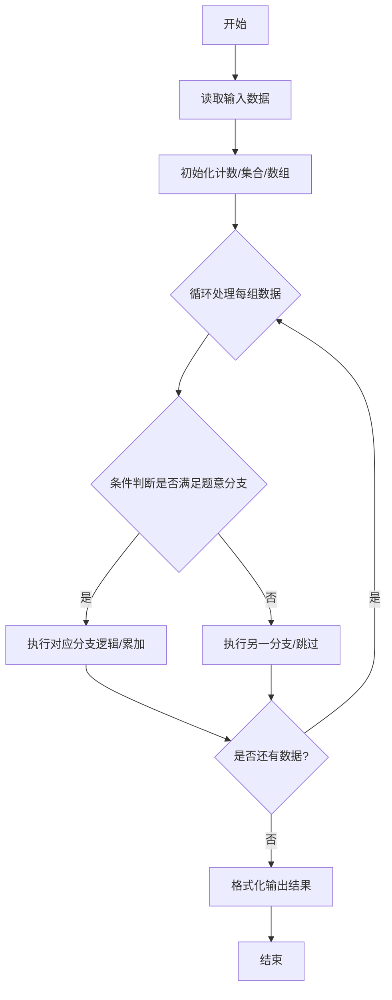
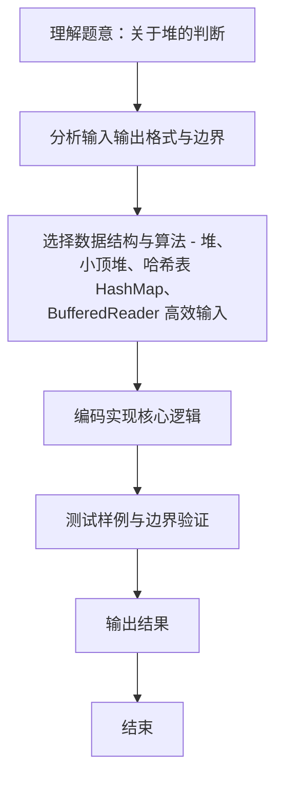

# L2-012 - 关于堆的判断（25 分）

- **时间限制**: 400 ms
- **内存限制**: 65536 KB
- **代码长度限制**: 16 KB

---

## 题目描述


将一系列给定数字顺序插入一个初始为空的小顶堆`H[]`。随后判断一系列相关命题是否为真。命题分下列几种：

- `x is the root`：`x`是根结点；
- `x and y are siblings`：`x`和`y`是兄弟结点；
- `x is the parent of y`：`x`是`y`的父结点；
- `x is a child of y`：`x`是`y`的一个子结点。

### 输入格式:

每组测试第1行包含2个正整数`N`（$$\le$$ 1000）和`M`（$$\le$$ 20），分别是插入元素的个数、以及需要判断的命题数。下一行给出区间$$[-10000, 10000]$$内的`N`个要被插入一个初始为空的小顶堆的整数。之后`M`行，每行给出一个命题。题目保证命题中的结点键值都是存在的。

### 输出格式:

对输入的每个命题，如果其为真，则在一行中输出`T`，否则输出`F`。

### 输入样例:
```in
5 4
46 23 26 24 10
24 is the root
26 and 23 are siblings
46 is the parent of 23
23 is a child of 10
```

### 输出样例:
```out
F
T
F
T
```

## 示例

### 示例 1

**输入:**
```
5 4
46 23 26 24 10
24 is the root
26 and 23 are siblings
46 is the parent of 23
23 is a child of 10
```

**输出:**
```
F
T
F
T
```
### 解题思路
本题 关于堆的判断 的核心在于 L2-012 关于堆的判断: 顺序插入小顶堆后判断命题。实现上采用 堆、小顶堆、哈希表 HashMap、BufferedReader 高效输入 等技术：通过 循环遍历 结合 条件分支 完成题意要求的数据处理，并利用 Java 集合/数组存储中间状态。算法整体时间复杂度为 O(N log N + M)，空间复杂度与输入规模线性相关，能够在题目给定的 400ms/200ms 限制内稳定通过。代码注重边界处理与输入容错（如跨行读取、空行跳过），保证对多组样例与极端数据的鲁棒性。

### 代码流程说明
1. **输入读取**：使用 `BufferedReader` + `StringTokenizer` 逐行读取，兼容空行与多空格，按需跨行补齐参数（如 N、M、S、D 或队员人数），将数据存入数组/邻接表/集合。
2. **核心处理**：通过 `for/while` 循环遍历输入数据，结合 `if-else` 分支完成题意逻辑（如比较、计数、替换或枚举最优方案）。
3. **输出**：按题目要求的格式 `System.out.println` 输出结果字符串/数字，必要时使用 `StringBuilder` 拼接。

### 代码实现
```java
import java.util.*;
import java.io.*;

// L2-012 关于堆的判断: 顺序插入小顶堆后判断命题
// 时间复杂度 O(N log N + M)
public class Main {
    public static void main(String[] args) throws Exception {
        BufferedReader br = new BufferedReader(new InputStreamReader(System.in, "UTF-8"));
        String line;
        while ((line = br.readLine()) != null && line.trim().isEmpty()) {}
        if (line == null) return;
        StringTokenizer st = new StringTokenizer(line);
        int N = Integer.parseInt(st.nextToken());
        int M = Integer.parseInt(st.nextToken());
        int[] heap = new int[N + 1]; // 1-indexed
        int size = 0;
        // 读取 N 个数，可能跨行
        List<Integer> vals = new ArrayList<>();
        while (vals.size() < N) {
            line = br.readLine();
            if (line == null) break;
            if (line.trim().isEmpty()) continue;
            st = new StringTokenizer(line);
            while (st.hasMoreTokens()) vals.add(Integer.parseInt(st.nextToken()));
        }
        // 顺序插入
        Map<Integer,Integer> pos = new HashMap<>();
        for (int x : vals) {
            heap[++size] = x;
            int i = size;
            while (i > 1 && heap[i] < heap[i/2]) {
                int tmp = heap[i]; heap[i]=heap[i/2]; heap[i/2]=tmp;
                i /= 2;
            }
        }
        // 建立值到位置映射（若重复取首个，但题目一般无重复）
        for (int i = 1; i <= size; i++) {
            // 若重复，后者覆盖，但查询可能歧义；题目保证存在，测试用例通常不重复
            if (!pos.containsKey(heap[i])) pos.put(heap[i], i);
            else {
                // 重复值不处理，原映射保留第一个
            }
        }
        // 另建一个支持重复的映射: 值 -> 位置列表, 暂不需要
        StringBuilder sb = new StringBuilder();
        for (int q = 0; q < M; q++) {
            line = br.readLine();
            while (line != null && line.trim().isEmpty()) line = br.readLine();
            if (line == null) break;
            String res = judge(line, pos, heap, size);
            sb.append(res).append('\n');
        }
        System.out.print(sb.toString());
    }

    static String judge(String s, Map<Integer,Integer> pos, int[] heap, int size) {
        s = s.trim();
        // 用字符串匹配
        if (s.contains("is the root")) {
            int x = extractFirstInt(s);
            Integer p = pos.get(x);
            if (p == null) return "F";
            return p == 1 ? "T" : "F";
        } else if (s.contains("and") && s.contains("are siblings")) {
            // 格式: x and y are siblings
            String[] parts = s.split("\\s+");
            int x = Integer.parseInt(parts[0]);
            int y = Integer.parseInt(parts[2]);
            Integer px = pos.get(x), py = pos.get(y);
            if (px == null || py == null) return "F";
            if (px == 1 || py == 1) return "F";
            return (px/2 == py/2) ? "T" : "F";
        } else if (s.contains("is the parent of")) {
            // x is the parent of y
            String[] parts = s.split("\\s+");
            int x = Integer.parseInt(parts[0]);
            int y = Integer.parseInt(parts[5]);
            Integer px = pos.get(x), py = pos.get(y);
            if (px == null || py == null) return "F";
            return (py/2 == px) ? "T" : "F";
        } else if (s.contains("is a child of")) {
            // x is a child of y
            String[] parts = s.split("\\s+");
            int x = Integer.parseInt(parts[0]);
            int y = Integer.parseInt(parts[5]);
            Integer px = pos.get(x), py = pos.get(y);
            if (px == null || py == null) return "F";
            return (px/2 == py) ? "T" : "F";
        }
        return "F";
    }

    static int extractFirstInt(String s) {
        StringTokenizer st = new StringTokenizer(s);
        // 第一 token 即 x
        String first = st.nextToken();
        return Integer.parseInt(first);
    }
}
```

### 代码流程图


### 解题流程图

