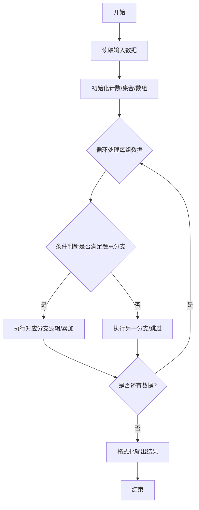
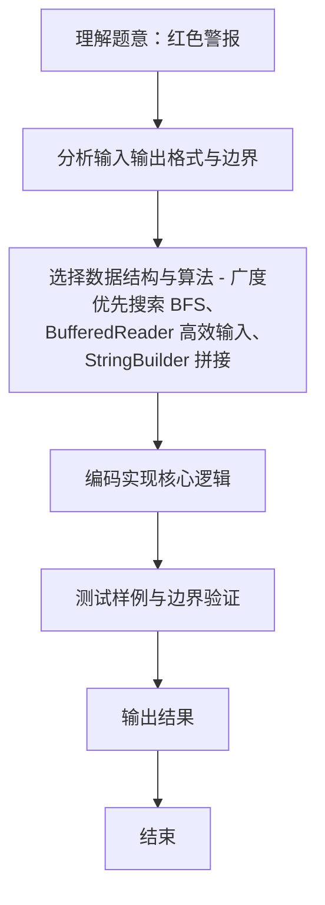

# L2-013 - 红色警报（25 分）

- **时间限制**: 400 ms
- **内存限制**: 65536 KB
- **代码长度限制**: 16 KB

---

## 题目描述


战争中保持各个城市间的连通性非常重要。本题要求你编写一个报警程序，当失去一个城市导致国家被分裂为多个无法连通的区域时，就发出红色警报。注意：若该国本来就不完全连通，是分裂的k个区域，而失去一个城市并不改变其他城市之间的连通性，则不要发出警报。

### 输入格式:

输入在第一行给出两个整数`N`（0 $$<$$ `N` $$\le$$ 500）和`M`（$$\le$$ 5000），分别为城市个数（于是默认城市从0到`N`-1编号）和连接两城市的通路条数。随后`M`行，每行给出一条通路所连接的两个城市的编号，其间以1个空格分隔。在城市信息之后给出被攻占的信息，即一个正整数`K`和随后的`K`个被攻占的城市的编号。

注意：输入保证给出的被攻占的城市编号都是合法的且无重复，但并不保证给出的通路没有重复。

### 输出格式:

对每个被攻占的城市，如果它会改变整个国家的连通性，则输出`Red Alert: City k is lost!`，其中`k`是该城市的编号；否则只输出`City k is lost.`即可。如果该国失去了最后一个城市，则增加一行输出`Game Over.`。

### 输入样例:
```in
5 4
0 1
1 3
3 0
0 4
5
1 2 0 4 3
```

### 输出样例:
```out
City 1 is lost.
City 2 is lost.
Red Alert: City 0 is lost!
City 4 is lost.
City 3 is lost.
Game Over.
```

## 示例

### 示例 1

**输入:**
```
5 4
0 1
1 3
3 0
0 4
5
1 2 0 4 3
```

**输出:**
```
City 1 is lost.
City 2 is lost.
Red Alert: City 0 is lost!
City 4 is lost.
City 3 is lost.
Game Over.
```
### 解题思路
本题 红色警报 的核心在于 L2-013 红色警报: 逐个攻占城市判断连通分量变化。实现上采用 广度优先搜索 BFS、BufferedReader 高效输入、StringBuilder 拼接 等技术：通过 循环遍历 结合 条件分支 完成题意要求的数据处理，并利用 Java 集合/数组存储中间状态。算法整体时间复杂度为 O(K*(N+M)，空间复杂度与输入规模线性相关，能够在题目给定的 400ms/200ms 限制内稳定通过。代码注重边界处理与输入容错（如跨行读取、空行跳过），保证对多组样例与极端数据的鲁棒性。

### 代码流程说明
1. **输入读取**：使用 `BufferedReader` + `StringTokenizer` 逐行读取，兼容空行与多空格，按需跨行补齐参数（如 N、M、S、D 或队员人数），将数据存入数组/邻接表/集合。
2. **核心处理**：通过 `for/while` 循环遍历输入数据，结合 `if-else` 分支完成题意逻辑（如比较、计数、替换或枚举最优方案）。
3. **输出**：按题目要求的格式 `System.out.println` 输出结果字符串/数字，必要时使用 `StringBuilder` 拼接。

### 代码实现
```java
import java.util.*;
import java.io.*;

// L2-013 红色警报: 逐个攻占城市判断连通分量变化
// 时间复杂度 O(K*(N+M))
public class Main {
    static int N, M;
    static List<Integer>[] adj;
    static boolean[] lost;
    static int countComponents() {
        boolean[] vis = new boolean[N];
        int comp = 0;
        for (int i = 0; i < N; i++) if (!lost[i] && !vis[i]) {
            comp++;
            // BFS
            Queue<Integer> q = new LinkedList<>();
            q.offer(i); vis[i]=true;
            while(!q.isEmpty()){
                int u=q.poll();
                for(int v: adj[u]) if(!lost[v] && !vis[v]) {vis[v]=true; q.offer(v);}
            }
        }
        return comp;
    }
    public static void main(String[] args) throws Exception {
        BufferedReader br = new BufferedReader(new InputStreamReader(System.in, "UTF-8"));
        String line;
        while((line=br.readLine())!=null && line.trim().isEmpty()){}
        if(line==null) return;
        StringTokenizer st=new StringTokenizer(line);
        N=Integer.parseInt(st.nextToken());
        M=Integer.parseInt(st.nextToken());
        adj=new ArrayList[N];
        for(int i=0;i<N;i++) adj[i]=new ArrayList<>();
        for(int i=0;i<M;i++){
            line=br.readLine();
            while(line!=null && line.trim().isEmpty()) line=br.readLine();
            st=new StringTokenizer(line);
            int a=Integer.parseInt(st.nextToken());
            int b=Integer.parseInt(st.nextToken());
            if(a<0||a>=N||b<0||b>=N) continue;
            adj[a].add(b); adj[b].add(a);
        }
        // 读取 K 和攻击序列，可能跨行
        // 剩余输入的 token
        List<Integer> tokens=new ArrayList<>();
        while((line=br.readLine())!=null){
            if(line.trim().isEmpty()) continue;
            st=new StringTokenizer(line);
            while(st.hasMoreTokens()) tokens.add(Integer.parseInt(st.nextToken()));
        }
        if(tokens.isEmpty()) return;
        int K=tokens.get(0);
        List<Integer> attacks=new ArrayList<>();
        for(int i=1;i<=K && i<tokens.size();i++) attacks.add(tokens.get(i));
        // 若 tokens 数量不足，说明输入异常，但一般足够

        lost=new boolean[N];
        int prevComp = countComponents();
        StringBuilder sb=new StringBuilder();
        for(int i=0;i<K;i++){
            int city=attacks.get(i);
            lost[city]=true;
            int curComp = countComponents();
            // 判断是否需要红警: curComp > prevComp
            if(curComp > prevComp){
                sb.append(String.format("Red Alert: City %d is lost!\n", city));
            } else {
                sb.append(String.format("City %d is lost.\n", city));
            }
            prevComp = curComp;
            if(i==K-1 || curComp==0){
                // 检查是否失去最后一个城市? 当所有城市 lost 后输出 Game Over
                boolean allLost=true;
                for(boolean b: lost) if(!b){allLost=false;break;}
                if(allLost && i==K-1){
                    sb.append("Game Over.\n");
                }
            }
        }
        // 如果 K 攻占后还有未攻占城市但所有城市已 lost? 已处理
        // 按题目: 若该国失去最后一个城市则增加一行 Game Over.
        // 我们的判断基于 lost 全 true
        // 若 attacks 长度 < N 但已全部 lost? 已包含
        System.out.print(sb.toString());
    }
}
```

### 代码流程图


### 解题流程图

