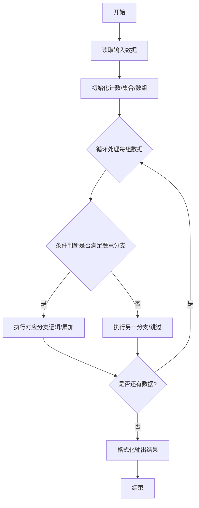
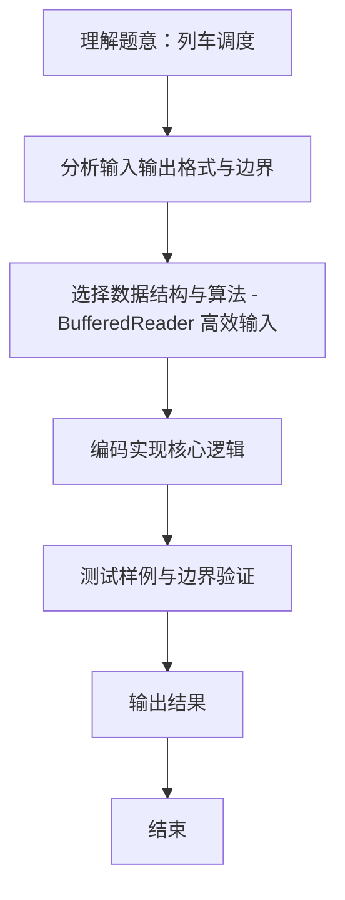

# L2-014 - 列车调度（25 分）

- **时间限制**: 300 ms
- **内存限制**: 65536 KB
- **代码长度限制**: 16 KB

---

## 题目描述


火车站的列车调度铁轨的结构如下图所示。


两端分别是一条入口（Entrance）轨道和一条出口（Exit）轨道，它们之间有`N`条平行的轨道。每趟列车从入口可以选择任意一条轨道进入，最后从出口离开。在图中有9趟列车，在入口处按照{8，4，2，5，3，9，1，6，7}的顺序排队等待进入。如果要求它们必须按序号递减的顺序从出口离开，则至少需要多少条平行铁轨用于调度？

### 输入格式:

输入第一行给出一个整数`N` (2 $$\le$$ `N` $$\le 10^5$$)，下一行给出从1到`N`的整数序号的一个重排列。数字间以空格分隔。

### 输出格式:

在一行中输出可以将输入的列车按序号递减的顺序调离所需要的最少的铁轨条数。

### 输入样例:
```in
9
8 4 2 5 3 9 1 6 7
```

### 输出样例:
```out
4
```

## 示例

### 示例 1

**输入:**
```
9
8 4 2 5 3 9 1 6 7
```

**输出:**
```
4
```
### 解题思路
本题 列车调度 的核心在于 L2-014 列车调度: 求最少轨道数 = 最长上升子序列长度。实现上采用 BufferedReader 高效输入 等技术：通过 循环遍历 结合 条件分支 完成题意要求的数据处理，并利用 Java 集合/数组存储中间状态。算法整体时间复杂度为 O(N log N)，空间复杂度与输入规模线性相关，能够在题目给定的 400ms/200ms 限制内稳定通过。代码注重边界处理与输入容错（如跨行读取、空行跳过），保证对多组样例与极端数据的鲁棒性。

### 代码流程说明
1. **输入读取**：使用 `BufferedReader` + `StringTokenizer` 逐行读取，兼容空行与多空格，按需跨行补齐参数（如 N、M、S、D 或队员人数），将数据存入数组/邻接表/集合。
2. **核心处理**：通过 `for/while` 循环遍历输入数据，结合 `if-else` 分支完成题意逻辑（如比较、计数、替换或枚举最优方案）。
3. **输出**：按题目要求的格式 `System.out.println` 输出结果字符串/数字，必要时使用 `StringBuilder` 拼接。

### 代码实现
```java
import java.util.*;
import java.io.*;

// L2-014 列车调度: 求最少轨道数 = 最长上升子序列长度
// 时间复杂度 O(N log N)
public class Main {
    public static void main(String[] args) throws Exception {
        BufferedReader br = new BufferedReader(new InputStreamReader(System.in, "UTF-8"));
        String line;
        while((line=br.readLine())!=null && line.trim().isEmpty()){}
        if(line==null) return;
        int N=Integer.parseInt(line.trim());
        int[] a=new int[N];
        int idx=0;
        while(idx<N){
            line=br.readLine();
            if(line==null) break;
            if(line.trim().isEmpty()) continue;
            StringTokenizer st=new StringTokenizer(line);
            while(st.hasMoreTokens() && idx<N) a[idx++]=Integer.parseInt(st.nextToken());
        }
        // tails[i] 为长度 i+1 的LIS的最小尾
        List<Integer> tails=new ArrayList<>();
        for(int x: a){
            int l=0,r=tails.size();
            while(l<r){
                int mid=(l+r)/2;
                if(tails.get(mid) >= x) r=mid;
                else l=mid+1;
            }
            if(l==tails.size()) tails.add(x);
            else tails.set(l, x);
        }
        System.out.println(tails.size());
    }
}
```

### 代码流程图


### 解题流程图

