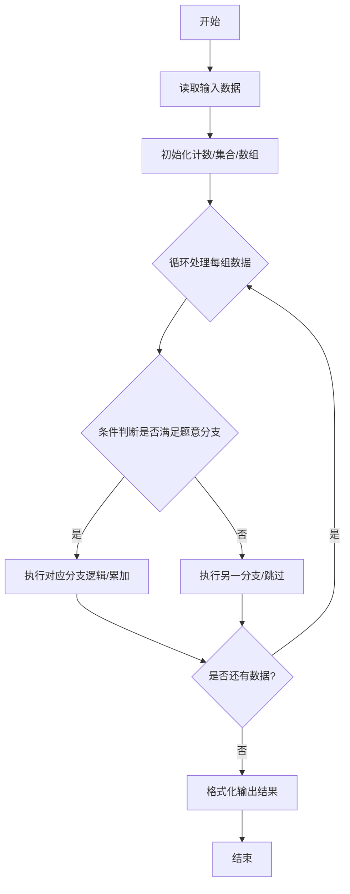
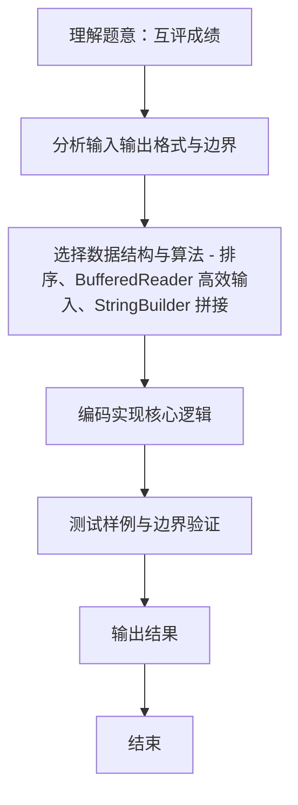

# L2-015 - 互评成绩（25 分）

- **时间限制**: 300 ms
- **内存限制**: 65536 KB
- **代码长度限制**: 16 KB

---

## 题目描述


学生互评作业的简单规则是这样定的：每个人的作业会被`k`个同学评审，得到`k`个成绩。系统需要去掉一个最高分和一个最低分，将剩下的分数取平均，就得到这个学生的最后成绩。本题就要求你编写这个互评系统的算分模块。

### 输入格式:

输入第一行给出3个正整数`N`（3 $$<$$ `N` $$\le 10^4$$，学生总数）、`k`（3 $$\le$$ `k` $$\le$$ 10，每份作业的评审数）、`M`（$$\le$$ 20，需要输出的学生数）。随后`N`行，每行给出一份作业得到的`k`个评审成绩（在区间[0, 100]内），其间以空格分隔。

### 输出格式:

按非递减顺序输出最后得分最高的`M`个成绩，保留小数点后3位。分数间有1个空格，行首尾不得有多余空格。

### 输入样例:
```in
6 5 3
88 90 85 99 60
67 60 80 76 70
90 93 96 99 99
78 65 77 70 72
88 88 88 88 88
55 55 55 55 55
```

### 输出样例:
```out
87.667 88.000 96.000
```

## 示例

### 示例 1

**输入:**
```
6 5 3
88 90 85 99 60
67 60 80 76 70
90 93 96 99 99
78 65 77 70 72
88 88 88 88 88
55 55 55 55 55
```

**输出:**
```
87.667 88.000 96.000
```
### 解题思路
本题 互评成绩 的核心在于 L2-015 互评成绩: 去掉最高最低取平均，输出最高的M个非递减。实现上采用 排序、BufferedReader 高效输入、StringBuilder 拼接 等技术：通过 循环遍历 结合 条件分支 完成题意要求的数据处理，并利用 Java 集合/数组存储中间状态。算法整体时间复杂度为 O(N k + N log N)，空间复杂度与输入规模线性相关，能够在题目给定的 400ms/200ms 限制内稳定通过。代码注重边界处理与输入容错（如跨行读取、空行跳过），保证对多组。

### 代码流程说明
1. **输入读取**：使用 `BufferedReader` + `StringTokenizer` 逐行读取，兼容空行与多空格，按需跨行补齐参数（如 N、M、S、D 或队员人数），将数据存入数组/邻接表/集合。
2. **排序/贪心**：将对象按关键属性（如单价、余额、价格）降序/升序排序，必要时按次关键字稳定排序。
3. **遍历处理**：顺序扫描排序后序列，累计结果或按题意判断输出。

### 代码实现
```java
import java.util.*;
import java.io.*;

// L2-015 互评成绩: 去掉最高最低取平均，输出最高的M个非递减
// 时间复杂度 O(N k + N log N)
public class Main {
    public static void main(String[] args) throws Exception {
        BufferedReader br = new BufferedReader(new InputStreamReader(System.in, "UTF-8"));
        String line;
        while((line=br.readLine())!=null && line.trim().isEmpty()){}
        if(line==null) return;
        StringTokenizer st=new StringTokenizer(line);
        int N=Integer.parseInt(st.nextToken());
        int k=Integer.parseInt(st.nextToken());
        int M=Integer.parseInt(st.nextToken());
        double[] scores=new double[N];
        for(int i=0;i<N;i++){
            // 读取 k 个成绩，可能跨行
            int cnt=0;
            int sum=0, mn=Integer.MAX_VALUE, mx=Integer.MIN_VALUE;
            while(cnt<k){
                line=br.readLine();
                if(line==null) break;
                if(line.trim().isEmpty()) continue;
                st=new StringTokenizer(line);
                while(st.hasMoreTokens() && cnt<k){
                    int v=Integer.parseInt(st.nextToken());
                    sum+=v;
                    mn=Math.min(mn,v);
                    mx=Math.max(mx,v);
                    cnt++;
                }
            }
            scores[i]=(sum - mn - mx) * 1.0 / (k-2);
        }
        Arrays.sort(scores);
        StringBuilder sb=new StringBuilder();
        for(int i=N-M;i<N;i++){
            if(i> N-M) sb.append(' ');
            sb.append(String.format("%.3f", scores[i]));
        }
        System.out.println(sb.toString());
    }
}
```

### 代码流程图


### 解题流程图

