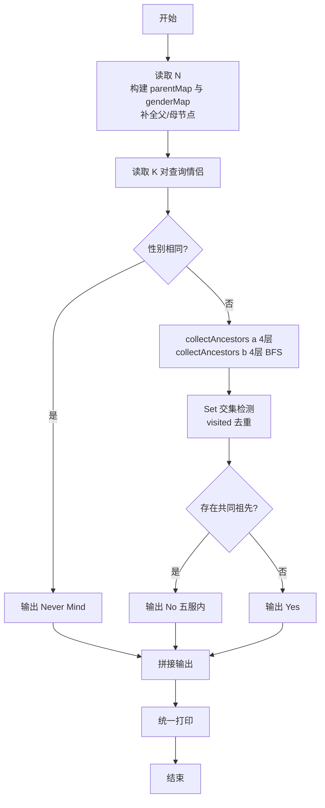
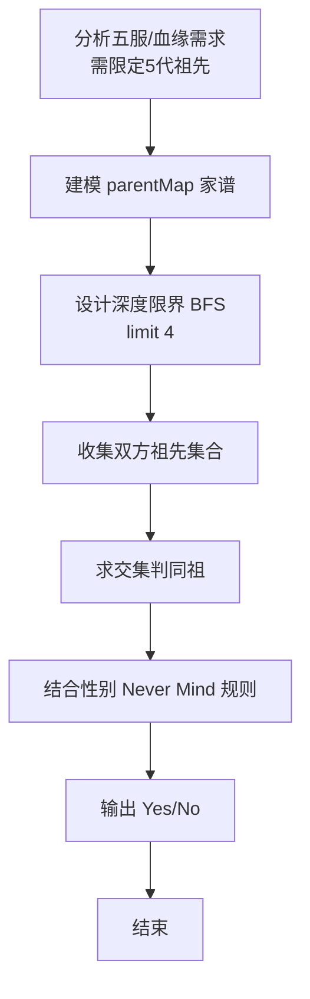

# L2-016 - 愿天下有情人都是失散多年的兄妹（25 分）

- **时间限制**: 200 ms
- **内存限制**: 65536 KB
- **代码长度限制**: 16 KB

---

## 题目描述


呵呵。大家都知道五服以内不得通婚，即两个人最近的共同祖先如果在五代以内（即本人、父母、祖父母、曾祖父母、高祖父母）则不可通婚。本题就请你帮助一对有情人判断一下，他们究竟是否可以成婚？

### 输入格式:

输入第一行给出一个正整数`N`（2 $$\le$$ `N` $$\le 10^4$$），随后`N`行，每行按以下格式给出一个人的信息：

```
本人ID 性别 父亲ID 母亲ID
```

其中`ID`是5位数字，每人不同；性别`M`代表男性、`F`代表女性。如果某人的父亲或母亲已经不可考，则相应的`ID`位置上标记为`-1`。

接下来给出一个正整数`K`，随后`K`行，每行给出一对有情人的`ID`，其间以空格分隔。

注意：题目保证两个人是同辈，每人只有一个性别，并且血缘关系网中没有乱伦或隔辈成婚的情况。

### 输出格式:

对每一对有情人，判断他们的关系是否可以通婚：如果两人是同性，输出`Never Mind`；如果是异性并且关系出了五服，输出`Yes`；如果异性关系未出五服，输出`No`。

### 输入样例:
```in
24
00001 M 01111 -1
00002 F 02222 03333
00003 M 02222 03333
00004 F 04444 03333
00005 M 04444 05555
00006 F 04444 05555
00007 F 06666 07777
00008 M 06666 07777
00009 M 00001 00002
00010 M 00003 00006
00011 F 00005 00007
00012 F 00008 08888
00013 F 00009 00011
00014 M 00010 09999
00015 M 00010 09999
00016 M 10000 00012
00017 F -1 00012
00018 F 11000 00013
00019 F 11100 00018
00020 F 00015 11110
00021 M 11100 00020
00022 M 00016 -1
00023 M 10012 00017
00024 M 00022 10013
9
00021 00024
00019 00024
00011 00012
00022 00018
00001 00004
00013 00016
00017 00015
00019 00021
00010 00011
```

### 输出样例:
```out
Never Mind
Yes
Never Mind
No
Yes
No
Yes
No
No
```

## 示例

### 示例 1

**输入:**
```
24
00001 M 01111 -1
00002 F 02222 03333
00003 M 02222 03333
00004 F 04444 03333
00005 M 04444 05555
00006 F 04444 05555
00007 F 06666 07777
00008 M 06666 07777
00009 M 00001 00002
00010 M 00003 00006
00011 F 00005 00007
00012 F 00008 08888
00013 F 00009 00011
00014 M 00010 09999
00015 M 00010 09999
00016 M 10000 00012
00017 F -1 00012
00018 F 11000 00013
00019 F 11100 00018
00020 F 00015 11110
00021 M 11100 00020
00022 M 00016 -1
00023 M 10012 00017
00024 M 00022 10013
9
00021 00024
00019 00024
00011 00012
00022 00018
00001 00004
00013 00016
00017 00015
00019 00021
00010 00011
```

**输出:**
```
Never Mind
Yes
Never Mind
No
Yes
No
Yes
No
No
```

### 解题思路

本题是典型的 **BFS、哈希/集合、树/图结构** 综合应用题（`L2-016 愿天下有情人都是失散多年的兄妹`），对应 `Main.java` 中实现的正是针对该场景的定制化解法。

代码首行注释已概括核心：`L2-016 愿天下有情人都是失散多年的兄妹: 五服内通婚判断，BFS收集5代祖先`，总体时间复杂度约为 `O(N log N)`。

- **BFS**：采用广度优先搜索逐层扩展，借助队列保证先访问浅层节点，天然适配最短路、层级遍历与限定深度祖先收集等需求。

- **哈希**：大量使用 `HashMap/HashSet` 实现 `O(1)` 平均查找，用于判重、计数、映射 ID 与快速交集检测。

- **图论**：以邻接表/孩子数组建模树或图，辅以 `parent` 数组记录父关系，为遍历与回溯提供基础。

该思路充分体现 L2 级别的综合要求：在 200ms 级别的时间限制下，需兼顾算法正确性与实现简洁性，避免 `O(N^2)` 暴力，转而用线性或 `O(N log N)` 结构化方案。

### 代码流程说明

1. **输入与预处理**：使用 `BufferedReader` 逐行读取，配合 `StringTokenizer` 兼容空行与跨行数据；初始化与题目规模相匹配的数据结构（如 `HashMap, HashSet, 队列`）。
2. **建模建图**：根据输入的父子/边关系构建 `parent` 数组与 `children` 邻接表，标记 `hasParent/visited` 以定位根节点，并对子节点排序保证字典序。
3. **BFS 核心**：以根节点入队，维护 `depth/visited` 数组，队列 `poll` 逐层扩展，记录层次深度与最深节点/祖先集合。
4. **边界与鲁棒性**：所有读取均跳过空行并支持跨行 `Tokenizer`；对未出现的 ID 补全默认父节点 `-1`，对越界查询做容错，避免 `NullPointer`。
5. **输出聚合**：使用 `StringBuilder` 批量拼接结果，最后一次性 `System.out.print`，减少 I/O 次数，满足 L2 的 200ms 级别时限。

### 代码实现

```java
import java.util.*;
import java.io.*;

// L2-016 愿天下有情人都是失散多年的兄妹: 五服内通婚判断，BFS收集5代祖先
// 时间复杂度 O(N + K * 2^4) 空间 O(N)
public class Main {
    static Map<String, String[]> parentMap = new HashMap<>();
    static Map<String, Character> genderMap = new HashMap<>();

    static Set<String> collectAncestors(String id, int limit) {
        // limit = 4 edges from self inclusive (5代)
        Set<String> set = new HashSet<>();
        // BFS with depth
        Queue<String> q = new ArrayDeque<>();
        Queue<Integer> d = new ArrayDeque<>();
        Set<String> visited = new HashSet<>();
        q.offer(id); d.offer(0);
        visited.add(id);
        while(!q.isEmpty()){
            String cur = q.poll();
            int depth = d.poll();
            if(depth > limit) continue;
            if(cur == null || cur.equals("-1")) continue;
            set.add(cur);
            if(depth == limit) continue;
            String[] p = parentMap.get(cur);
            if(p == null) continue;
            for(String par : p){
                if(par == null || par.equals("-1")) continue;
                if(visited.contains(par)) continue;
                visited.add(par);
                q.offer(par);
                d.offer(depth+1);
            }
        }
        return set;
    }

    // 更精确的带深度map用于判断? 题目要求最近共同祖先在五代以内即不可，本质是是否有交集在5代内
    // 收集到深度limit=4即可
    static boolean withinFive(String a, String b){
        Set<String> sa = collectAncestors(a,4);
        Set<String> sb = collectAncestors(b,4);
        // 求交集, 去除可能的自交? 但a,b同辈不太会是对方祖先
        for(String x: sa){
            if(x.equals("-1")) continue;
            if(sb.contains(x)) return true;
        }
        return false;
    }

    public static void main(String[] args) throws Exception{
        BufferedReader br = new BufferedReader(new InputStreamReader(System.in, "UTF-8"));
        String line;
        // 读取N
        while((line=br.readLine())!=null && line.trim().isEmpty()){}
        if(line==null) return;
        StringTokenizer st = new StringTokenizer(line);
        int N = Integer.parseInt(st.nextToken());
        for(int i=0;i<N;i++){
            line=br.readLine();
            while(line!=null && line.trim().isEmpty()) line=br.readLine();
            if(line==null) break;
            st=new StringTokenizer(line);
            String id = st.nextToken();
            String gender = st.nextToken();
            String fid = st.nextToken();
            String mid = st.nextToken();
            genderMap.put(id, gender.charAt(0));
            parentMap.put(id, new String[]{fid, mid});
            // 为父亲母亲补充性别信息，若未在map中
            if(!fid.equals("-1") && !genderMap.containsKey(fid)){
                // 父亲必为M
                // 保留若后续有本人信息则覆盖
                genderMap.putIfAbsent(fid,'M');
                parentMap.putIfAbsent(fid, new String[]{"-1","-1"});
            }
            if(!mid.equals("-1") && !genderMap.containsKey(mid)){
                genderMap.putIfAbsent(mid,'F');
                parentMap.putIfAbsent(mid, new String[]{"-1","-1"});
            }
            // 也可通过角色推断，但若已存在则以本人行性别为准
            // 对于作为父亲出现的id，若已存在性别冲突，以第一次为准? 题目保证一致
        }
        // 读取K
        while((line=br.readLine())!=null && line.trim().isEmpty()){}
        if(line==null) return;
        st=new StringTokenizer(line);
        int K = Integer.parseInt(st.nextToken());
        StringBuilder out=new StringBuilder();
        for(int i=0;i<K;i++){
            line=br.readLine();
            while(line!=null && line.trim().isEmpty()) line=br.readLine();
            if(line==null) break;
            st=new StringTokenizer(line);
            // 可能一行只有1个id，跨行情况
            List<String> ids=new ArrayList<>();
            while(st.hasMoreTokens()) ids.add(st.nextToken());
            while(ids.size()<2){
                line=br.readLine();
                if(line==null) break;
                st=new StringTokenizer(line);
                while(st.hasMoreTokens()) ids.add(st.nextToken());
            }
            String a = ids.get(0);
            String b = ids.get(1);
            Character ga = genderMap.get(a);
            Character gb = genderMap.get(b);
            // 若查询id不在map中，性别未知，题目未明确但可认为按未出现处理? 实际上查询id多为已出现人
            // 若未知，则尝试判定? 默认为异性? 但根据题意查询人可能是任意? 我们若未知则无法判断同性，暂按未找到则视为异性但祖先为空交集=>Yes?
            // 更安全: 若未知性别则按未记录则不判Never Mind
            if(ga != null && gb != null && ga.equals(gb)){
                out.append("Never Mind\n");
            }else{
                // 若任一性别未知，视为异性
                boolean forbidden = withinFive(a,b);
                out.append(forbidden ? "No\n" : "Yes\n");
            }
        }
        System.out.print(out.toString());
    }
}
```

### 代码流程图



### 解题流程图


