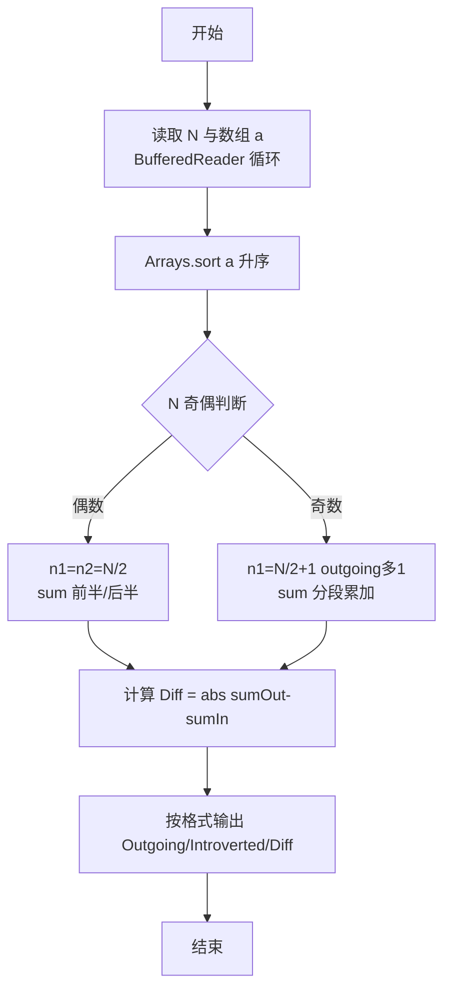
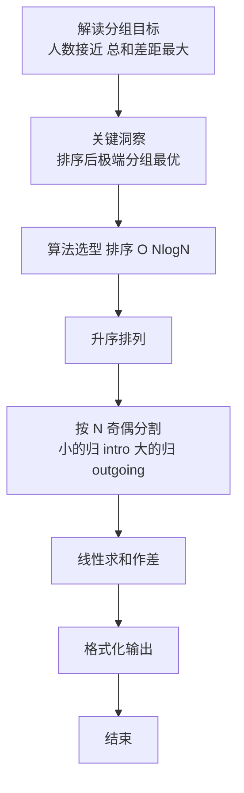

# L2-017 - 人以群分（25 分）

- **时间限制**: 150 ms
- **内存限制**: 65536 KB
- **代码长度限制**: 16 KB

---

## 题目描述


社交网络中我们给每个人定义了一个“活跃度”，现希望根据这个指标把人群分为两大类，即外向型（outgoing，即活跃度高的）和内向型（introverted，即活跃度低的）。要求两类人群的规模尽可能接近，而他们的总活跃度差距尽可能拉开。

### 输入格式:

输入第一行给出一个正整数$$N$$（$$2 \le N \le 10^5$$）。随后一行给出$$N$$个正整数，分别是每个人的活跃度，其间以空格分隔。题目保证这些数字以及它们的和都不会超过$$2^{31}$$。

### 输出格式:

按下列格式输出：

```
Outgoing #: N1
Introverted #: N2
Diff = N3
```

其中`N1`是外向型人的个数；`N2`是内向型人的个数；`N3`是两群人总活跃度之差的绝对值。

### 输入样例 1：
```in
10
23 8 10 99 46 2333 46 1 666 555
```

### 输出样例 1：
```out
Outgoing #: 5
Introverted #: 5
Diff = 3611
```

### 输入样例 2：
```in
13
110 79 218 69 3721 100 29 135 2 6 13 5188 85
```

### 输出样例 2：
```out
Outgoing #: 7
Introverted #: 6
Diff = 9359
```

## 示例

### 示例 1

**输入:**
```
10
23 8 10 99 46 2333 46 1 666 555
```

**输出:**
```
Outgoing #: 5
Introverted #: 5
Diff = 3611
```

### 示例 2

**输入:**
```
13
110 79 218 69 3721 100 29 135 2 6 13 5188 85
```

**输出:**
```
Outgoing #: 7
Introverted #: 6
Diff = 9359
```

### 解题思路

本题是典型的 **排序、树/图结构** 综合应用题（`L2-017 人以群分`），对应 `Main.java` 中实现的正是针对该场景的定制化解法。

代码首行注释已概括核心：`L2-017 人以群分: 排序后按人数均分求差`，总体时间复杂度约为 `O(N log N)`。

- **排序**：先对关键维度排序，再线性扫描分组或去重，排序是降低后续逻辑复杂度的关键预处理。

- **图论**：以邻接表/孩子数组建模树或图，辅以 `parent` 数组记录父关系，为遍历与回溯提供基础。

该思路充分体现 L2 级别的综合要求：在 200ms 级别的时间限制下，需兼顾算法正确性与实现简洁性，避免 `O(N^2)` 暴力，转而用线性或 `O(N log N)` 结构化方案。

### 代码流程说明

1. **输入与预处理**：使用 `BufferedReader` 逐行读取，兼容空行与跨行输入。
2. **排序预处理**：将活跃度/记录数组 `Arrays.sort` 升序排列，为后续分组与差值计算奠定有序基础。
3. **分组与统计**：排序后按人数均分（`N` 奇偶分歧），线性累加 `sumIn/sumOut`，或按标签计数去重后排序输出。
4. **边界与鲁棒性**：所有读取均跳过空行并支持跨行 `Tokenizer`；对未出现的 ID 补全默认父节点 `-1`，对越界查询做容错，避免 `NullPointer`。
5. **输出聚合**：使用 `StringBuilder` 批量拼接结果，最后一次性 `System.out.print`，减少 I/O 次数，满足 L2 的 200ms 级别时限。

### 代码实现

```java
import java.util.*;
import java.io.*;

// L2-017 人以群分: 排序后按人数均分求差
// 时间复杂度 O(N log N)
public class Main {
    public static void main(String[] args) throws Exception{
        BufferedReader br=new BufferedReader(new InputStreamReader(System.in,"UTF-8"));
        String line;
        while((line=br.readLine())!=null && line.trim().isEmpty()){}
        if(line==null) return;
        StringTokenizer st=new StringTokenizer(line);
        int N=Integer.parseInt(st.nextToken());
        int[] a=new int[N];
        int idx=0;
        while(idx<N){
            line=br.readLine();
            if(line==null) break;
            if(line.trim().isEmpty()) continue;
            st=new StringTokenizer(line);
            while(st.hasMoreTokens() && idx<N){
                a[idx++]=Integer.parseInt(st.nextToken());
            }
        }
        Arrays.sort(a);
        int n1,n2;
        long sumOut=0,sumIn=0;
        // 排序后前半为Introverted(小), 后半为Outgoing(大)
        // N偶: 各N/2 ; N奇: Outgoing多1
        if(N%2==0){
            n1=N/2;
            n2=N/2;
            for(int i=0;i<N/2;i++) sumIn+=a[i];
            for(int i=N/2;i<N;i++) sumOut+=a[i];
        }else{
            n1=N/2+1; // outgoing 多1
            n2=N/2;
            for(int i=0;i<N/2;i++) sumIn+=a[i];
            for(int i=N/2;i<N;i++) sumOut+=a[i];
            // 但上述把小的当intro, 大的当outgoing; 对于奇数，intro为 N/2个小值, outgoing为N/2+1个大值
            // 重新计算: 实际上 sumIn 应为前 N/2个，sumOut为后N/2+1个
            // 上面循环已满足 (因为 N/2 = floor)
        }
        long diff = Math.abs(sumOut - sumIn);
        System.out.println("Outgoing #: "+n1);
        System.out.println("Introverted #: "+n2);
        System.out.println("Diff = "+diff);
    }
}
```

### 代码流程图



### 解题流程图


