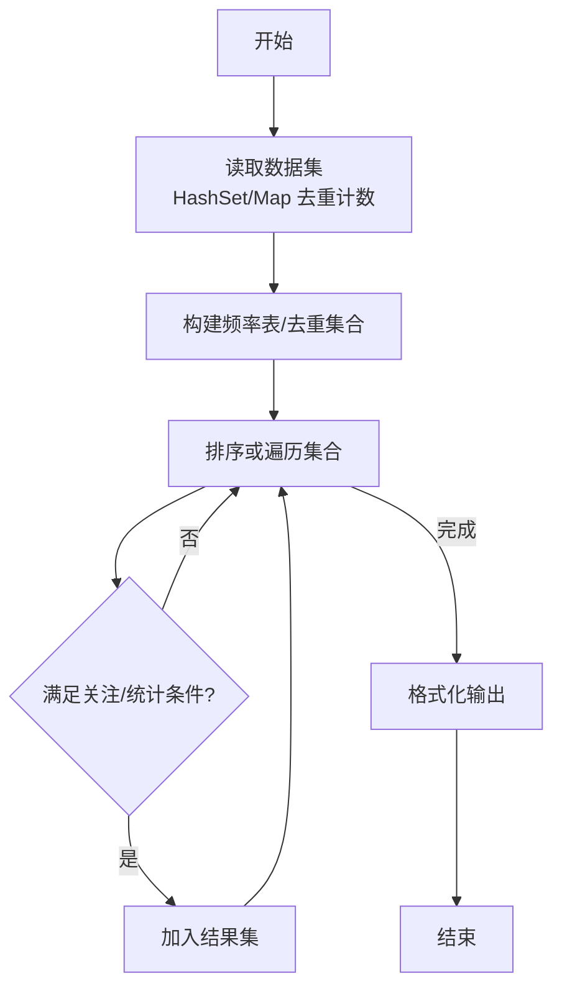
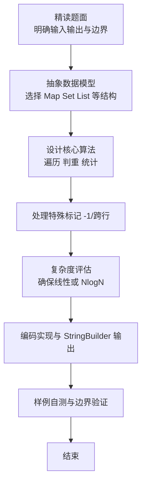

# L2-018 - 多项式A除以B（25 分）

- **时间限制**: 400 ms
- **内存限制**: 65536 KB
- **代码长度限制**: 16 KB

---

## 题目描述


这仍然是一道关于A/B的题，只不过A和B都换成了多项式。你需要计算两个多项式相除的商Q和余R，其中R的阶数必须小于B的阶数。

### 输入格式:

输入分两行，每行给出一个非零多项式，先给出A，再给出B。每行的格式如下：

```
N e[1] c[1] ... e[N] c[N]
```

其中`N`是该多项式非零项的个数，`e[i]`是第`i`个非零项的指数，`c[i]`是第`i`个非零项的系数。各项按照指数递减的顺序给出，保证所有指数是各不相同的非负整数，所有系数是非零整数，所有整数在整型范围内。

### 输出格式:

分两行先后输出商和余，输出格式与输入格式相同，输出的系数保留小数点后1位。同行数字间以1个空格分隔，行首尾不得有多余空格。注意：零多项式是一个特殊多项式，对应输出为`0 0 0.0`。但非零多项式不能输出零系数（包括舍入后为0.0）的项。在样例中，余多项式其实有常数项`-1/27`，但因其舍入后为0.0，故不输出。

### 输入样例:
```in
4 4 1 2 -3 1 -1 0 -1
3 2 3 1 -2 0 1
```

### 输出样例:
```out
3 2 0.3 1 0.2 0 -1.0
1 1 -3.1
```

## 示例

### 示例 1

**输入:**
```
4 4 1 2 -3 1 -1 0 -1
3 2 3 1 -2 0 1
```

**输出:**
```
3 2 0.3 1 0.2 0 -1.0
1 1 -3.1
```

### 解题思路

本题是典型的 **哈希/集合、树/图结构** 综合应用题（`L2-018 多项式A除以B`），对应 `Main.java` 中实现的正是针对该场景的定制化解法。

代码首行注释已概括核心：`L2-018 多项式A除以B: 长除法，保留1位小数`，总体时间复杂度约为 `O(N log N)`。

- **哈希**：大量使用 `HashMap/HashSet` 实现 `O(1)` 平均查找，用于判重、计数、映射 ID 与快速交集检测。

- **图论**：以邻接表/孩子数组建模树或图，辅以 `parent` 数组记录父关系，为遍历与回溯提供基础。

该思路充分体现 L2 级别的综合要求：在 200ms 级别的时间限制下，需兼顾算法正确性与实现简洁性，避免 `O(N^2)` 暴力，转而用线性或 `O(N log N)` 结构化方案。

### 代码流程说明

1. **输入与预处理**：使用 `BufferedReader` 逐行读取，配合 `StringTokenizer` 兼容空行与跨行数据；初始化与题目规模相匹配的数据结构（如 `HashMap`）。
2. **数据结构构建**：按题意将原始输入映射为便于算法处理的内部表示（Map/Set/List 等），并处理 `-1/空值` 等特殊标记。
3. **核心算法执行**：在 `Main.java` 的主循环中按题面规则迭代处理，利用哈希快速判重与集合交集，完成题目逻辑判定（如五服校验、图着色冲突检测等）。
4. **边界与鲁棒性**：所有读取均跳过空行并支持跨行 `Tokenizer`；对未出现的 ID 补全默认父节点 `-1`，对越界查询做容错，避免 `NullPointer`。
5. **输出聚合**：使用 `StringBuilder` 批量拼接结果，最后一次性 `System.out.print`，减少 I/O 次数，满足 L2 的 200ms 级别时限。

### 代码实现

```java
import java.util.*;
import java.io.*;

// L2-018 多项式A除以B: 长除法，保留1位小数
// 时间复杂度 O((degA-degB)*degB)
public class Main {
    static final double EPS = 1e-9;
    static TreeMap<Integer,Double> filter(TreeMap<Integer,Double> map){
        TreeMap<Integer,Double> res=new TreeMap<>(Collections.reverseOrder());
        for(Map.Entry<Integer,Double> e: map.entrySet()){
            double v=e.getValue();
            double r=Math.round(v*10.0)/10.0;
            if(Math.abs(r) < 0.05) continue; // 舍入后为0.0
            // 去除 -0.0 影响
            if(r==0.0) r=0.0;
            res.put(e.getKey(), v); // 保留原始v用于输出时格式化会再次舍入
        }
        return res;
    }
    public static void main(String[] args) throws Exception{
        BufferedReader br=new BufferedReader(new InputStreamReader(System.in,"UTF-8"));
        String line;
        // 读取两行多项式，可能跨行? 题目说每行一个多项式
        List<String> tokens=new ArrayList<>();
        // 读所有token
        String all="";
        while((line=br.readLine())!=null){
            if(line.trim().isEmpty()) continue;
            all+= " "+line;
        }
        if(all.trim().isEmpty()) return;
        StringTokenizer st=new StringTokenizer(all);
        List<String> ts=new ArrayList<>();
        while(st.hasMoreTokens()) ts.add(st.nextToken());
        // 解析两个多项式: t0=N, 然后2*N个数, 再下一个N
        int idx=0;
        if(idx>=ts.size()) return;
        int nA=Integer.parseInt(ts.get(idx++));
        TreeMap<Integer,Double> a=new TreeMap<>(Collections.reverseOrder());
        for(int i=0;i<nA;i++){
            int e=Integer.parseInt(ts.get(idx++));
            double c=Double.parseDouble(ts.get(idx++));
            a.put(e,c);
        }
        if(idx>=ts.size()){
            // 无B? 异常
            return;
        }
        int nB=Integer.parseInt(ts.get(idx++));
        TreeMap<Integer,Double> b=new TreeMap<>(Collections.reverseOrder());
        for(int i=0;i<nB;i++){
            int e=Integer.parseInt(ts.get(idx++));
            double c=Double.parseDouble(ts.get(idx++));
            b.put(e,c);
        }

        TreeMap<Integer,Double> q=new TreeMap<>(Collections.reverseOrder());
        TreeMap<Integer,Double> r=new TreeMap<>(Collections.reverseOrder());
        r.putAll(a);
        // 清除r中零系数干扰
        // 先过滤微小?
        int degB=b.firstKey();
        double leadB=b.get(degB);

        while(!r.isEmpty()){
            int degR=r.firstKey();
            double coeffR=r.get(degR);
            if(Math.abs(coeffR)<EPS){
                r.remove(degR);
                continue;
            }
            if(degR < degB) break;
            double coeffQ = coeffR / leadB;
            int degQ = degR - degB;
            // 合并到q
            q.put(degQ, q.getOrDefault(degQ,0.0)+coeffQ);
            // r = r - coeffQ * x^{degQ} * b
            for(Map.Entry<Integer,Double> be: b.entrySet()){
                int e = be.getKey()+degQ;
                double c = be.getValue()*coeffQ;
                double cur = r.getOrDefault(e,0.0) - c;
                if(Math.abs(cur)<EPS) r.remove(e);
                else r.put(e,cur);
            }
            // 上述循环已将degR项置0并移除
            // 为避免残留，确保删除degR (若还存在则误差)
            // 实际上上面已处理e=degR
            if(r.containsKey(degR) && Math.abs(r.get(degR))<EPS) r.remove(degR);
        }

        TreeMap<Integer,Double> qf=filter(q);
        TreeMap<Integer,Double> rf=filter(r);

        StringBuilder sb=new StringBuilder();
        if(qf.isEmpty()){
            sb.append("0 0 0.0\n");
        }else{
            sb.append(qf.size());
            for(Map.Entry<Integer,Double> e: qf.entrySet()){
                sb.append(' ').append(e.getKey()).append(' ');
                sb.append(String.format(Locale.US,"%.1f", e.getValue()));
            }
            sb.append('\n');
        }
        if(rf.isEmpty()){
            sb.append("0 0 0.0");
        }else{
            sb.append(rf.size());
            for(Map.Entry<Integer,Double> e: rf.entrySet()){
                sb.append(' ').append(e.getKey()).append(' ');
                sb.append(String.format(Locale.US,"%.1f", e.getValue()));
            }
        }
        System.out.print(sb.toString());
    }
}
```

### 代码流程图



### 解题流程图


