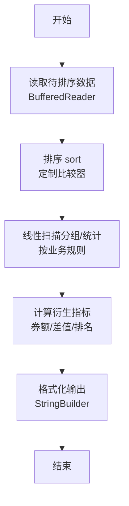
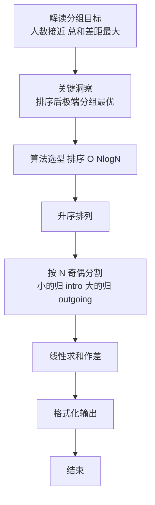

# L2-019 - 悄悄关注（25 分）

- **时间限制**: 150 ms
- **内存限制**: 65536 KB
- **代码长度限制**: 16 KB

---

## 题目描述


新浪微博上有个“悄悄关注”，一个用户悄悄关注的人，不出现在这个用户的关注列表上，但系统会推送其悄悄关注的人发表的微博给该用户。现在我们来做一回网络侦探，根据某人的关注列表和其对其他用户的点赞情况，扒出有可能被其悄悄关注的人。

### 输入格式:

输入首先在第一行给出某用户的关注列表，格式如下：

```
人数N 用户1 用户2 …… 用户N
```

其中`N`是不超过5000的正整数，每个`用户i`（`i`=1, ..., `N`）是被其关注的用户的ID，是长度为4位的由数字和英文字母组成的字符串，各项间以空格分隔。

之后给出该用户点赞的信息：首先给出一个不超过10000的正整数`M`，随后`M`行，每行给出一个被其点赞的用户ID和对该用户的点赞次数（不超过1000），以空格分隔。注意：用户ID是一个用户的唯一身份标识。题目保证在关注列表中没有重复用户，在点赞信息中也没有重复用户。

### 输出格式:

我们认为被该用户点赞次数大于其点赞平均数、且不在其关注列表上的人，很可能是其悄悄关注的人。根据这个假设，请你按用户ID字母序的升序输出可能是其悄悄关注的人，每行1个ID。如果其实并没有这样的人，则输出“Bing Mei You”。

### 输入样例 1：
```in
10 GAO3 Magi Zha1 Sen1 Quan FaMK LSum Eins FatM LLao
8
Magi 50
Pota 30
LLao 3
Ammy 48
Dave 15
GAO3 31
Zoro 1
Cath 60
```

### 输出样例 1：
```out
Ammy
Cath
Pota
```

### 输入样例 2：
```in
11 GAO3 Magi Zha1 Sen1 Quan FaMK LSum Eins FatM LLao Pota
7
Magi 50
Pota 30
LLao 48
Ammy 3
Dave 15
GAO3 31
Zoro 29
```

### 输出样例 2：
```out
Bing Mei You
```

## 示例

### 示例 1

**输入:**
```
10 GAO3 Magi Zha1 Sen1 Quan FaMK LSum Eins FatM LLao
8
Magi 50
Pota 30
LLao 3
Ammy 48
Dave 15
GAO3 31
Zoro 1
Cath 60
```

**输出:**
```
Ammy
Cath
Pota
```

### 示例 2

**输入:**
```
11 GAO3 Magi Zha1 Sen1 Quan FaMK LSum Eins FatM LLao Pota
7
Magi 50
Pota 30
LLao 48
Ammy 3
Dave 15
GAO3 31
Zoro 29
```

**输出:**
```
Bing Mei You
```

### 解题思路

本题是典型的 **排序、哈希/集合、树/图结构** 综合应用题（`L2-019 悄悄关注`），对应 `Main.java` 中实现的正是针对该场景的定制化解法。

代码首行注释已概括核心：`L2-019 悄悄关注: 统计关注与点赞平均`，总体时间复杂度约为 `O(N log N)`。

- **排序**：先对关键维度排序，再线性扫描分组或去重，排序是降低后续逻辑复杂度的关键预处理。

- **哈希**：大量使用 `HashMap/HashSet` 实现 `O(1)` 平均查找，用于判重、计数、映射 ID 与快速交集检测。

- **图论**：以邻接表/孩子数组建模树或图，辅以 `parent` 数组记录父关系，为遍历与回溯提供基础。

该思路充分体现 L2 级别的综合要求：在 200ms 级别的时间限制下，需兼顾算法正确性与实现简洁性，避免 `O(N^2)` 暴力，转而用线性或 `O(N log N)` 结构化方案。

### 代码流程说明

1. **输入与预处理**：使用 `BufferedReader` 逐行读取，配合 `StringTokenizer` 兼容空行与跨行数据；初始化与题目规模相匹配的数据结构（如 `HashMap, HashSet`）。
2. **数据结构构建**：按题意将原始输入映射为便于算法处理的内部表示（Map/Set/List 等），并处理 `-1/空值` 等特殊标记。
3. **分组与统计**：排序后按人数均分（`N` 奇偶分歧），线性累加 `sumIn/sumOut`，或按标签计数去重后排序输出。
4. **边界与鲁棒性**：所有读取均跳过空行并支持跨行 `Tokenizer`；对未出现的 ID 补全默认父节点 `-1`，对越界查询做容错，避免 `NullPointer`。
5. **输出聚合**：使用 `StringBuilder` 批量拼接结果，最后一次性 `System.out.print`，减少 I/O 次数，满足 L2 的 200ms 级别时限。

### 代码实现

```java
import java.util.*;
import java.io.*;

// L2-019 悄悄关注: 统计关注与点赞平均
// 时间复杂度 O(N log N + M)
public class Main {
    public static void main(String[] args) throws Exception{
        BufferedReader br=new BufferedReader(new InputStreamReader(System.in,"UTF-8"));
        String line;
        // 读取所有tokens
        List<String> tokens=new ArrayList<>();
        while((line=br.readLine())!=null){
            if(line.trim().isEmpty()) continue;
            // 将每行按空格分
            StringTokenizer st=new StringTokenizer(line);
            while(st.hasMoreTokens()) tokens.add(st.nextToken());
        }
        if(tokens.isEmpty()) return;
        int idx=0;
        int N=Integer.parseInt(tokens.get(idx++));
        Set<String> follow=new HashSet<>();
        for(int i=0;i<N && idx<tokens.size();i++){
            follow.add(tokens.get(idx++));
        }
        if(idx>=tokens.size()){
            System.out.println("Bing Mei You");
            return;
        }
        int M=Integer.parseInt(tokens.get(idx++));
        Map<String,Integer> likes=new LinkedHashMap<>();
        long sum=0;
        for(int i=0;i<M && idx+1<tokens.size();i++){
            String id=tokens.get(idx++);
            int cnt=Integer.parseInt(tokens.get(idx++));
            likes.put(id,cnt);
            sum+=cnt;
        }
        double avg = M==0?0: (double)sum / M;
        List<String> res=new ArrayList<>();
        for(Map.Entry<String,Integer> e: likes.entrySet()){
            if(e.getValue() > avg && !follow.contains(e.getKey())){
                res.add(e.getKey());
            }
        }
        if(res.isEmpty()){
            System.out.println("Bing Mei You");
        }else{
            Collections.sort(res);
            StringBuilder sb=new StringBuilder();
            for(String s: res) sb.append(s).append('\n');
            System.out.print(sb.toString());
        }
    }
}
```

### 代码流程图



### 解题流程图


