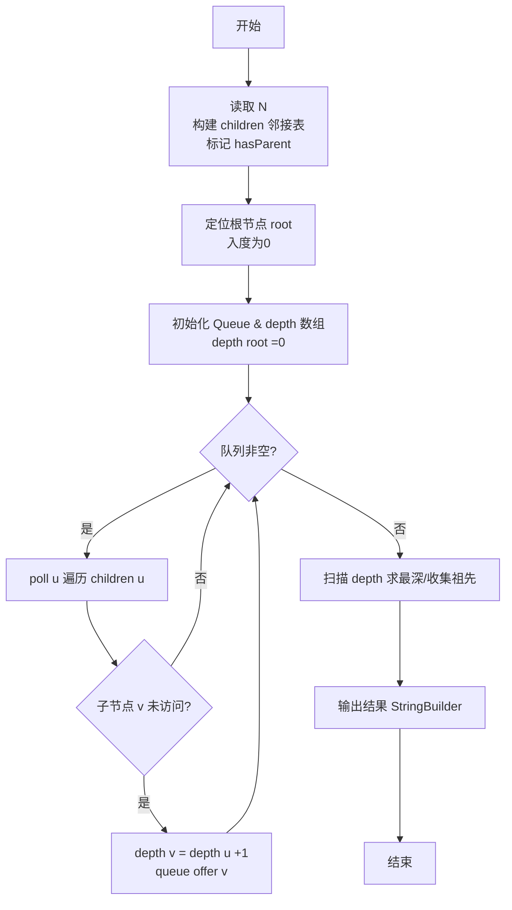
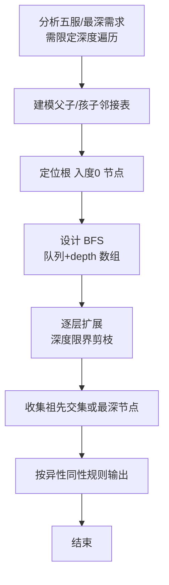

# L2-020 - 功夫传人（25 分）

- **时间限制**: 400 ms
- **内存限制**: 65536 KB
- **代码长度限制**: 16 KB

---

## 题目描述


一门武功能否传承久远并被发扬光大，是要看缘分的。一般来说，师傅传授给徒弟的武功总要打个折扣，于是越往后传，弟子们的功夫就越弱…… 直到某一支的某一代突然出现一个天分特别高的弟子（或者是吃到了灵丹、挖到了特别的秘笈），会将功夫的威力一下子放大N倍 —— 我们称这种弟子为“得道者”。

这里我们来考察某一位祖师爷门下的徒子徒孙家谱：假设家谱中的每个人只有1位师傅（除了祖师爷没有师傅）；每位师傅可以带很多徒弟；并且假设辈分严格有序，即祖师爷这门武功的每个第`i`代传人只能在第`i-1`代传人中拜1个师傅。我们假设已知祖师爷的功力值为`Z`，每向下传承一代，就会减弱`r%`，除非某一代弟子得道。现给出师门谱系关系，要求你算出所有得道者的功力总值。

### 输入格式:

输入在第一行给出3个正整数，分别是：$$N$$（$$\le 10^5$$）——整个师门的总人数（于是每个人从0到$$N-1$$编号，祖师爷的编号为0）；$$Z$$——祖师爷的功力值（不一定是整数，但起码是正数）；$$r$$ ——每传一代功夫所打的折扣百分比值（不超过100的正数）。接下来有$$N$$行，第$$i$$行（$$i=0, \cdots , N-1$$）描述编号为$$i$$的人所传的徒弟，格式为：

$$K_i$$ ID[1] ID[2] $$\cdots$$ ID[$$K_i$$]

其中$$K_i$$是徒弟的个数，后面跟的是各位徒弟的编号，数字间以空格间隔。$$K_i$$为零表示这是一位得道者，这时后面跟的一个数字表示其武功被放大的倍数。

### 输出格式:

在一行中输出所有得道者的功力总值，只保留其整数部分。题目保证输入和正确的输出都不超过$$10^{10}$$。

### 输入样例:
```in
10 18.0 1.00
3 2 3 5
1 9
1 4
1 7
0 7
2 6 1
1 8
0 9
0 4
0 3
```

### 输出样例:
```out
404
```

## 示例

### 示例 1

**输入:**
```
10 18.0 1.00
3 2 3 5
1 9
1 4
1 7
0 7
2 6 1
1 8
0 9
0 4
0 3
```

**输出:**
```
404
```

### 解题思路

本题是典型的 **DFS、BFS、树/图结构** 综合应用题（`L2-020 功夫传人`），对应 `Main.java` 中实现的正是针对该场景的定制化解法。

代码首行注释已概括核心：`L2-020 功夫传人: 树上DFS计算功力`，总体时间复杂度约为 `O(N log N)`。

- **DFS**：通过深度优先搜索递归/显式栈遍历整棵树或图，能够回溯记录路径，适合求最长链、判定连通分量与字典序比较。

- **BFS**：采用广度优先搜索逐层扩展，借助队列保证先访问浅层节点，天然适配最短路、层级遍历与限定深度祖先收集等需求。

- **图论**：以邻接表/孩子数组建模树或图，辅以 `parent` 数组记录父关系，为遍历与回溯提供基础。

该思路充分体现 L2 级别的综合要求：在 200ms 级别的时间限制下，需兼顾算法正确性与实现简洁性，避免 `O(N^2)` 暴力，转而用线性或 `O(N log N)` 结构化方案。

### 代码流程说明

1. **输入与预处理**：使用 `BufferedReader` 逐行读取，配合 `StringTokenizer` 兼容空行与跨行数据；初始化与题目规模相匹配的数据结构（如 `队列, 邻接表/孩子数组`）。
2. **建模建图**：根据输入的父子/边关系构建 `parent` 数组与 `children` 邻接表，标记 `hasParent/visited` 以定位根节点，并对子节点排序保证字典序。
3. **BFS 核心**：以根节点入队，维护 `depth/visited` 数组，队列 `poll` 逐层扩展，记录层次深度与最深节点/祖先集合。
4. **边界与鲁棒性**：所有读取均跳过空行并支持跨行 `Tokenizer`；对未出现的 ID 补全默认父节点 `-1`，对越界查询做容错，避免 `NullPointer`。
5. **输出聚合**：使用 `StringBuilder` 批量拼接结果，最后一次性 `System.out.print`，减少 I/O 次数，满足 L2 的 200ms 级别时限。

### 代码实现

```java
import java.util.*;
import java.io.*;

// L2-020 功夫传人: 树上DFS计算功力
// 时间复杂度 O(N)
public class Main {
    static class Node{
        List<Integer> children=new ArrayList<>();
        boolean isLeaf=false;
        int mult=0;
    }
    public static void main(String[] args) throws Exception{
        BufferedReader br=new BufferedReader(new InputStreamReader(System.in,"UTF-8"));
        String line;
        while((line=br.readLine())!=null && line.trim().isEmpty()){}
        if(line==null) return;
        StringTokenizer st=new StringTokenizer(line);
        int N=Integer.parseInt(st.nextToken());
        double Z=Double.parseDouble(st.nextToken());
        double r=Double.parseDouble(st.nextToken());
        double factor = 1 - r/100.0;
        Node[] nodes=new Node[N];
        for(int i=0;i<N;i++) nodes[i]=new Node();
        for(int i=0;i<N;i++){
            line=br.readLine();
            while(line!=null && line.trim().isEmpty()) line=br.readLine();
            if(line==null) break;
            st=new StringTokenizer(line);
            if(!st.hasMoreTokens()){ i--; continue; }
            int K=Integer.parseInt(st.nextToken());
            if(K==0){
                nodes[i].isLeaf=true;
                if(st.hasMoreTokens()) nodes[i].mult=Integer.parseInt(st.nextToken());
                else{
                    // 可能跨行
                    line=br.readLine();
                    if(line!=null) nodes[i].mult=Integer.parseInt(line.trim());
                }
            }else{
                List<Integer> list=new ArrayList<>();
                while(list.size()<K){
                    while(!st.hasMoreTokens()){
                        line=br.readLine();
                        if(line==null) break;
                        st=new StringTokenizer(line);
                    }
                    if(st.hasMoreTokens()) list.add(Integer.parseInt(st.nextToken()));
                }
                nodes[i].children=list;
            }
        }
        // BFS
        double total=0;
        Queue<Integer> q=new ArrayDeque<>();
        Queue<Double> pw=new ArrayDeque<>();
        q.offer(0); pw.offer(Z);
        // 为避免递归栈, 用队列
        boolean[] visited=new boolean[N];
        visited[0]=true;
        // 需要层次因子: 子节点功力 = 父功力 * factor
        // 但根的功力Z, 子代依次衰减
        // BFS中每层衰减一次，所以子功力 = 父功力*factor
        while(!q.isEmpty()){
            int u=q.poll();
            double power=pw.poll();
            Node nd=nodes[u];
            if(nd.isLeaf){
                total += power * nd.mult;
            }else{
                double childPower = power * factor;
                for(int v: nd.children){
                    if(!visited[v]){
                        visited[v]=true;
                        q.offer(v);
                        pw.offer(childPower);
                    }
                }
            }
        }
        // 也可能有未访问得道者? 但树保证连通
        System.out.println((long)total); // 截断整数
    }
}
```

### 代码流程图



### 解题流程图


