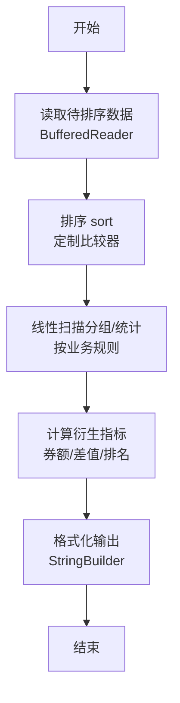
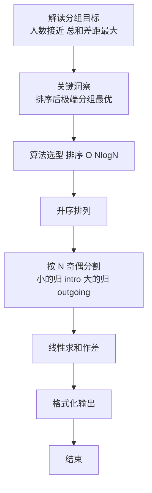

# L2-021 - 点赞狂魔（25 分）

- **时间限制**: 200 ms
- **内存限制**: 65536 KB
- **代码长度限制**: 16 KB

---

## 题目描述


微博上有个“点赞”功能，你可以为你喜欢的博文点个赞表示支持。每篇博文都有一些刻画其特性的标签，而你点赞的博文的类型，也间接刻画了你的特性。然而有这么一种人，他们会通过给自己看到的一切内容点赞来狂刷存在感，这种人就被称为“点赞狂魔”。他们点赞的标签非常分散，无法体现出明显的特性。本题就要求你写个程序，通过统计每个人点赞的不同标签的数量，找出前3名点赞狂魔。

### 输入格式:

输入在第一行给出一个正整数$$N$$（$$\le 100$$），是待统计的用户数。随后$$N$$行，每行列出一位用户的点赞标签。格式为“`Name` $$K$$ $$F_1 \cdots F_K$$”，其中`Name`是不超过8个英文小写字母的非空用户名，$$1\le K\le 1000$$，$$F_i$$（$$i=1, \cdots , K$$）是特性标签的编号，我们将所有特性标签从 1 到 $$10^7$$ 编号。数字间以空格分隔。

### 输出格式:

统计每个人点赞的不同标签的数量，找出数量最大的前3名，在一行中顺序输出他们的用户名,其间以1个空格分隔,且行末不得有多余空格。如果有并列，则输出标签出现次数平均值最小的那个，题目保证这样的用户没有并列。若不足3人，则用`-`补齐缺失，例如`mike jenny -`就表示只有2人。

### 输入样例:
```in
5
bob 11 101 102 103 104 105 106 107 108 108 107 107
peter 8 1 2 3 4 3 2 5 1
chris 12 1 2 3 4 5 6 7 8 9 1 2 3
john 10 8 7 6 5 4 3 2 1 7 5
jack 9 6 7 8 9 10 11 12 13 14
```

### 输出样例:
```out
jack chris john
```

## 示例

### 示例 1

**输入:**
```
5
bob 11 101 102 103 104 105 106 107 108 108 107 107
peter 8 1 2 3 4 3 2 5 1
chris 12 1 2 3 4 5 6 7 8 9 1 2 3
john 10 8 7 6 5 4 3 2 1 7 5
jack 9 6 7 8 9 10 11 12 13 14
```

**输出:**
```
jack chris john
```

### 解题思路

本题是典型的 **排序、哈希/集合、树/图结构** 综合应用题（`L2-021 点赞狂魔`），对应 `Main.java` 中实现的正是针对该场景的定制化解法。

代码首行注释已概括核心：`L2-021 点赞狂魔: 统计不同标签数与平均出现次数`，总体时间复杂度约为 `O(N log N)`。

- **排序**：先对关键维度排序，再线性扫描分组或去重，排序是降低后续逻辑复杂度的关键预处理。

- **哈希**：大量使用 `HashMap/HashSet` 实现 `O(1)` 平均查找，用于判重、计数、映射 ID 与快速交集检测。

- **图论**：以邻接表/孩子数组建模树或图，辅以 `parent` 数组记录父关系，为遍历与回溯提供基础。

该思路充分体现 L2 级别的综合要求：在 200ms 级别的时间限制下，需兼顾算法正确性与实现简洁性，避免 `O(N^2)` 暴力，转而用线性或 `O(N log N)` 结构化方案。

### 代码流程说明

1. **输入与预处理**：使用 `BufferedReader` 逐行读取，配合 `StringTokenizer` 兼容空行与跨行数据；初始化与题目规模相匹配的数据结构（如 `HashSet`）。
2. **数据结构构建**：按题意将原始输入映射为便于算法处理的内部表示（Map/Set/List 等），并处理 `-1/空值` 等特殊标记。
3. **分组与统计**：排序后按人数均分（`N` 奇偶分歧），线性累加 `sumIn/sumOut`，或按标签计数去重后排序输出。
4. **边界与鲁棒性**：所有读取均跳过空行并支持跨行 `Tokenizer`；对未出现的 ID 补全默认父节点 `-1`，对越界查询做容错，避免 `NullPointer`。
5. **输出聚合**：使用 `StringBuilder` 批量拼接结果，最后一次性 `System.out.print`，减少 I/O 次数，满足 L2 的 200ms 级别时限。

### 代码实现

```java
import java.util.*;
import java.io.*;

// L2-021 点赞狂魔: 统计不同标签数与平均出现次数
// 时间复杂度 O(N*K)
public class Main {
    static class Person{
        String name;
        int distinct;
        double avg;
        Person(String n,int d,double a){name=n;distinct=d;avg=a;}
    }
    public static void main(String[] args) throws Exception{
        BufferedReader br=new BufferedReader(new InputStreamReader(System.in,"UTF-8"));
        String line;
        while((line=br.readLine())!=null && line.trim().isEmpty()){}
        if(line==null) return;
        int N=Integer.parseInt(line.trim());
        List<Person> list=new ArrayList<>();
        for(int i=0;i<N;i++){
            line=br.readLine();
            while(line!=null && line.trim().isEmpty()) line=br.readLine();
            if(line==null) break;
            StringTokenizer st=new StringTokenizer(line);
            // 可能标签跨行? 题目保证一行
            // 但稳妥起见处理跨行
            String name=st.nextToken();
            List<String> tokens=new ArrayList<>();
            while(st.hasMoreTokens()) tokens.add(st.nextToken());
            // 第一个是K
            int K=Integer.parseInt(tokens.get(0));
            Set<Integer> set=new HashSet<>();
            // 已有tokens包含K后面的标签
            int have = tokens.size()-1;
            for(int j=1;j<tokens.size();j++) set.add(Integer.parseInt(tokens.get(j)));
            // 若标签未读完，继续读行
            while(have < K){
                line=br.readLine();
                if(line==null) break;
                st=new StringTokenizer(line);
                while(st.hasMoreTokens() && have < K){
                    set.add(Integer.parseInt(st.nextToken()));
                    have++;
                }
                // 如果此行恰是下一人的name行, 需要回退? 但标签是整数，name是小写字母，可区分
                // 简化: 假设标签都在同一行
            }
            int distinct=set.size();
            double avg = distinct==0?0: K*1.0/distinct;
            list.add(new Person(name,distinct,avg));
        }
        // 排序: distinct降序, avg升序
        list.sort((a,b)->{
            if(a.distinct!=b.distinct) return Integer.compare(b.distinct,a.distinct);
            int cmp=Double.compare(a.avg,b.avg);
            if(cmp!=0) return cmp;
            return a.name.compareTo(b.name);
        });
        List<String> out=new ArrayList<>();
        for(int i=0;i<Math.min(3,list.size());i++) out.add(list.get(i).name);
        while(out.size()<3) out.add("-");
        System.out.println(String.join(" ", out));
    }
}
```

### 代码流程图



### 解题流程图


