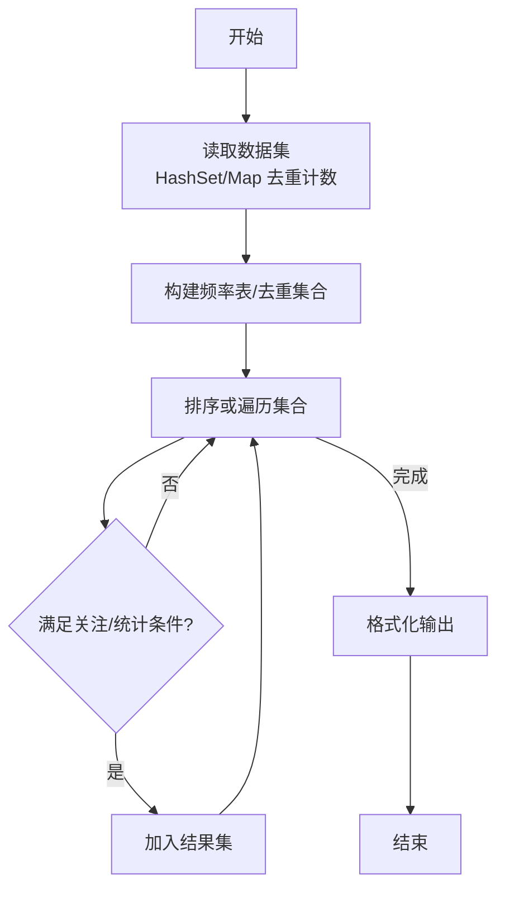
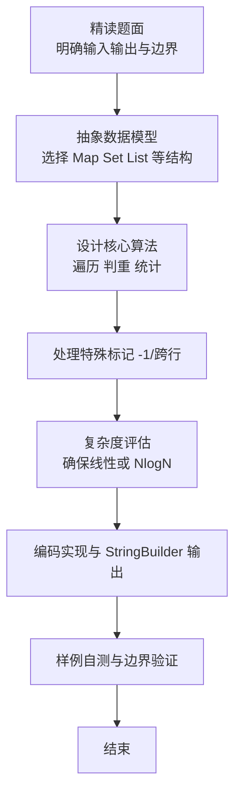

# L2-022 - 重排链表（25 分）

- **时间限制**: 500 ms
- **内存限制**: 65536 KB
- **代码长度限制**: 16 KB

---

## 题目描述


给定一个单链表 $$L_1$$→$$L_2$$→$$\cdots$$→$$L_{n-1}$$→$$L_n$$，请编写程序将链表重新排列为 $$L_n$$→$$L_1$$→$$L_{n-1}$$→$$L_2$$→$$\cdots$$。例如：给定$$L$$为1→2→3→4→5→6，则输出应该为6→1→5→2→4→3。

### 输入格式:

每个输入包含1个测试用例。每个测试用例第1行给出第1个结点的地址和结点总个数，即正整数$$N$$ ($$\le 10^5$$)。结点的地址是5位非负整数，NULL地址用$$-1$$表示。

接下来有$$N$$行，每行格式为：

```
Address Data Next
```

其中`Address`是结点地址；`Data`是该结点保存的数据，为不超过$$10^5$$的正整数；`Next`是下一结点的地址。题目保证给出的链表上至少有两个结点。

### 输出格式:

对每个测试用例，顺序输出重排后的结果链表，其上每个结点占一行，格式与输入相同。

### 输入样例:
```in
00100 6
00000 4 99999
00100 1 12309
68237 6 -1
33218 3 00000
99999 5 68237
12309 2 33218
```

### 输出样例:
```out
68237 6 00100
00100 1 99999
99999 5 12309
12309 2 00000
00000 4 33218
33218 3 -1
```

## 示例

### 示例 1

**输入:**
```
00100 6
00000 4 99999
00100 1 12309
68237 6 -1
33218 3 00000
99999 5 68237
12309 2 33218
```

**输出:**
```
68237 6 00100
00100 1 99999
99999 5 12309
12309 2 00000
00000 4 33218
33218 3 -1
```

### 解题思路

本题是典型的 **哈希/集合、树/图结构** 综合应用题（`L2-022 重排链表`），对应 `Main.java` 中实现的正是针对该场景的定制化解法。

代码首行注释已概括核心：`L2-022 重排链表: 链表重排 Ln->L1->Ln-1->L2...`，总体时间复杂度约为 `O(N log N)`。

- **哈希**：大量使用 `HashMap/HashSet` 实现 `O(1)` 平均查找，用于判重、计数、映射 ID 与快速交集检测。

- **图论**：以邻接表/孩子数组建模树或图，辅以 `parent` 数组记录父关系，为遍历与回溯提供基础。

该思路充分体现 L2 级别的综合要求：在 200ms 级别的时间限制下，需兼顾算法正确性与实现简洁性，避免 `O(N^2)` 暴力，转而用线性或 `O(N log N)` 结构化方案。

### 代码流程说明

1. **输入与预处理**：使用 `BufferedReader` 逐行读取，配合 `StringTokenizer` 兼容空行与跨行数据；初始化与题目规模相匹配的数据结构（如 `HashMap, HashSet`）。
2. **数据结构构建**：按题意将原始输入映射为便于算法处理的内部表示（Map/Set/List 等），并处理 `-1/空值` 等特殊标记。
3. **核心算法执行**：在 `Main.java` 的主循环中按题面规则迭代处理，利用哈希快速判重与集合交集，完成题目逻辑判定（如五服校验、图着色冲突检测等）。
4. **边界与鲁棒性**：所有读取均跳过空行并支持跨行 `Tokenizer`；对未出现的 ID 补全默认父节点 `-1`，对越界查询做容错，避免 `NullPointer`。
5. **输出聚合**：使用 `StringBuilder` 批量拼接结果，最后一次性 `System.out.print`，减少 I/O 次数，满足 L2 的 200ms 级别时限。

### 代码实现

```java
import java.util.*;
import java.io.*;

// L2-022 重排链表: 链表重排 Ln->L1->Ln-1->L2...
// 时间复杂度 O(N)
public class Main {
    static class Node{
        int addr;
        int data;
        int next;
        Node(int a,int d,int n){addr=a;data=d;next=n;}
    }
    public static void main(String[] args) throws Exception{
        BufferedReader br=new BufferedReader(new InputStreamReader(System.in,"UTF-8"));
        String line;
        while((line=br.readLine())!=null && line.trim().isEmpty()){}
        if(line==null) return;
        StringTokenizer st=new StringTokenizer(line);
        String firstAddrStr=st.nextToken();
        int firstAddr = Integer.parseInt(firstAddrStr);
        int N=Integer.parseInt(st.nextToken());
        Map<Integer, Node> map=new HashMap<>();
        for(int i=0;i<N;i++){
            line=br.readLine();
            while(line!=null && line.trim().isEmpty()) line=br.readLine();
            if(line==null) break;
            st=new StringTokenizer(line);
            int addr=Integer.parseInt(st.nextToken());
            int data=Integer.parseInt(st.nextToken());
            int nxt=Integer.parseInt(st.nextToken());
            map.put(addr,new Node(addr,data,nxt));
        }
        // 重建链表顺序
        List<Node> seq=new ArrayList<>();
        int cur=firstAddr;
        Set<Integer> visited=new HashSet<>();
        while(cur!=-1 && map.containsKey(cur) && !visited.contains(cur)){
            Node nd=map.get(cur);
            seq.add(nd);
            visited.add(cur);
            cur=nd.next;
        }
        int L=seq.size();
        List<Node> reordered=new ArrayList<>();
        int l=0,r=L-1;
        while(l<r){
            reordered.add(seq.get(r));
            reordered.add(seq.get(l));
            l++; r--;
        }
        if(l==r) reordered.add(seq.get(l));
        StringBuilder sb=new StringBuilder();
        for(int i=0;i<reordered.size();i++){
            Node nd=reordered.get(i);
            int nextAddr = (i+1<reordered.size()) ? reordered.get(i+1).addr : -1;
            String curAddrStr = String.format("%05d", nd.addr);
            String nextStr = nextAddr==-1? "-1" : String.format("%05d", nextAddr);
            sb.append(curAddrStr).append(' ').append(nd.data).append(' ').append(nextStr);
            if(i+1<reordered.size()) sb.append('\n');
        }
        System.out.print(sb.toString());
    }
}
```

### 代码流程图



### 解题流程图


