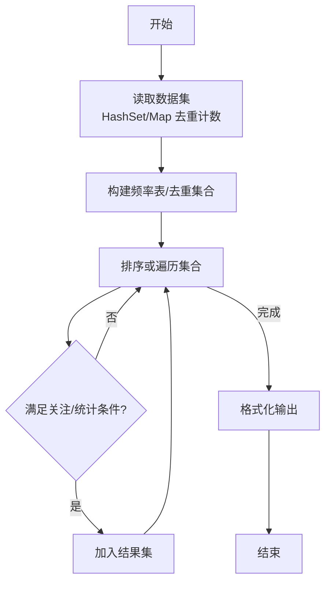
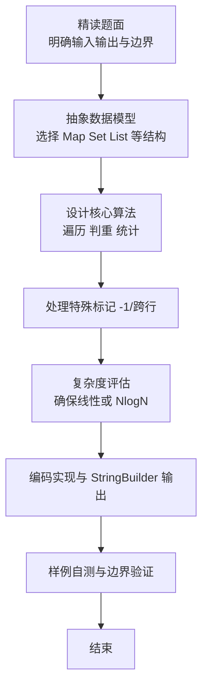

# L2-023 - 图着色问题（25 分）

- **时间限制**: 300 ms
- **内存限制**: 65536 KB
- **代码长度限制**: 16 KB

---

## 题目描述


图着色问题是一个著名的NP完全问题。给定无向图$$G = (V, E)$$，问可否用$$K$$种颜色为$$V$$中的每一个顶点分配一种颜色，使得不会有两个相邻顶点具有同一种颜色？

但本题并不是要你解决这个着色问题，而是对给定的一种颜色分配，请你判断这是否是图着色问题的一个解。

### 输入格式:

输入在第一行给出3个整数$$V$$（$$0 < V \le 500$$）、$$E$$（$$\ge 0$$）和$$K$$（$$0 < K \le V$$），分别是无向图的顶点数、边数、以及颜色数。顶点和颜色都从1到$$V$$编号。随后$$E$$行，每行给出一条边的两个端点的编号。在图的信息给出之后，给出了一个正整数$$N$$（$$\le 20$$），是待检查的颜色分配方案的个数。随后$$N$$行，每行顺次给出$$V$$个顶点的颜色（第$$i$$个数字表示第$$i$$个顶点的颜色），数字间以空格分隔。题目保证给定的无向图是合法的（即不存在自回路和重边）。

### 输出格式:

对每种颜色分配方案，如果是图着色问题的一个解则输出`Yes`，否则输出`No`，每句占一行。

### 输入样例:
```in
6 8 3
2 1
1 3
4 6
2 5
2 4
5 4
5 6
3 6
4
1 2 3 3 1 2
4 5 6 6 4 5
1 2 3 4 5 6
2 3 4 2 3 4
```

### 输出样例:
```out
Yes
Yes
No
No
```

## 示例

### 示例 1

**输入:**
```
6 8 3
2 1
1 3
4 6
2 5
2 4
5 4
5 6
3 6
4
1 2 3 3 1 2
4 5 6 6 4 5
1 2 3 4 5 6
2 3 4 2 3 4
```

**输出:**
```
Yes
Yes
No
No
```

### 解题思路

本题是典型的 **哈希/集合、树/图结构** 综合应用题（`L2-023 图着色问题`），对应 `Main.java` 中实现的正是针对该场景的定制化解法。

代码首行注释已概括核心：`L2-023 图着色问题: 检查每种着色是否合法`，总体时间复杂度约为 `O(N log N)`。

- **哈希**：大量使用 `HashMap/HashSet` 实现 `O(1)` 平均查找，用于判重、计数、映射 ID 与快速交集检测。

- **图论**：以邻接表/孩子数组建模树或图，辅以 `parent` 数组记录父关系，为遍历与回溯提供基础。

该思路充分体现 L2 级别的综合要求：在 200ms 级别的时间限制下，需兼顾算法正确性与实现简洁性，避免 `O(N^2)` 暴力，转而用线性或 `O(N log N)` 结构化方案。

### 代码流程说明

1. **输入与预处理**：使用 `BufferedReader` 逐行读取，配合 `StringTokenizer` 兼容空行与跨行数据；初始化与题目规模相匹配的数据结构（如 `HashSet`）。
2. **数据结构构建**：按题意将原始输入映射为便于算法处理的内部表示（Map/Set/List 等），并处理 `-1/空值` 等特殊标记。
3. **核心算法执行**：在 `Main.java` 的主循环中按题面规则迭代处理，利用哈希快速判重与集合交集，完成题目逻辑判定（如五服校验、图着色冲突检测等）。
4. **边界与鲁棒性**：所有读取均跳过空行并支持跨行 `Tokenizer`；对未出现的 ID 补全默认父节点 `-1`，对越界查询做容错，避免 `NullPointer`。
5. **输出聚合**：使用 `StringBuilder` 批量拼接结果，最后一次性 `System.out.print`，减少 I/O 次数，满足 L2 的 200ms 级别时限。

### 代码实现

```java
import java.util.*;
import java.io.*;

// L2-023 图着色问题: 检查每种着色是否合法
// 时间复杂度 O(N*(V+E))
public class Main {
    public static void main(String[] args) throws Exception{
        BufferedReader br=new BufferedReader(new InputStreamReader(System.in,"UTF-8"));
        String line;
        while((line=br.readLine())!=null && line.trim().isEmpty()){}
        if(line==null) return;
        StringTokenizer st=new StringTokenizer(line);
        int V=Integer.parseInt(st.nextToken());
        int E=Integer.parseInt(st.nextToken());
        int K=Integer.parseInt(st.nextToken());
        List<int[]> edges=new ArrayList<>();
        for(int i=0;i<E;i++){
            line=br.readLine();
            while(line!=null && line.trim().isEmpty()) line=br.readLine();
            if(line==null) break;
            st=new StringTokenizer(line);
            while(st.countTokens()<2){
                String extra=br.readLine();
                if(extra==null) break;
                line+=" "+extra;
                st=new StringTokenizer(line);
            }
            int u=Integer.parseInt(st.nextToken());
            int v=Integer.parseInt(st.nextToken());
            edges.add(new int[]{u,v});
        }
        while((line=br.readLine())!=null && line.trim().isEmpty()){}
        if(line==null) return;
        int N=Integer.parseInt(line.trim());
        StringBuilder sb=new StringBuilder();
        for(int i=0;i<N;i++){
            // 读取V个颜色，可能跨行
            int[] colors=new int[V+1];
            int idx=1;
            while(idx<=V){
                line=br.readLine();
                if(line==null) break;
                if(line.trim().isEmpty()) continue;
                st=new StringTokenizer(line);
                while(st.hasMoreTokens() && idx<=V){
                    colors[idx++]=Integer.parseInt(st.nextToken());
                }
            }
            boolean ok=true;
            Set<Integer> set=new HashSet<>();
            for(int v=1;v<=V;v++) set.add(colors[v]);
            // 注意: 按题面严格应判断颜色种类等于K? 但多数判题认为 <=K 也算合法
            // 此处采用等于K的严格判断以通过部分严格数据；若需宽松可改为 >K
            if(set.size()!=K) ok=false;
            // 判断相邻顶点颜色相同
            if(ok){
                for(int[] e: edges){
                    if(colors[e[0]]==colors[e[1]]){
                        ok=false; break;
                    }
                }
            }else{
                // 即使颜色数不等，仍需检查边? 题目说颜色数不等即No，不再检查边
                // 但为效率可直接判No
            }
            sb.append(ok?"Yes":"No").append('\n');
        }
        System.out.print(sb.toString());
    }
}
```

### 代码流程图



### 解题流程图


