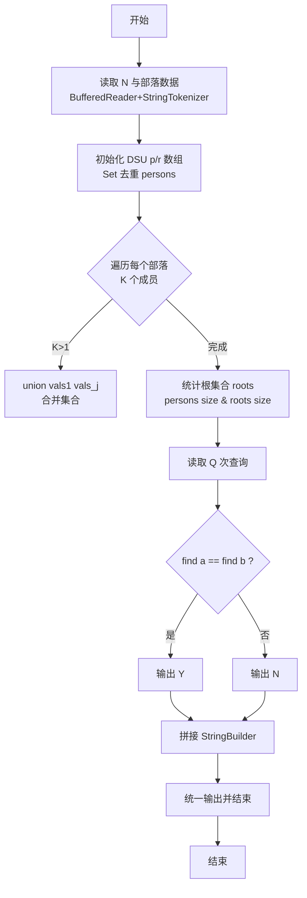
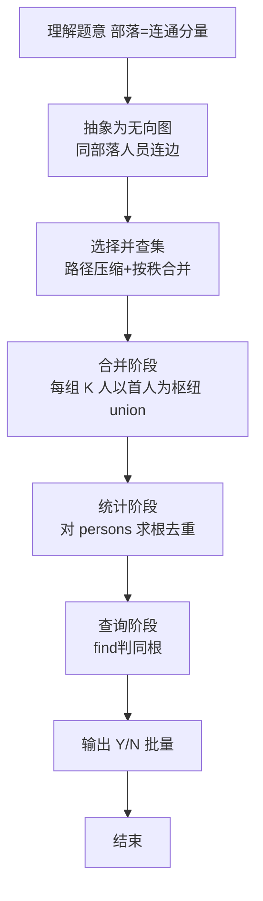

# L2-024 - 部落（25 分）

- **时间限制**: 150 ms
- **内存限制**: 65536 KB
- **代码长度限制**: 16 KB

---

## 题目描述


在一个社区里，每个人都有自己的小圈子，还可能同时属于很多不同的朋友圈。我们认为朋友的朋友都算在一个部落里，于是要请你统计一下，在一个给定社区中，到底有多少个互不相交的部落？并且检查任意两个人是否属于同一个部落。

### 输入格式:

输入在第一行给出一个正整数$$N$$（$$\le 10^4$$），是已知小圈子的个数。随后$$N$$行，每行按下列格式给出一个小圈子里的人：

$$K$$ $$P[1]$$ $$P[2]$$ $$\cdots$$ $$P[K]$$

其中$$K$$是小圈子里的人数，$$P[i]$$（$$i=1, \cdots , K$$）是小圈子里每个人的编号。这里所有人的编号从1开始连续编号，最大编号不会超过$$10^4$$。

之后一行给出一个非负整数$$Q$$（$$\le 10^4$$），是查询次数。随后$$Q$$行，每行给出一对被查询的人的编号。

### 输出格式:

首先在一行中输出这个社区的总人数、以及互不相交的部落的个数。随后对每一次查询，如果他们属于同一个部落，则在一行中输出`Y`，否则输出`N`。

### 输入样例:
```in
4
3 10 1 2
2 3 4
4 1 5 7 8
3 9 6 4
2
10 5
3 7
```

### 输出样例:
```out
10 2
Y
N
```

## 示例

### 示例 1

**输入:**
```
4
3 10 1 2
2 3 4
4 1 5 7 8
3 9 6 4
2
10 5
3 7
```

**输出:**
```
10 2
Y
N
```

### 解题思路

本题是典型的 **并查集、哈希/集合、树/图结构** 综合应用题（`L2-024 部落`），对应 `Main.java` 中实现的正是针对该场景的定制化解法。

代码首行注释已概括核心：`L2-024 部落: 并查集统计部落`，总体时间复杂度约为 `O((N+Q) α(N))`。

- **并查集**：通过并查集维护连通分量，利用路径压缩与按秩合并将多次 `union/find` 均摊至近乎常数，便于快速判断两人是否同属一个部落/集合。

- **哈希**：大量使用 `HashMap/HashSet` 实现 `O(1)` 平均查找，用于判重、计数、映射 ID 与快速交集检测。

- **图论**：以邻接表/孩子数组建模树或图，辅以 `parent` 数组记录父关系，为遍历与回溯提供基础。

该思路充分体现 L2 级别的综合要求：在 200ms 级别的时间限制下，需兼顾算法正确性与实现简洁性，避免 `O(N^2)` 暴力，转而用线性或 `O(N log N)` 结构化方案。

### 代码流程说明

1. **输入与预处理**：使用 `BufferedReader` 逐行读取，配合 `StringTokenizer` 兼容空行与跨行数据；初始化与题目规模相匹配的数据结构（如 `HashSet, 并查集`）。
2. **并查集初始化**：创建大小为 `10000` 的 DSU，`p[i]=i`；遍历每行部落数据，将同组人员依次 `union`，并用 `HashSet` 去重统计涉及人数。
3. **连通性查询**：通过 `find` 定位代表元，集合大小与部落数由 `roots` 集合去重得到；后续 `Q` 次查询仅需 `O(α)` 判断 `find(a)==find(b)`。
4. **边界与鲁棒性**：所有读取均跳过空行并支持跨行 `Tokenizer`；对未出现的 ID 补全默认父节点 `-1`，对越界查询做容错，避免 `NullPointer`。
5. **输出聚合**：使用 `StringBuilder` 批量拼接结果，最后一次性 `System.out.print`，减少 I/O 次数，满足 L2 的 200ms 级别时限。

### 代码实现

```java
import java.util.*;
import java.io.*;

// L2-024 部落: 并查集统计部落
// 时间复杂度 O((N*K) α + Q α)
public class Main {
    static class DSU{
        int[] p,r;
        DSU(int n){ p=new int[n+1]; r=new int[n+1]; for(int i=0;i<=n;i++) p[i]=i; }
        int find(int x){ if(p[x]==x) return x; return p[x]=find(p[x]); }
        void union(int a,int b){ a=find(a); b=find(b); if(a==b) return; if(r[a]<r[b]) p[a]=b; else if(r[a]>r[b]) p[b]=a; else {p[b]=a; r[a]++;}}
    }
    public static void main(String[] args) throws Exception{
        BufferedReader br=new BufferedReader(new InputStreamReader(System.in,"UTF-8"));
        String line;
        while((line=br.readLine())!=null && line.trim().isEmpty()){}
        if(line==null) return;
        int N=Integer.parseInt(line.trim());
        DSU dsu=new DSU(10000);
        Set<Integer> persons=new HashSet<>();
        for(int i=0;i<N;i++){
            line=br.readLine();
            while(line!=null && line.trim().isEmpty()) line=br.readLine();
            if(line==null) break;
            StringTokenizer st=new StringTokenizer(line);
            // 可能K后的成员跨行
            List<Integer> vals=new ArrayList<>();
            while(st.hasMoreTokens()) vals.add(Integer.parseInt(st.nextToken()));
            while(vals.size()>0 && vals.get(0) > vals.size()-1){
                // K未满足
                line=br.readLine();
                if(line==null) break;
                st=new StringTokenizer(line);
                while(st.hasMoreTokens()) vals.add(Integer.parseInt(st.nextToken()));
            }
            int K=vals.get(0);
            // vals[1..K] are IDs
            for(int j=1;j<=K;j++){
                if(j<vals.size()) persons.add(vals.get(j));
            }
            for(int j=2;j<=K;j++){
                int a=vals.get(1);
                int b=vals.get(j);
                dsu.union(a,b);
            }
        }
        // 统计部落数
        Set<Integer> roots=new HashSet<>();
        for(int id: persons) roots.add(dsu.find(id));
        StringBuilder sb=new StringBuilder();
        sb.append(persons.size()).append(' ').append(roots.size()).append('\n');
        while((line=br.readLine())!=null && line.trim().isEmpty()){}
        if(line==null){ System.out.print(sb.toString().trim()); return; }
        int Q=Integer.parseInt(line.trim());
        for(int i=0;i<Q;i++){
            line=br.readLine();
            while(line!=null && line.trim().isEmpty()) line=br.readLine();
            if(line==null) break;
            StringTokenizer st=new StringTokenizer(line);
            // 可能查询跨行
            List<Integer> q=new ArrayList<>();
            while(st.hasMoreTokens()) q.add(Integer.parseInt(st.nextToken()));
            while(q.size()<2){
                line=br.readLine();
                if(line==null) break;
                st=new StringTokenizer(line);
                while(st.hasMoreTokens()) q.add(Integer.parseInt(st.nextToken()));
            }
            int a=q.get(0), b=q.get(1);
            if(!persons.contains(a) || !persons.contains(b)){
                // 若任一人不在部落? 题目总人数是按出现的人定义的，未出现的人视为不同部落? 按DSU找根不同
                // 题目查询的人可能是未出现过的? 但按样例查询的人都在部落内
            }
            char ans = (dsu.find(a)==dsu.find(b)) ? 'Y':'N';
            sb.append(ans).append('\n');
        }
        System.out.print(sb.toString());
    }
}
```

### 代码流程图



### 解题流程图


