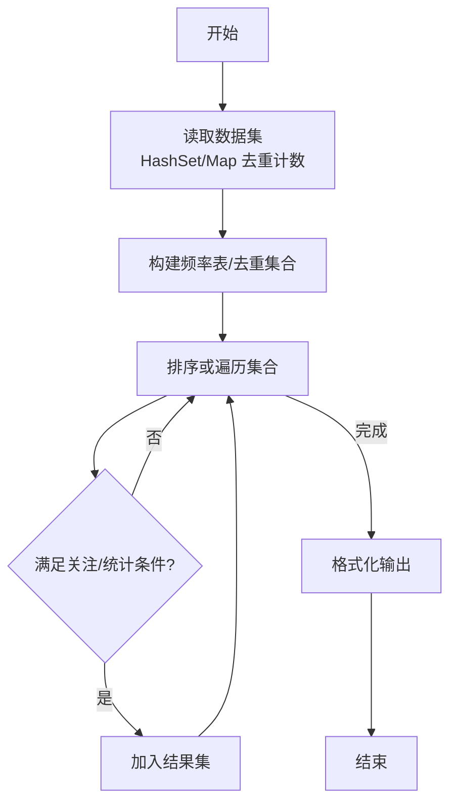
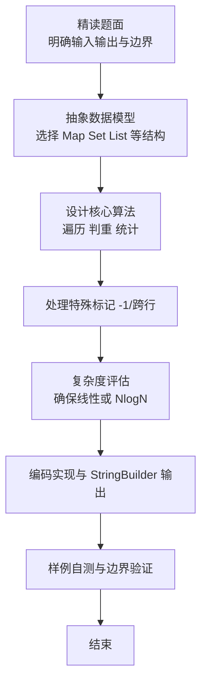

# L2-025 - 分而治之（25 分）

- **时间限制**: 600 ms
- **内存限制**: 65536 KB
- **代码长度限制**: 16 KB

---

## 题目描述


分而治之，各个击破是兵家常用的策略之一。在战争中，我们希望首先攻下敌方的部分城市，使其剩余的城市变成孤立无援，然后再分头各个击破。为此参谋部提供了若干打击方案。本题就请你编写程序，判断每个方案的可行性。

### 输入格式:

输入在第一行给出两个正整数 N 和 M（均不超过10 000），分别为敌方城市个数（于是默认城市从 1 到 N 编号）和连接两城市的通路条数。随后 M 行，每行给出一条通路所连接的两个城市的编号，其间以一个空格分隔。在城市信息之后给出参谋部的系列方案，即一个正整数 K （$$\le$$ 100）和随后的 K 行方案，每行按以下格式给出：

```
Np v[1] v[2] ... v[Np]
```

其中 `Np` 是该方案中计划攻下的城市数量，后面的系列 `v[i]` 是计划攻下的城市编号。

### 输出格式:

对每一套方案，如果可行就输出`YES`，否则输出`NO`。

### 输入样例:
```in
10 11
8 7
6 8
4 5
8 4
8 1
1 2
1 4
9 8
9 1
1 10
2 4
5
4 10 3 8 4
6 6 1 7 5 4 9
3 1 8 4
2 2 8
7 9 8 7 6 5 4 2
```

### 输出样例:
```out
NO
YES
YES
NO
NO
```

## 示例

### 示例 1

**输入:**
```
10 11
8 7
6 8
4 5
8 4
8 1
1 2
1 4
9 8
9 1
1 10
2 4
5
4 10 3 8 4
6 6 1 7 5 4 9
3 1 8 4
2 2 8
7 9 8 7 6 5 4 2
```

**输出:**
```
NO
YES
YES
NO
NO
```

### 解题思路

本题是典型的 **哈希/集合、树/图结构** 综合应用题（`L2-025 分而治之`），对应 `Main.java` 中实现的正是针对该场景的定制化解法。

代码首行注释已概括核心：`L2-025 分而治之: 判断是否为点覆盖使剩余图无边`，总体时间复杂度约为 `O(N log N)`。

- **哈希**：大量使用 `HashMap/HashSet` 实现 `O(1)` 平均查找，用于判重、计数、映射 ID 与快速交集检测。

- **图论**：以邻接表/孩子数组建模树或图，辅以 `parent` 数组记录父关系，为遍历与回溯提供基础。

该思路充分体现 L2 级别的综合要求：在 200ms 级别的时间限制下，需兼顾算法正确性与实现简洁性，避免 `O(N^2)` 暴力，转而用线性或 `O(N log N)` 结构化方案。

### 代码流程说明

1. **输入与预处理**：使用 `BufferedReader` 逐行读取，配合 `StringTokenizer` 兼容空行与跨行数据；初始化与题目规模相匹配的数据结构（如 `HashSet`）。
2. **数据结构构建**：按题意将原始输入映射为便于算法处理的内部表示（Map/Set/List 等），并处理 `-1/空值` 等特殊标记。
3. **核心算法执行**：在 `Main.java` 的主循环中按题面规则迭代处理，利用哈希快速判重与集合交集，完成题目逻辑判定（如五服校验、图着色冲突检测等）。
4. **边界与鲁棒性**：所有读取均跳过空行并支持跨行 `Tokenizer`；对未出现的 ID 补全默认父节点 `-1`，对越界查询做容错，避免 `NullPointer`。
5. **输出聚合**：使用 `StringBuilder` 批量拼接结果，最后一次性 `System.out.print`，减少 I/O 次数，满足 L2 的 200ms 级别时限。

### 代码实现

```java
import java.util.*;
import java.io.*;

// L2-025 分而治之: 判断是否为点覆盖使剩余图无边
// 时间复杂度 O(K*(M + Np))
public class Main {
    public static void main(String[] args) throws Exception{
        BufferedReader br=new BufferedReader(new InputStreamReader(System.in,"UTF-8"));
        String line;
        while((line=br.readLine())!=null && line.trim().isEmpty()){}
        if(line==null) return;
        StringTokenizer st=new StringTokenizer(line);
        // 保证读到N M
        List<Integer> first=new ArrayList<>();
        while(st.hasMoreTokens()) first.add(Integer.parseInt(st.nextToken()));
        while(first.size()<2){
            line=br.readLine();
            if(line==null) break;
            st=new StringTokenizer(line);
            while(st.hasMoreTokens()) first.add(Integer.parseInt(st.nextToken()));
        }
        int N=first.get(0), M=first.get(1);
        List<int[]> edges=new ArrayList<>();
        for(int i=0;i<M;i++){
            line=br.readLine();
            while(line!=null && line.trim().isEmpty()) line=br.readLine();
            if(line==null) break;
            st=new StringTokenizer(line);
            while(st.countTokens()<2){
                String extra=br.readLine();
                if(extra==null) break;
                line+=" "+extra;
                st=new StringTokenizer(line);
            }
            int u=Integer.parseInt(st.nextToken());
            int v=Integer.parseInt(st.nextToken());
            edges.add(new int[]{u,v});
        }
        while((line=br.readLine())!=null && line.trim().isEmpty()){}
        if(line==null) return;
        int K=Integer.parseInt(line.trim());
        StringBuilder sb=new StringBuilder();
        for(int i=0;i<K;i++){
            line=br.readLine();
            while(line!=null && line.trim().isEmpty()) line=br.readLine();
            if(line==null) break;
            st=new StringTokenizer(line);
            List<Integer> vals=new ArrayList<>();
            while(st.hasMoreTokens()) vals.add(Integer.parseInt(st.nextToken()));
            // 可能跨行
            int Np=vals.get(0);
            while(vals.size()-1 < Np){
                line=br.readLine();
                if(line==null) break;
                st=new StringTokenizer(line);
                while(st.hasMoreTokens()) vals.add(Integer.parseInt(st.nextToken()));
            }
            Set<Integer> attacked=new HashSet<>();
            for(int j=1;j<=Np && j<vals.size();j++) attacked.add(vals.get(j));
            boolean ok=true;
            for(int[] e: edges){
                if(!attacked.contains(e[0]) && !attacked.contains(e[1])){
                    ok=false; break;
                }
            }
            sb.append(ok?"YES":"NO").append('\n');
        }
        System.out.print(sb.toString());
    }
}
```

### 代码流程图



### 解题流程图


