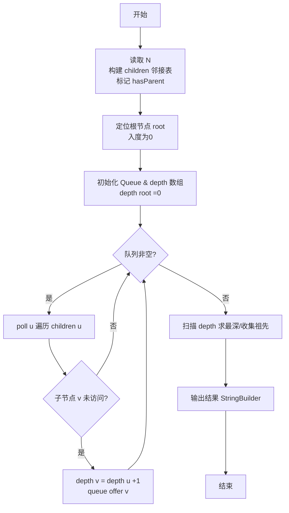
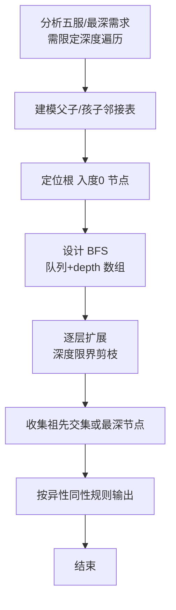

# L2-026 - 小字辈（25 分）

- **时间限制**: 400 ms
- **内存限制**: 65536 KB
- **代码长度限制**: 16 KB

---

## 题目描述


本题给定一个庞大家族的家谱，要请你给出最小一辈的名单。

### 输入格式:

输入在第一行给出家族人口总数 N（不超过 100 000 的正整数） —— 简单起见，我们把家族成员从 1 到 N 编号。随后第二行给出 N 个编号，其中第 i 个编号对应第 i 位成员的父/母。家谱中辈分最高的老祖宗对应的父/母编号为 -1。一行中的数字间以空格分隔。

### 输出格式:

首先输出最小的辈分（老祖宗的辈分为 1，以下逐级递增）。然后在第二行按递增顺序输出辈分最小的成员的编号。编号间以一个空格分隔，行首尾不得有多余空格。

### 输入样例:
```in
9
2 6 5 5 -1 5 6 4 7
```

### 输出样例:
```out
4
1 9
```

## 示例

### 示例 1

**输入:**
```
9
2 6 5 5 -1 5 6 4 7
```

**输出:**
```
4
1 9
```

### 解题思路

本题是典型的 **BFS、排序、树/图结构** 综合应用题（`L2-026 小字辈`），对应 `Main.java` 中实现的正是针对该场景的定制化解法。

代码首行注释已概括核心：`L2-026 小字辈: 找最深叶子, BFS层序`，总体时间复杂度约为 `O(N log N)`。

- **BFS**：采用广度优先搜索逐层扩展，借助队列保证先访问浅层节点，天然适配最短路、层级遍历与限定深度祖先收集等需求。

- **排序**：先对关键维度排序，再线性扫描分组或去重，排序是降低后续逻辑复杂度的关键预处理。

- **图论**：以邻接表/孩子数组建模树或图，辅以 `parent` 数组记录父关系，为遍历与回溯提供基础。

该思路充分体现 L2 级别的综合要求：在 200ms 级别的时间限制下，需兼顾算法正确性与实现简洁性，避免 `O(N^2)` 暴力，转而用线性或 `O(N log N)` 结构化方案。

### 代码流程说明

1. **输入与预处理**：使用 `BufferedReader` 逐行读取，配合 `StringTokenizer` 兼容空行与跨行数据；初始化与题目规模相匹配的数据结构（如 `队列, 邻接表/孩子数组, 父节点数组`）。
2. **建模建图**：根据输入的父子/边关系构建 `parent` 数组与 `children` 邻接表，标记 `hasParent/visited` 以定位根节点，并对子节点排序保证字典序。
3. **BFS 核心**：以根节点入队，维护 `depth/visited` 数组，队列 `poll` 逐层扩展，记录层次深度与最深节点/祖先集合。
4. **边界与鲁棒性**：所有读取均跳过空行并支持跨行 `Tokenizer`；对未出现的 ID 补全默认父节点 `-1`，对越界查询做容错，避免 `NullPointer`。
5. **输出聚合**：使用 `StringBuilder` 批量拼接结果，最后一次性 `System.out.print`，减少 I/O 次数，满足 L2 的 200ms 级别时限。

### 代码实现

```java
import java.util.*;
import java.io.*;

// L2-026 小字辈: 找最深叶子, BFS层序
// 时间复杂度 O(N)
public class Main {
    public static void main(String[] args) throws Exception{
        BufferedReader br=new BufferedReader(new InputStreamReader(System.in,"UTF-8"));
        String line;
        while((line=br.readLine())!=null && line.trim().isEmpty()){}
        if(line==null) return;
        int N=Integer.parseInt(line.trim());
        int[] parent=new int[N+1];
        List<Integer>[] children=new ArrayList[N+1];
        for(int i=1;i<=N;i++) children[i]=new ArrayList<>();
        int root=-1;
        int idx=1;
        // 第二行可能跨多行
        while(idx<=N){
            line=br.readLine();
            if(line==null) break;
            if(line.trim().isEmpty()) continue;
            StringTokenizer st=new StringTokenizer(line);
            while(st.hasMoreTokens() && idx<=N){
                int p=Integer.parseInt(st.nextToken());
                parent[idx]=p;
                if(p==-1) root=idx;
                else children[p].add(idx);
                idx++;
            }
        }
        // BFS求深度
        Queue<Integer> q=new ArrayDeque<>();
        q.offer(root);
        int[] depth=new int[N+1];
        depth[root]=1;
        int maxDepth=1;
        while(!q.isEmpty()){
            int u=q.poll();
            for(int v: children[u]){
                depth[v]=depth[u]+1;
                maxDepth=Math.max(maxDepth, depth[v]);
                q.offer(v);
            }
        }
        List<Integer> ans=new ArrayList<>();
        for(int i=1;i<=N;i++) if(depth[i]==maxDepth) ans.add(i);
        Collections.sort(ans);
        StringBuilder sb=new StringBuilder();
        sb.append(maxDepth).append('\n');
        for(int i=0;i<ans.size();i++){
            if(i>0) sb.append(' ');
            sb.append(ans.get(i));
        }
        System.out.print(sb.toString());
    }
}
```

### 代码流程图



### 解题流程图


