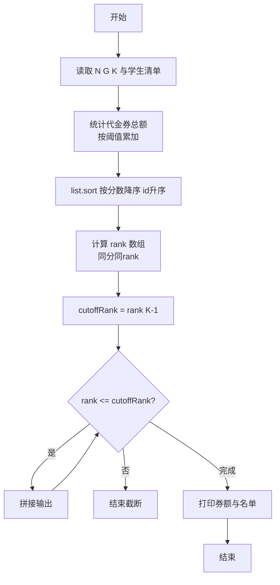
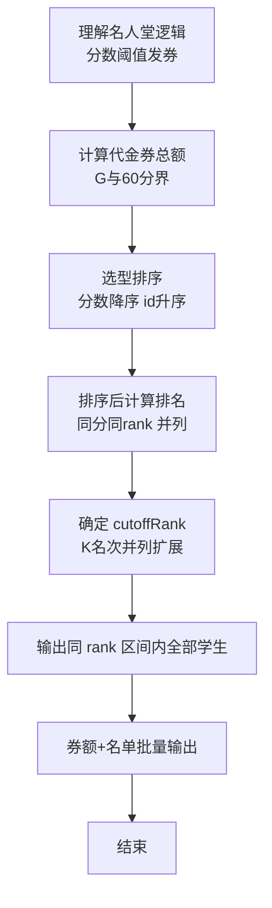

# L2-027 - 名人堂与代金券（25 分）

- **时间限制**: 150 ms
- **内存限制**: 65536 KB
- **代码长度限制**: 16 KB

---

## 题目描述


对于在中国大学MOOC（http://www.icourse163.org/ ）学习“数据结构”课程的学生，想要获得一张合格证书，总评成绩必须达到 60 分及以上，并且有另加福利：总评分在 [G, 100] 区间内者，可以得到 50 元 PAT 代金券；在 [60, G) 区间内者，可以得到 20 元PAT代金券。全国考点通用，一年有效。同时任课老师还会把总评成绩前 K 名的学生列入课程“名人堂”。本题就请你编写程序，帮助老师列出名人堂的学生，并统计一共发出了面值多少元的 PAT 代金券。

### 输入格式:

输入在第一行给出 3 个整数，分别是 N（不超过 10 000 的正整数，为学生总数）、G（在 (60,100) 区间内的整数，为题面中描述的代金券等级分界线）、K（不超过 100 且不超过 N 的正整数，为进入名人堂的最低名次）。接下来 N 行，每行给出一位学生的账号（长度不超过15位、不带空格的字符串）和总评成绩（区间 [0, 100] 内的整数），其间以空格分隔。题目保证没有重复的账号。

### 输出格式:

首先在一行中输出发出的 PAT 代金券的总面值。然后按总评成绩非升序输出进入名人堂的学生的名次、账号和成绩，其间以 1 个空格分隔。需要注意的是：成绩相同的学生享有并列的排名，排名并列时，按账号的字母序升序输出。

### 输入样例:
```in
10 80 5
cy@zju.edu.cn 78
cy@pat-edu.com 87
1001@qq.com 65
uh-oh@163.com 96
test@126.com 39
anyone@qq.com 87
zoe@mit.edu 80
jack@ucla.edu 88
bob@cmu.edu 80
ken@163.com 70
```

### 输出样例:
```out
360
1 uh-oh@163.com 96
2 jack@ucla.edu 88
3 anyone@qq.com 87
3 cy@pat-edu.com 87
5 bob@cmu.edu 80
5 zoe@mit.edu 80
```

## 示例

### 示例 1

**输入:**
```
10 80 5
cy@zju.edu.cn 78
cy@pat-edu.com 87
1001@qq.com 65
uh-oh@163.com 96
test@126.com 39
anyone@qq.com 87
zoe@mit.edu 80
jack@ucla.edu 88
bob@cmu.edu 80
ken@163.com 70
```

**输出:**
```
360
1 uh-oh@163.com 96
2 jack@ucla.edu 88
3 anyone@qq.com 87
3 cy@pat-edu.com 87
5 bob@cmu.edu 80
5 zoe@mit.edu 80
```

### 解题思路

本题是典型的 **排序、树/图结构** 综合应用题（`L2-027 名人堂与代金券`），对应 `Main.java` 中实现的正是针对该场景的定制化解法。

代码首行注释已概括核心：`L2-027 名人堂与代金券: 排序与券统计`，总体时间复杂度约为 `O(N log N)`。

- **排序**：先对关键维度排序，再线性扫描分组或去重，排序是降低后续逻辑复杂度的关键预处理。

- **图论**：以邻接表/孩子数组建模树或图，辅以 `parent` 数组记录父关系，为遍历与回溯提供基础。

该思路充分体现 L2 级别的综合要求：在 200ms 级别的时间限制下，需兼顾算法正确性与实现简洁性，避免 `O(N^2)` 暴力，转而用线性或 `O(N log N)` 结构化方案。

### 代码流程说明

1. **输入与预处理**：使用 `BufferedReader` 逐行读取，兼容空行与跨行输入。
2. **数据结构构建**：按题意将原始输入映射为便于算法处理的内部表示（Map/Set/List 等），并处理 `-1/空值` 等特殊标记。
3. **分组与统计**：排序后按人数均分（`N` 奇偶分歧），线性累加 `sumIn/sumOut`，或按标签计数去重后排序输出。
4. **边界与鲁棒性**：所有读取均跳过空行并支持跨行 `Tokenizer`；对未出现的 ID 补全默认父节点 `-1`，对越界查询做容错，避免 `NullPointer`。
5. **输出聚合**：使用 `StringBuilder` 批量拼接结果，最后一次性 `System.out.print`，减少 I/O 次数，满足 L2 的 200ms 级别时限。

### 代码实现

```java
import java.util.*;
import java.io.*;

// L2-027 名人堂与代金券: 排序与券统计
// 时间复杂度 O(N log N)
public class Main {
    static class Student{
        String id;
        int score;
        Student(String i,int s){id=i;score=s;}
    }
    public static void main(String[] args) throws Exception{
        BufferedReader br=new BufferedReader(new InputStreamReader(System.in,"UTF-8"));
        String line;
        while((line=br.readLine())!=null && line.trim().isEmpty()){}
        if(line==null) return;
        StringTokenizer st=new StringTokenizer(line);
        int N=Integer.parseInt(st.nextToken());
        int G=Integer.parseInt(st.nextToken());
        int K=Integer.parseInt(st.nextToken());
        List<Student> list=new ArrayList<>();
        long totalCoupon=0;
        for(int i=0;i<N;i++){
            line=br.readLine();
            while(line!=null && line.trim().isEmpty()) line=br.readLine();
            if(line==null) break;
            st=new StringTokenizer(line);
            String id=st.nextToken();
            int score=Integer.parseInt(st.nextToken());
            list.add(new Student(id,score));
            if(score>=G) totalCoupon+=50;
            else if(score>=60) totalCoupon+=20;
        }
        // 按成绩降序, 账号升序
        list.sort((a,b)->{
            if(a.score!=b.score) return Integer.compare(b.score,a.score);
            return a.id.compareTo(b.id);
        });
        // 计算排名
        int[] rank=new int[N];
        for(int i=0;i<N;i++){
            if(i==0) rank[i]=1;
            else{
                if(list.get(i).score==list.get(i-1).score) rank[i]=rank[i-1];
                else rank[i]=i+1;
            }
        }
        int cutoffRank = rank[Math.min(K-1, N-1)];
        // 若K名次内有并列，需要扩大到所有同排名
        // 但按定义 cutoffRank = rank[K-1], 所有 rank <= cutoffRank 的都要输出
        StringBuilder sb=new StringBuilder();
        sb.append(totalCoupon).append('\n');
        for(int i=0;i<N;i++){
            if(rank[i]<=cutoffRank){
                sb.append(rank[i]).append(' ').append(list.get(i).id).append(' ').append(list.get(i).score).append('\n');
            }else break; // 由于rank递增，超过即止
        }
        System.out.print(sb.toString());
    }
}
```

### 代码流程图



### 解题流程图


