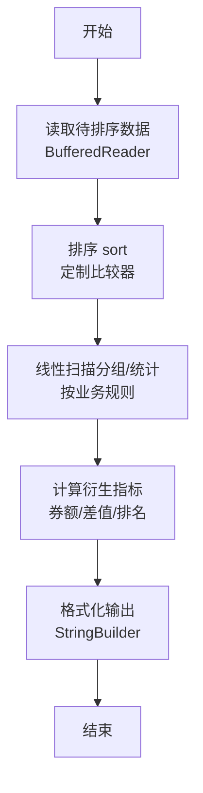
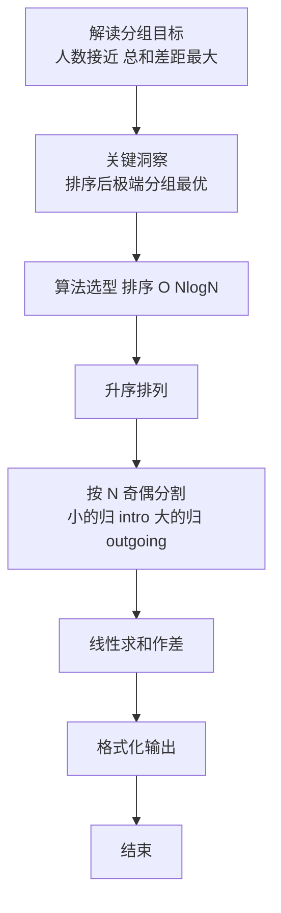

# L2-028 - 秀恩爱分得快（25 分）

- **时间限制**: 500 ms
- **内存限制**: 65536 KB
- **代码长度限制**: 16 KB

---

## 题目描述


古人云：秀恩爱，分得快。

互联网上每天都有大量人发布大量照片，我们通过分析这些照片，可以分析人与人之间的亲密度。如果一张照片上出现了 K 个人，这些人两两间的亲密度就被定义为 1/K。任意两个人如果同时出现在若干张照片里，他们之间的亲密度就是所有这些同框照片对应的亲密度之和。下面给定一批照片，请你分析一对给定的情侣，看看他们分别有没有亲密度更高的异性朋友？

### 输入格式:

输入在第一行给出 2 个正整数：N（不超过1000，为总人数——简单起见，我们把所有人从 0 到 N-1 编号。为了区分性别，我们用编号前的负号表示女性）和 M（不超过1000，为照片总数）。随后 M 行，每行给出一张照片的信息，格式如下：

```
K P[1] ... P[K]
```

其中 K（$$\le$$ 500）是该照片中出现的人数，P[1] ~ P[K] 就是这些人的编号。最后一行给出一对异性情侣的编号 A 和 B。同行数字以空格分隔。题目保证每个人只有一个性别，并且不会在同一张照片里出现多次。

### 输出格式:

首先输出 `A PA`，其中 `PA` 是与 `A` 最亲密的异性。如果 `PA` 不唯一，则按他们编号的绝对值递增输出；然后类似地输出 `B PB`。但如果 `A` 和 `B` 正是彼此亲密度最高的一对，则只输出他们的编号，无论是否还有其他人并列。

### 输入样例 1：
```in
10 4
4 -1 2 -3 4
4 2 -3 -5 -6
3 2 4 -5
3 -6 0 2
-3 2
```

### 输出样例 1：
```out
-3 2
2 -5
2 -6
```

### 输入样例 2：
```in
4 4
4 -1 2 -3 0
2 0 -3
2 2 -3
2 -1 2 
-3 2
```

### 输出样例 2：
```out
-3 2
```

## 示例

### 示例 1

**输入:**
```
10 4
4 -1 2 -3 4
4 2 -3 -5 -6
3 2 4 -5
3 -6 0 2
-3 2
```

**输出:**
```
-3 2
2 -5
2 -6
```

### 示例 2

**输入:**
```
4 4
4 -1 2 -3 0
2 0 -3
2 2 -3
2 -1 2 
-3 2
```

**输出:**
```
-3 2
```

### 解题思路

本题是典型的 **排序、树/图结构** 综合应用题（`L2-028 秀恩爱分得快`），对应 `Main.java` 中实现的正是针对该场景的定制化解法。

代码首行注释已概括核心：`L2-028 秀恩爱分得快: 计算亲密度`，总体时间复杂度约为 `O(N log N)`。

- **排序**：先对关键维度排序，再线性扫描分组或去重，排序是降低后续逻辑复杂度的关键预处理。

- **图论**：以邻接表/孩子数组建模树或图，辅以 `parent` 数组记录父关系，为遍历与回溯提供基础。

该思路充分体现 L2 级别的综合要求：在 200ms 级别的时间限制下，需兼顾算法正确性与实现简洁性，避免 `O(N^2)` 暴力，转而用线性或 `O(N log N)` 结构化方案。

### 代码流程说明

1. **输入与预处理**：使用 `BufferedReader` 逐行读取，配合 `StringTokenizer` 兼容空行与跨行数据；初始化与题目规模相匹配的数据结构（如 `HashMap`）。
2. **数据结构构建**：按题意将原始输入映射为便于算法处理的内部表示（Map/Set/List 等），并处理 `-1/空值` 等特殊标记。
3. **分组与统计**：排序后按人数均分（`N` 奇偶分歧），线性累加 `sumIn/sumOut`，或按标签计数去重后排序输出。
4. **边界与鲁棒性**：所有读取均跳过空行并支持跨行 `Tokenizer`；对未出现的 ID 补全默认父节点 `-1`，对越界查询做容错，避免 `NullPointer`。
5. **输出聚合**：使用 `StringBuilder` 批量拼接结果，最后一次性 `System.out.print`，减少 I/O 次数，满足 L2 的 200ms 级别时限。

### 代码实现

```java
import java.util.*;
import java.io.*;

// L2-028 秀恩爱分得快: 计算亲密度
// 时间复杂度 O(M*K^2)
public class Main {
    public static void main(String[] args) throws Exception{
        BufferedReader br=new BufferedReader(new InputStreamReader(System.in,"UTF-8"));
        String line;
        while((line=br.readLine())!=null && line.trim().isEmpty()){}
        if(line==null) return;
        StringTokenizer st=new StringTokenizer(line);
        int N=Integer.parseInt(st.nextToken());
        int M=Integer.parseInt(st.nextToken());
        // 用绝对值编号 0..N-1, 性别 map
        int[] gender=new int[N]; // 1 male, -1 female, 0 unknown
        // 需要记录字符串到绝对id的映射? 直接用int值
        // 亲密度矩阵
        double[][] close=new double[N][N];
        // 为了快速判断性别，用Map<abs, gender>
        // 读取照片
        for(int i=0;i<M;i++){
            line=br.readLine();
            while(line!=null && line.trim().isEmpty()) line=br.readLine();
            if(line==null) break;
            st=new StringTokenizer(line);
            // 可能跨行
            List<String> parts=new ArrayList<>();
            while(st.hasMoreTokens()) parts.add(st.nextToken());
            while(parts.size()==0){
                line=br.readLine();
                if(line==null) break;
                st=new StringTokenizer(line);
                while(st.hasMoreTokens()) parts.add(st.nextToken());
            }
            int K=Integer.parseInt(parts.get(0));
            List<Integer> ids=new ArrayList<>();
            List<Integer> signs=new ArrayList<>();
            for(int j=1;j<parts.size();j++){
                String s=parts.get(j);
                int val=Integer.parseInt(s);
                ids.add(Math.abs(val));
                signs.add(val<0 ? -1 : 1);
            }
            while(ids.size()<K){
                line=br.readLine();
                if(line==null) break;
                st=new StringTokenizer(line);
                while(st.hasMoreTokens() && ids.size()<K){
                    String s=st.nextToken();
                    int val=Integer.parseInt(s);
                    ids.add(Math.abs(val));
                    signs.add(val<0 ? -1 : 1);
                }
            }
            // 记录性别
            for(int j=0;j<ids.size();j++){
                int abs=ids.get(j);
                if(abs>=0 && abs<N){
                    if(gender[abs]==0) gender[abs]=signs.get(j);
                    // 保证一致
                }
            }
            if(K<=1) continue;
            double w=1.0/K;
            // 两两亲密度，仅异性? 但先全计算，后续过滤异性也可
            for(int a=0;a<K;a++){
                for(int b=a+1;b<K;b++){
                    int ia=ids.get(a), ib=ids.get(b);
                    // 若异性才累加? 题目说所有人两两亲密度定义1/K，但后续只关心异性最高
                    // 累加所有也可
                    close[ia][ib]+=w;
                    close[ib][ia]+=w;
                }
            }
        }
        // 读取情侣 A B
        line=br.readLine();
        while(line!=null && line.trim().isEmpty()) line=br.readLine();
        if(line==null) return;
        st=new StringTokenizer(line);
        List<String> ab=new ArrayList<>();
        while(st.hasMoreTokens()) ab.add(st.nextToken());
        while(ab.size()<2){
            line=br.readLine();
            if(line==null) break;
            st=new StringTokenizer(line);
            while(st.hasMoreTokens()) ab.add(st.nextToken());
        }
        String sA=ab.get(0), sB=ab.get(1);
        int A=Integer.parseInt(sA);
        int B=Integer.parseInt(sB);
        int absA=Math.abs(A), absB=Math.abs(B);
        // 用于输出的带符号字符串
        String outA=sA, outB=sB;

        // 计算各自最亲密异性
        double maxA=-1, maxB=-1;
        for(int i=0;i<N;i++){
            if(gender[i]==0) continue;
            if(gender[absA]!=0 && gender[i]==gender[absA]) continue;
            // i是abs
            if(close[absA][i] > maxA) maxA=close[absA][i];
        }
        for(int i=0;i<N;i++){
            if(gender[i]==0) continue;
            if(gender[absB]!=0 && gender[i]==gender[absB]) continue;
            if(close[absB][i] > maxB) maxB=close[absB][i];
        }
        // 收集列表
        List<Integer> listA=new ArrayList<>();
        List<Integer> listB=new ArrayList<>();
        for(int i=0;i<N;i++){
            if(gender[i]==0) continue;
            if(gender[absA]!=0 && gender[i]==gender[absA]) continue;
            if(Math.abs(close[absA][i]-maxA) < 1e-9 && maxA>-0.5) listA.add(i);
        }
        for(int i=0;i<N;i++){
            if(gender[i]==0) continue;
            if(gender[absB]!=0 && gender[i]==gender[absB]) continue;
            if(Math.abs(close[absB][i]-maxB) < 1e-9 && maxB>-0.5) listB.add(i);
        }
        // 按绝对值递增排序
        Collections.sort(listA);
        Collections.sort(listB);
        // 判断是否互为最高
        boolean aLikesB=false,bLikesA=false;
        // 需要判断B是否在listA中, A是否在listB中
        // 但close[absA][absB]可能为maxA/B
        if(Math.abs(close[absA][absB]-maxA) < 1e-9 && Math.abs(close[absB][absA]-maxB) < 1e-9){
            // 且双方都在对方列表中视为互为最高
            if(listA.contains(absB) && listB.contains(absA)){
                System.out.println(outA+" "+outB);
                return;
            }
        }
        StringBuilder sb=new StringBuilder();
        // 输出 A 及其最亲密
        // 如果listA空? 可能无异性同框，maxA可能为0或未更新，则不输出? 按题意应至少有? 若无则不输出?
        // 但常规应输出所有最大亲密度为0的? 若maxA为0 可能所有异性亲密度0，则全部并列? 但K限制内可能未同框
        // 此时视为所有异性都是0，数量很多，不合理；题目保证情侣有异性最高
        // 我们按若maxA <0 (无异性)则不输出A部分
        // 否则输出每项
        // 格式化符号: 女性用负号，男性用正? 需要按性别恢复符号
        // gender: -1 female => 输出 "-"+abs ; 1 male => 输出 abs 不带号 (但情侣A/B输入符号需保留)
        // 对于list中的人，输出符号需根据其性别: 若female => "-"+abs, male => ""+abs ; 但0需特殊? 0的负号 "-0"？
        // 题面对于0可能有 "-0" 表示女性0? 按输入例子 "-3" etc. 保持性别符号
        for(int abs: listA){
            String sign = (gender[abs]==-1) ? "-"+abs : String.valueOf(abs);
            // 若abs==0且gender==-1, 应输出 "-0" ?
            if(abs==0 && gender[abs]==-1) sign="-0";
            sb.append(outA).append(' ').append(sign).append('\n');
        }
        for(int abs: listB){
            String sign = (gender[abs]==-1) ? "-"+abs : String.valueOf(abs);
            if(abs==0 && gender[abs]==-1) sign="-0";
            sb.append(outB).append(' ').append(sign).append('\n');
        }
        System.out.print(sb.toString());
    }
}
```

### 代码流程图



### 解题流程图


