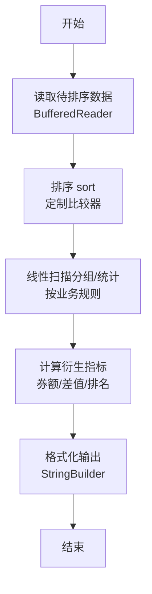
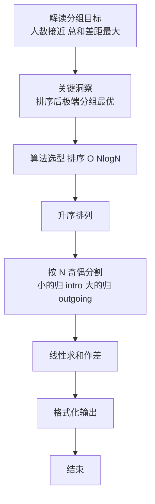

# L2-029 - 特立独行的幸福（25 分）

- **时间限制**: 400 ms
- **内存限制**: 65536 KB
- **代码长度限制**: 16 KB

---

## 题目描述

对一个十进制数的各位数字做一次平方和，称作一次迭代。如果一个十进制数能通过若干次迭代得到 1，就称该数为幸福数。1 是一个幸福数。此外，例如 19 经过 1 次迭代得到 82，2 次迭代后得到 68，3 次迭代后得到 100，最后得到 1。则 19 就是幸福数。显然，在一个幸福数迭代到 1 的过程中经过的数字都是幸福数，它们的幸福是依附于初始数字的。例如 82、68、100 的幸福是依附于 19 的。而一个**特立独行**的幸福数，是在一个有限的区间内不依附于任何其它数字的；其**独立性**就是依附于它的的幸福数的个数。如果这个数还是个素数，则其独立性加倍。例如 19 在区间[1, 100] 内就是一个特立独行的幸福数，其独立性为 $$2\times 4 = 8$$。

另一方面，如果一个大于1的数字经过数次迭代后进入了死循环，那这个数就不幸福。例如 29 迭代得到 85、89、145、42、20、4、16、37、58、89、…… 可见 89 到 58 形成了死循环，所以 29 就不幸福。

本题就要求你编写程序，列出给定区间内的所有特立独行的幸福数和它的独立性。

## 输入格式：

输入在第一行给出闭区间的两个端点：$$1<A<B\le 10^4$$。

## 输出格式：

按递增顺序列出给定闭区间 $$[A,B]$$ 内的所有特立独行的幸福数和它的独立性。每对数字占一行，数字间以 1 个空格分隔。

如果区间内没有幸福数，则在一行中输出 `SAD`。

## 输入样例 1：
```
10 40
```

## 输出样例 1：
```
19 8
23 6
28 3
31 4
32 3
```

**注意：**样例中，10、13 也都是幸福数，但它们分别依附于其他数字（如 23、31 等等），所以不输出。其它数字虽然其实也依附于其它幸福数，但因为那些数字不在给定区间 [10, 40] 内，所以它们在给定区间内是特立独行的幸福数。

## 输入样例 2：
```
110 120
```

## 输出样例 2：
```
SAD
```

## 题解

### 解题思路

本题是典型的 **排序、哈希/集合、树/图结构** 综合应用题（`L2-029 特立独行的幸福`），对应 `Main.java` 中实现的正是针对该场景的定制化解法。

代码首行注释已概括核心：`L2-029 特立独行的幸福: 幸福数判断与独立性`，总体时间复杂度约为 `O(N log N)`。

- **排序**：先对关键维度排序，再线性扫描分组或去重，排序是降低后续逻辑复杂度的关键预处理。

- **哈希**：大量使用 `HashMap/HashSet` 实现 `O(1)` 平均查找，用于判重、计数、映射 ID 与快速交集检测。

- **图论**：以邻接表/孩子数组建模树或图，辅以 `parent` 数组记录父关系，为遍历与回溯提供基础。

该思路充分体现 L2 级别的综合要求：在 200ms 级别的时间限制下，需兼顾算法正确性与实现简洁性，避免 `O(N^2)` 暴力，转而用线性或 `O(N log N)` 结构化方案。

### 代码流程说明

1. **输入与预处理**：使用 `BufferedReader` 逐行读取，配合 `StringTokenizer` 兼容空行与跨行数据；初始化与题目规模相匹配的数据结构（如 `HashMap, HashSet`）。
2. **数据结构构建**：按题意将原始输入映射为便于算法处理的内部表示（Map/Set/List 等），并处理 `-1/空值` 等特殊标记。
3. **分组与统计**：排序后按人数均分（`N` 奇偶分歧），线性累加 `sumIn/sumOut`，或按标签计数去重后排序输出。
4. **边界与鲁棒性**：所有读取均跳过空行并支持跨行 `Tokenizer`；对未出现的 ID 补全默认父节点 `-1`，对越界查询做容错，避免 `NullPointer`。
5. **输出聚合**：使用 `StringBuilder` 批量拼接结果，最后一次性 `System.out.print`，减少 I/O 次数，满足 L2 的 200ms 级别时限。

### 代码实现

```java
import java.util.*;
import java.io.*;

// L2-029 特立独行的幸福: 幸福数判断与独立性
// 时间复杂度 O((B-A)*迭代长度)
public class Main {
    static int squareSum(int x){
        int s=0;
        while(x>0){ int d=x%10; s+=d*d; x/=10; }
        return s;
    }
    static boolean isPrime(int n){
        if(n<2) return false;
        if(n%2==0) return n==2;
        for(int i=3;i*i<=n;i+=2) if(n%i==0) return false;
        return true;
    }
    static class Info{
        boolean happy;
        List<Integer> chain; // 包含1
        Info(boolean h, List<Integer> c){happy=h;chain=c;}
    }
    static Info getInfo(int n){
        Set<Integer> visited=new HashSet<>();
        List<Integer> chain=new ArrayList<>();
        int cur=n;
        visited.add(cur);
        while(true){
            int nxt=squareSum(cur);
            if(nxt==1){
                chain.add(1);
                return new Info(true, chain);
            }
            if(visited.contains(nxt)){
                return new Info(false, chain);
            }
            visited.add(nxt);
            chain.add(nxt);
            cur=nxt;
            // 防止无限循环过大
            if(chain.size()>1000) return new Info(false, chain);
        }
    }
    public static void main(String[] args) throws Exception{
        BufferedReader br=new BufferedReader(new InputStreamReader(System.in,"UTF-8"));
        String line;
        while((line=br.readLine())!=null && line.trim().isEmpty()){}
        if(line==null) return;
        StringTokenizer st=new StringTokenizer(line);
        List<Integer> vals=new ArrayList<>();
        while(st.hasMoreTokens()) vals.add(Integer.parseInt(st.nextToken()));
        while(vals.size()<2){
            line=br.readLine();
            if(line==null) break;
            st=new StringTokenizer(line);
            while(st.hasMoreTokens()) vals.add(Integer.parseInt(st.nextToken()));
        }
        int A=vals.get(0), B=vals.get(1);
        Map<Integer, Info> infoMap=new HashMap<>();
        Set<Integer> happySet=new HashSet<>();
        Map<Integer, List<Integer>> chainMap=new HashMap<>();
        for(int i=A;i<=B;i++){
            Info inf=getInfo(i);
            infoMap.put(i, inf);
            if(inf.happy){
                happySet.add(i);
                chainMap.put(i, inf.chain);
            }
        }
        // 找出依附关系: 哪些数出现在其他数的chain中
        Set<Integer> dependent=new HashSet<>();
        for(int h: happySet){
            List<Integer> ch=chainMap.get(h);
            for(int v: ch){
                if(v!=h && v>=A && v<=B && happySet.contains(v)){
                    dependent.add(v);
                }
            }
        }
        List<Integer> specials=new ArrayList<>();
        for(int h: happySet) if(!dependent.contains(h)) specials.add(h);
        Collections.sort(specials);
        if(specials.isEmpty()){
            System.out.println("SAD");
            return;
        }
        StringBuilder sb=new StringBuilder();
        for(int v: specials){
            List<Integer> ch=chainMap.get(v);
            int indep = ch.size(); // 包含1
            if(isPrime(v)) indep*=2;
            sb.append(v).append(' ').append(indep).append('\n');
        }
        System.out.print(sb.toString());
    }
}
```

### 代码流程图



### 解题流程图


