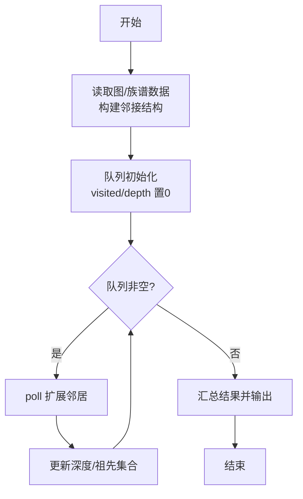
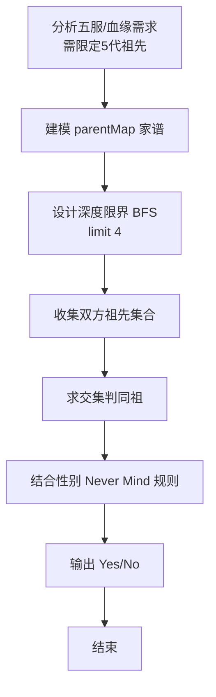

# L2-030 - 冰岛人（25 分）

- **时间限制**: 400 ms
- **内存限制**: 65536 KB
- **代码长度限制**: 16 KB

---

## 题目描述


2018年世界杯，冰岛队因1:1平了强大的阿根廷队而一战成名。好事者发现冰岛人的名字后面似乎都有个“松”（son），于是有网友科普如下：


冰岛人沿用的是维京人古老的父系姓制，孩子的姓等于父亲的名加后缀，如果是儿子就加 sson，女儿则加 sdottir。因为冰岛人口较少，为避免近亲繁衍，本地人交往前先用个 App 查一下两人祖宗若干代有无联系。本题就请你实现这个 App 的功能。

### 输入格式:

输入首先在第一行给出一个正整数 $$N$$（$$1 < N \le 10^5$$），为当地人口数。随后 $$N$$ 行，每行给出一个人名，格式为：`名 姓（带性别后缀）`，两个字符串均由不超过 20 个小写的英文字母组成。维京人后裔是可以通过姓的后缀判断其性别的，其他人则是在姓的后面加 `m` 表示男性、`f` 表示女性。题目保证给出的每个维京家族的起源人都是男性。

随后一行给出正整数 $$M$$，为查询数量。随后 $$M$$ 行，每行给出一对人名，格式为：`名1 姓1 名2 姓2`。注意：这里的`姓`是不带后缀的。四个字符串均由不超过 20 个小写的英文字母组成。

题目保证不存在两个人是同名的。

### 输出格式:

对每一个查询，根据结果在一行内显示以下信息：

- 若两人为异性，且五代以内无公共祖先，则输出 `Yes`；
- 若两人为异性，但五代以内（不包括第五代）有公共祖先，则输出 `No`；
- 若两人为同性，则输出 `Whatever`；
- 若有一人不在名单内，则输出 `NA`。

所谓“五代以内无公共祖先”是指两人的公共祖先（如果存在的话）必须比任何一方的曾祖父辈分高。

### 输入样例:
```in
15
chris smithm
adam smithm
bob adamsson
jack chrissson
bill chrissson
mike jacksson
steve billsson
tim mikesson
april mikesdottir
eric stevesson
tracy timsdottir
james ericsson
patrick jacksson
robin patricksson
will robinsson
6
tracy tim james eric
will robin tracy tim
april mike steve bill
bob adam eric steve
tracy tim tracy tim
x man april mikes
```

### 输出样例:
```out
Yes
No
No
Whatever
Whatever
NA
```

## 示例

### 示例 1

**输入:**
```
15
chris smithm
adam smithm
bob adamsson
jack chrissson
bill chrissson
mike jacksson
steve billsson
tim mikesson
april mikesdottir
eric stevesson
tracy timsdottir
james ericsson
patrick jacksson
robin patricksson
will robinsson
6
tracy tim james eric
will robin tracy tim
april mike steve bill
bob adam eric steve
tracy tim tracy tim
x man april mikes
```

**输出:**
```
Yes
No
No
Whatever
Whatever
NA
```

### 解题思路

本题是典型的 **BFS、哈希/集合、树/图结构** 综合应用题（`L2-030 冰岛人`），对应 `Main.java` 中实现的正是针对该场景的定制化解法。

代码首行注释已概括核心：`L2-030 冰岛人: 5代亲属判断 (不包括第5代)`，总体时间复杂度约为 `O(N log N)`。

- **BFS**：采用广度优先搜索逐层扩展，借助队列保证先访问浅层节点，天然适配最短路、层级遍历与限定深度祖先收集等需求。

- **哈希**：大量使用 `HashMap/HashSet` 实现 `O(1)` 平均查找，用于判重、计数、映射 ID 与快速交集检测。

- **图论**：以邻接表/孩子数组建模树或图，辅以 `parent` 数组记录父关系，为遍历与回溯提供基础。

该思路充分体现 L2 级别的综合要求：在 200ms 级别的时间限制下，需兼顾算法正确性与实现简洁性，避免 `O(N^2)` 暴力，转而用线性或 `O(N log N)` 结构化方案。

### 代码流程说明

1. **输入与预处理**：使用 `BufferedReader` 逐行读取，配合 `StringTokenizer` 兼容空行与跨行数据；初始化与题目规模相匹配的数据结构（如 `HashMap, HashSet, 队列`）。
2. **数据结构构建**：按题意将原始输入映射为便于算法处理的内部表示（Map/Set/List 等），并处理 `-1/空值` 等特殊标记。
3. **BFS 核心**：以根节点入队，维护 `depth/visited` 数组，队列 `poll` 逐层扩展，记录层次深度与最深节点/祖先集合。
4. **边界与鲁棒性**：所有读取均跳过空行并支持跨行 `Tokenizer`；对未出现的 ID 补全默认父节点 `-1`，对越界查询做容错，避免 `NullPointer`。
5. **输出聚合**：使用 `StringBuilder` 批量拼接结果，最后一次性 `System.out.print`，减少 I/O 次数，满足 L2 的 200ms 级别时限。

### 代码实现

```java
import java.util.*;
import java.io.*;

// L2-030 冰岛人: 5代亲属判断 (不包括第5代)
// 时间复杂度 O(N + M*2^4)
public class Main {
    static class Person{
        String first;
        String base;
        String key; // first+" "+base
        char gender; // M/F
        String parentFirst; // 维京才有
        Person(String f,String b,String k,char g,String pf){first=f;base=b;key=k;gender=g;parentFirst=pf;}
    }
    static Map<String, Person> keyMap=new HashMap<>();
    static Map<String, Person> firstMap=new HashMap<>();

    static Set<String> ancestorsSet(Person p){
        Set<String> set=new HashSet<>();
        // 收集到 great-grandparent (深度3包含self)
        // self depth0, parent1, grand2, great3
        Queue<Person> q=new ArrayDeque<>();
        Queue<Integer> d=new ArrayDeque<>();
        Set<String> visited=new HashSet<>();
        q.offer(p); d.offer(0);
        visited.add(p.first);
        while(!q.isEmpty()){
            Person cur=q.poll();
            int depth=d.poll();
            if(depth>3) continue;
            set.add(cur.first);
            if(depth==3) continue;
            if(cur.parentFirst==null) continue;
            Person parent=firstMap.get(cur.parentFirst);
            if(parent==null) continue;
            if(visited.contains(parent.first)) continue;
            visited.add(parent.first);
            q.offer(parent); d.offer(depth+1);
        }
        return set;
    }

    public static void main(String[] args) throws Exception{
        BufferedReader br=new BufferedReader(new InputStreamReader(System.in,"UTF-8"));
        String line;
        while((line=br.readLine())!=null && line.trim().isEmpty()){}
        if(line==null) return;
        int N=Integer.parseInt(line.trim());
        for(int i=0;i<N;i++){
            line=br.readLine();
            while(line!=null && line.trim().isEmpty()) line=br.readLine();
            if(line==null) break;
            StringTokenizer st=new StringTokenizer(line);
            // 人名可能包含空格: 名 姓带后缀 两个token
            List<String> toks=new ArrayList<>();
            while(st.hasMoreTokens()) toks.add(st.nextToken());
            while(toks.size()<2){
                line=br.readLine();
                if(line==null) break;
                st=new StringTokenizer(line);
                while(st.hasMoreTokens()) toks.add(st.nextToken());
            }
            String first=toks.get(0);
            String lastWith=toks.get(1);
            String base=null;
            char gender='M';
            String parentFirst=null;
            if(lastWith.endsWith("sson")){
                base=lastWith.substring(0,lastWith.length()-4);
                gender='M';
                parentFirst=base;
            }else if(lastWith.endsWith("sdottir")){
                base=lastWith.substring(0,lastWith.length()-7);
                gender='F';
                parentFirst=base;
            }else if(lastWith.endsWith("m")){
                base=lastWith.substring(0,lastWith.length()-1);
                gender='M';
                parentFirst=null;
            }else if(lastWith.endsWith("f")){
                base=lastWith.substring(0,lastWith.length()-1);
                gender='F';
                parentFirst=null;
            }else{
                base=lastWith;
                gender='M';
            }
            String key=first+" "+base;
            Person p=new Person(first,base,key,gender,parentFirst);
            keyMap.put(key,p);
            // firstMap: 若first重复，后者覆盖? 假设first唯一
            firstMap.put(first,p);
        }
        while((line=br.readLine())!=null && line.trim().isEmpty()){}
        if(line==null) return;
        int M=Integer.parseInt(line.trim());
        StringBuilder out=new StringBuilder();
        for(int i=0;i<M;i++){
            line=br.readLine();
            while(line!=null && line.trim().isEmpty()) line=br.readLine();
            if(line==null) break;
            StringTokenizer st=new StringTokenizer(line);
            List<String> toks=new ArrayList<>();
            while(st.hasMoreTokens()) toks.add(st.nextToken());
            while(toks.size()<4){
                String extra=br.readLine();
                if(extra==null) break;
                st=new StringTokenizer(extra);
                while(st.hasMoreTokens()) toks.add(st.nextToken());
            }
            String f1=toks.get(0), b1=toks.get(1), f2=toks.get(2), b2=toks.get(3);
            String key1=f1+" "+b1;
            String key2=f2+" "+b2;
            Person p1=keyMap.get(key1);
            Person p2=keyMap.get(key2);
            if(p1==null || p2==null){
                out.append("NA\n");
                continue;
            }
            if(p1.gender==p2.gender){
                out.append("Whatever\n");
                continue;
            }
            Set<String> s1=ancestorsSet(p1);
            Set<String> s2=ancestorsSet(p2);
            boolean intersect=false;
            for(String s: s1) if(s2.contains(s)){ intersect=true; break; }
            out.append(intersect? "No\n":"Yes\n");
        }
        System.out.print(out.toString());
    }
}
```

### 代码流程图



### 解题流程图


