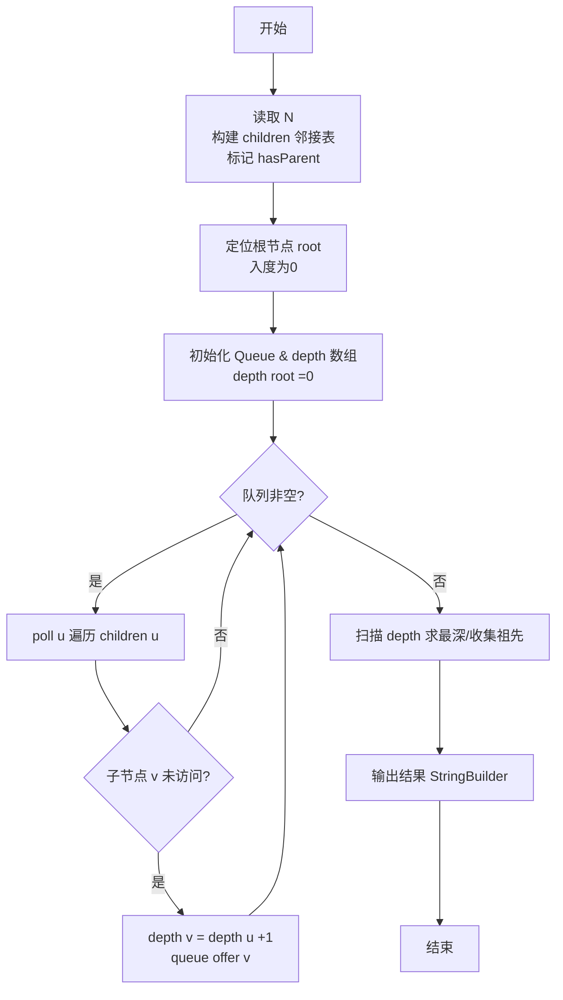
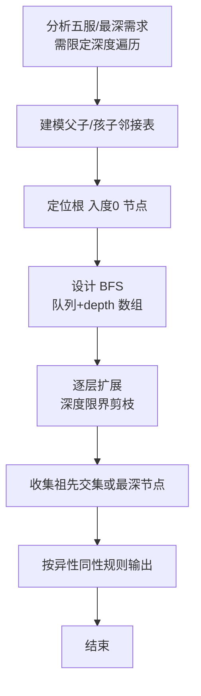

# L2-031 - 深入虎穴（25 分）

- **时间限制**: 400 ms
- **内存限制**: 65536 KB
- **代码长度限制**: 16 KB

---

## 题目描述


著名的王牌间谍 007 需要执行一次任务，获取敌方的机密情报。已知情报藏在一个地下迷宫里，迷宫只有一个入口，里面有很多条通路，每条路通向一扇门。每一扇门背后或者是一个房间，或者又有很多条路，同样是每条路通向一扇门…… 他的手里有一张表格，是其他间谍帮他收集到的情报，他们记下了每扇门的编号，以及这扇门背后的每一条通路所到达的门的编号。007 发现不存在两条路通向同一扇门。

内线告诉他，情报就藏在迷宫的最深处。但是这个迷宫太大了，他需要你的帮助 —— 请编程帮他找出距离入口最远的那扇门。

### 输入格式:

输入首先在一行中给出正整数 $$N$$（$$< 10^5$$），是门的数量。最后 $$N$$ 行，第 $$i$$ 行（$$1\le i \le N$$）按以下格式描述编号为 $$i$$ 的那扇门背后能通向的门：

```
K D[1] D[2] ... D[K]
```
其中 `K` 是通道的数量，其后是每扇门的编号。

### 输出格式:

在一行中输出距离入口最远的那扇门的编号。题目保证这样的结果是唯一的。

### 输入样例:
```in
13
3 2 3 4
2 5 6
1 7
1 8
1 9
0
2 11 10
1 13
0
0
1 12
0
0
```

### 输出样例:
```out
12
```

## 示例

### 示例 1

**输入:**
```
13
3 2 3 4
2 5 6
1 7
1 8
1 9
0
2 11 10
1 13
0
0
1 12
0
0
```

**输出:**
```
12
```

### 解题思路

本题是典型的 **BFS、树/图结构** 综合应用题（`L2-031 深入虎穴`），对应 `Main.java` 中实现的正是针对该场景的定制化解法。

代码首行注释已概括核心：`L2-031 深入虎穴 - 找树中最深节点（入口为入度0的根）`，总体时间复杂度约为 `O(N log N)`。

- **BFS**：采用广度优先搜索逐层扩展，借助队列保证先访问浅层节点，天然适配最短路、层级遍历与限定深度祖先收集等需求。

- **图论**：以邻接表/孩子数组建模树或图，辅以 `parent` 数组记录父关系，为遍历与回溯提供基础。

该思路充分体现 L2 级别的综合要求：在 200ms 级别的时间限制下，需兼顾算法正确性与实现简洁性，避免 `O(N^2)` 暴力，转而用线性或 `O(N log N)` 结构化方案。

### 代码流程说明

1. **输入与预处理**：使用 `BufferedReader` 逐行读取，配合 `StringTokenizer` 兼容空行与跨行数据；初始化与题目规模相匹配的数据结构（如 `队列, 邻接表/孩子数组`）。
2. **建模建图**：根据输入的父子/边关系构建 `parent` 数组与 `children` 邻接表，标记 `hasParent/visited` 以定位根节点，并对子节点排序保证字典序。
3. **BFS 核心**：以根节点入队，维护 `depth/visited` 数组，队列 `poll` 逐层扩展，记录层次深度与最深节点/祖先集合。
4. **边界与鲁棒性**：所有读取均跳过空行并支持跨行 `Tokenizer`；对未出现的 ID 补全默认父节点 `-1`，对越界查询做容错，避免 `NullPointer`。
5. **输出聚合**：使用 `StringBuilder` 批量拼接结果，最后一次性 `System.out.print`，减少 I/O 次数，满足 L2 的 200ms 级别时限。

### 代码实现

```java
import java.util.*;
import java.io.*;

// L2-031 深入虎穴 - 找树中最深节点（入口为入度0的根）
// 时间复杂度 O(N) BFS
public class Main {
    public static void main(String[] args) throws Exception {
        BufferedReader br = new BufferedReader(new InputStreamReader(System.in, "UTF-8"));
        String line;
        line = br.readLine();
        while (line != null && line.trim().isEmpty()) line = br.readLine();
        if (line == null) return;
        int N = Integer.parseInt(line.trim());
        List<Integer>[] children = new ArrayList[N + 1];
        for (int i = 1; i <= N; i++) children[i] = new ArrayList<>();
        boolean[] hasParent = new boolean[N + 1];
        for (int i = 1; i <= N; i++) {
            line = br.readLine();
            while (line != null && line.trim().isEmpty()) line = br.readLine();
            if (line == null) line = "0";
            StringTokenizer st = new StringTokenizer(line);
            if (!st.hasMoreTokens()) {
                continue;
            }
            int K = Integer.parseInt(st.nextToken());
            for (int j = 0; j < K; j++) {
                // 可能跨行？但题面每行足够
                while (!st.hasMoreTokens()) {
                    line = br.readLine();
                    if (line == null) break;
                    st = new StringTokenizer(line);
                }
                if (!st.hasMoreTokens()) break;
                int v = Integer.parseInt(st.nextToken());
                children[i].add(v);
                if (v >= 1 && v <= N) hasParent[v] = true;
            }
        }
        int root = 1;
        for (int i = 1; i <= N; i++) if (!hasParent[i]) { root = i; break; }
        // BFS
        Queue<Integer> q = new ArrayDeque<>();
        q.offer(root);
        int deepest = root;
        // 为了求最深，可分层
        // 也可用 BFS 记录深度
        int[] depth = new int[N + 1];
        Arrays.fill(depth, -1);
        depth[root] = 0;
        Queue<Integer> queue = new ArrayDeque<>();
        queue.offer(root);
        while (!queue.isEmpty()) {
            int u = queue.poll();
            deepest = u;
            for (int v : children[u]) {
                if (depth[v] == -1) {
                    depth[v] = depth[u] + 1;
                    queue.offer(v);
                }
            }
        }
        // 上述 BFS 按层次顺序，最后一个不一定是最深的（需要按深度最大）
        // 更严谨：找到深度最大的节点（题目保证唯一）
        int maxD = -1;
        int ans = root;
        for (int i = 1; i <= N; i++) {
            if (depth[i] > maxD) {
                maxD = depth[i];
                ans = i;
            }
        }
        System.out.println(ans);
    }
}
```

### 代码流程图



### 解题流程图


