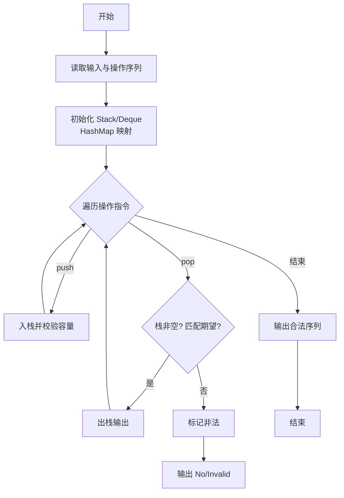
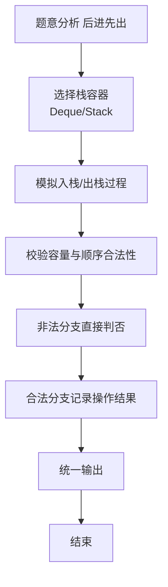

# L2-032 - 彩虹瓶（25 分）

- **时间限制**: 400 ms
- **内存限制**: 65536 KB
- **代码长度限制**: 16 KB

---

## 题目描述


彩虹瓶的制作过程（并不）是这样的：先把一大批空瓶铺放在装填场地上，然后按照一定的顺序将每种颜色的小球均匀撒到这批瓶子里。

假设彩虹瓶里要按顺序装 N 种颜色的小球（不妨将顺序就编号为 1 到 N）。现在工厂里有每种颜色的小球各一箱，工人需要一箱一箱地将小球从工厂里搬到装填场地。如果搬来的这箱小球正好是可以装填的颜色，就直接拆箱装填；如果不是，就把箱子先码放在一个临时货架上，码放的方法就是一箱一箱堆上去。当一种颜色装填完以后，先看看货架顶端的一箱是不是下一个要装填的颜色，如果是就取下来装填，否则去工厂里再搬一箱过来。

如果工厂里发货的顺序比较好，工人就可以顺利地完成装填。例如要按顺序装填 7 种颜色，工厂按照 7、6、1、3、2、5、4 这个顺序发货，则工人先拿到 7、6 两种不能装填的颜色，将其按照 7 在下、6 在上的顺序堆在货架上；拿到 1 时可以直接装填；拿到 3 时又得临时码放在 6 号颜色箱上；拿到 2 时可以直接装填；随后从货架顶取下 3 进行装填；然后拿到 5，临时码放到 6 上面；最后取了 4 号颜色直接装填；剩下的工作就是顺序从货架上取下 5、6、7 依次装填。

但如果工厂按照 3、1、5、4、2、6、7 这个顺序发货，工人就必须要愤怒地折腾货架了，因为装填完 2 号颜色以后，不把货架上的多个箱子搬下来就拿不到 3 号箱，就不可能顺利完成任务。

另外，货架的容量有限，如果要堆积的货物超过容量，工人也没办法顺利完成任务。例如工厂按照 7、6、5、4、3、2、1 这个顺序发货，如果货架够高，能码放 6 只箱子，那还是可以顺利完工的；但如果货架只能码放 5 只箱子，工人就又要愤怒了……

本题就请你判断一下，工厂的发货顺序能否让工人顺利完成任务。

### 输入格式:

输入首先在第一行给出 3 个正整数，分别是彩虹瓶的颜色数量 $$N$$（$$1 < N \le 10^3$$）、临时货架的容量 $$M$$（$$< N$$）、以及需要判断的发货顺序的数量 $$K$$。

随后 $$K$$ 行，每行给出 $$N$$ 个数字，是 1 到$$N$$ 的一个排列，对应工厂的发货顺序。

一行中的数字都以空格分隔。

### 输出格式:

对每个发货顺序，如果工人可以愉快完工，就在一行中输出 `YES`；否则输出 `NO`。

### 输入样例:
```in
7 5 3
7 6 1 3 2 5 4
3 1 5 4 2 6 7
7 6 5 4 3 2 1
```

### 输出样例:
```out
YES
NO
NO
```

## 示例

### 示例 1

**输入:**
```
7 5 3
7 6 1 3 2 5 4
3 1 5 4 2 6 7
7 6 5 4 3 2 1
```

**输出:**
```
YES
NO
NO
```

### 解题思路

本题是典型的 **栈、树/图结构** 综合应用题（`L2-032 彩虹瓶`），对应 `Main.java` 中实现的正是针对该场景的定制化解法。

代码首行注释已概括核心：`L2-032 彩虹瓶 - 栈模拟彩虹瓶发货`，总体时间复杂度约为 `O(N log N)`。

- **栈**：通过栈模拟后进先出的操作序列，如括号匹配、瓶/包装机调度，能够精确还原实际操作顺序。

- **图论**：以邻接表/孩子数组建模树或图，辅以 `parent` 数组记录父关系，为遍历与回溯提供基础。

该思路充分体现 L2 级别的综合要求：在 200ms 级别的时间限制下，需兼顾算法正确性与实现简洁性，避免 `O(N^2)` 暴力，转而用线性或 `O(N log N)` 结构化方案。

### 代码流程说明

1. **输入与预处理**：使用 `BufferedReader` 逐行读取，配合 `StringTokenizer` 兼容空行与跨行数据；初始化与题目规模相匹配的数据结构（如 `栈`）。
2. **数据结构构建**：按题意将原始输入映射为便于算法处理的内部表示（Map/Set/List 等），并处理 `-1/空值` 等特殊标记。
3. **栈模拟**：按给定的操作序列 `push/pop` 模拟栈行为，校验出栈顺序合法性或还原包装机状态，非法时即时判否。
4. **边界与鲁棒性**：所有读取均跳过空行并支持跨行 `Tokenizer`；对未出现的 ID 补全默认父节点 `-1`，对越界查询做容错，避免 `NullPointer`。
5. **输出聚合**：使用 `StringBuilder` 批量拼接结果，最后一次性 `System.out.print`，减少 I/O 次数，满足 L2 的 200ms 级别时限。

### 代码实现

```java
import java.util.*;
import java.io.*;

// L2-032 彩虹瓶 - 栈模拟彩虹瓶发货
// 时间复杂度 O(K*N)
public class Main {
    public static void main(String[] args) throws Exception {
        BufferedReader br = new BufferedReader(new InputStreamReader(System.in, "UTF-8"));
        String line = br.readLine();
        while (line != null && line.trim().isEmpty()) line = br.readLine();
        if (line == null) return;
        StringTokenizer st = new StringTokenizer(line);
        int N = Integer.parseInt(st.nextToken());
        int M = Integer.parseInt(st.nextToken());
        int K = Integer.parseInt(st.nextToken());
        StringBuilder out = new StringBuilder();
        for (int t = 0; t < K; t++) {
            // 读取 N 个数的排列，可能跨行
            List<Integer> seq = new ArrayList<>();
            while (seq.size() < N) {
                line = br.readLine();
                if (line == null) break;
                if (line.trim().isEmpty()) continue;
                StringTokenizer st2 = new StringTokenizer(line);
                while (st2.hasMoreTokens() && seq.size() < N) {
                    seq.add(Integer.parseInt(st2.nextToken()));
                }
            }
            boolean ok = canFinish(seq, N, M);
            out.append(ok ? "YES\n" : "NO\n");
        }
        System.out.print(out.toString());
    }

    static boolean canFinish(List<Integer> a, int N, int M) {
        Deque<Integer> stack = new ArrayDeque<>();
        int expect = 1;
        for (int c : a) {
            if (c == expect) {
                expect++;
                while (!stack.isEmpty() && stack.peek() == expect) {
                    stack.pop();
                    expect++;
                }
            } else {
                // 需要入栈
                if (stack.size() >= M) return false; // 容量已满无法入栈
                // 还有一个判断：如果栈顶已经可以出栈但c不等于expect，其实按流程c已经作为新到货物判断
                // 但若c != expect，应该入栈；但如果入栈后超过容量已处理
                stack.push(c);
                // 注意：如果c入栈后，其实不存在立即出栈的情况，因为c != expect
                // 但为了严谨，检查是否栈顶等于expect的情况不会发生因为c != expect
            }
            // 额外的容量检查：如果栈大小超过M直接失败
            if (stack.size() > M) return false;
        }
        while (!stack.isEmpty()) {
            if (stack.peek() == expect) {
                stack.pop();
                expect++;
            } else {
                return false;
            }
        }
        return expect == N + 1;
    }
}
```

### 代码流程图



### 解题流程图


