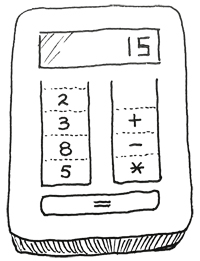
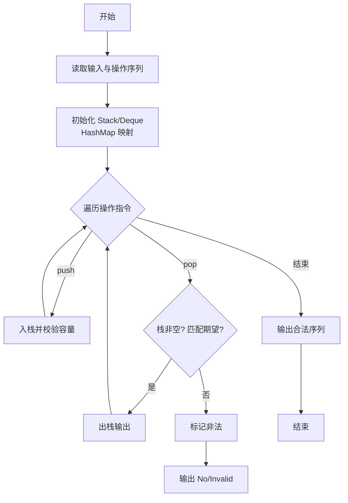
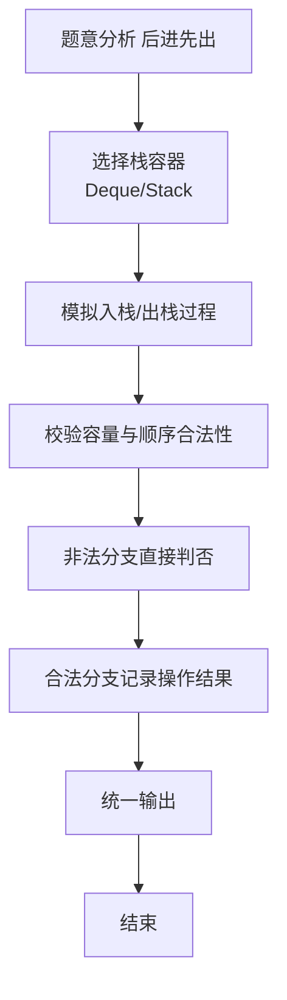

# L2-033 - 简单计算器（25 分）

- **时间限制**: 400 ms
- **内存限制**: 65536 KB
- **代码长度限制**: 16 KB

---

## 题目描述





本题要求你为初学数据结构的小伙伴设计一款简单的利用堆栈执行的计算器。如上图所示，计算器由两个堆栈组成，一个堆栈 $$S_1$$ 存放数字，另一个堆栈 $$S_2$$ 存放运算符。计算器的最下方有一个等号键，每次按下这个键，计算器就执行以下操作：

1. 从 $$S_1$$ 中弹出两个数字，顺序为 $$n_1$$ 和 $$n_2$$；
1. 从 $$S_2$$ 中弹出一个运算符 op；
1. 执行计算 $$n_2$$ op $$n_1$$；
1. 将得到的结果压回 $$S_1$$。

直到两个堆栈都为空时，计算结束，最后的结果将显示在屏幕上。

### 输入格式:

输入首先在第一行给出正整数 $$N$$（$$1 < N \le 10^3$$），为 $$S_1$$ 中数字的个数。

第二行给出 $$N$$ 个绝对值不超过 100 的整数；第三行给出 $$N-1$$ 个运算符 —— 这里仅考虑 `+`、`-`、`*`、`/` 这四种运算。一行中的数字和符号都以空格分隔。

### 输出格式:

将输入的数字和运算符按给定顺序分别压入堆栈 $$S_1$$ 和 $$S_2$$，将执行计算的最后结果输出。注意所有的计算都只取结果的整数部分。题目保证计算的中间和最后结果的绝对值都不超过 $$10^9$$。

如果执行除法时出现分母为零的非法操作，则在一行中输出：`ERROR: X/0`，其中 `X` 是当时的分子。然后结束程序。

### 输入样例 1：
```in
5
40 5 8 3 2
/ * - +
```

### 输出样例 1：
```out
2
```

### 输入样例 2：
```in
5
2 5 8 4 4
* / - +
```

### 输出样例 2：
```out
ERROR: 5/0
```

## 示例

### 示例 1

**输入:**
```
5
40 5 8 3 2
/ * - +
```

**输出:**
```
2
```

### 示例 2

**输入:**
```
5
2 5 8 4 4
* / - +
```

**输出:**
```
ERROR: 5/0
```


**题目引用自团体程序设计天梯赛真题（2020年）。**
### 解题思路

本题是典型的 **栈、树/图结构** 综合应用题（`L2-033 简单计算器`），对应 `Main.java` 中实现的正是针对该场景的定制化解法。

代码首行注释已概括核心：`L2-033 简单计算器 - 双栈逆序计算`，总体时间复杂度约为 `O(N log N)`。

- **栈**：通过栈模拟后进先出的操作序列，如括号匹配、瓶/包装机调度，能够精确还原实际操作顺序。

- **图论**：以邻接表/孩子数组建模树或图，辅以 `parent` 数组记录父关系，为遍历与回溯提供基础。

该思路充分体现 L2 级别的综合要求：在 200ms 级别的时间限制下，需兼顾算法正确性与实现简洁性，避免 `O(N^2)` 暴力，转而用线性或 `O(N log N)` 结构化方案。

### 代码流程说明

1. **输入与预处理**：使用 `BufferedReader` 逐行读取，兼容空行与跨行输入。
2. **数据结构构建**：按题意将原始输入映射为便于算法处理的内部表示（Map/Set/List 等），并处理 `-1/空值` 等特殊标记。
3. **栈模拟**：按给定的操作序列 `push/pop` 模拟栈行为，校验出栈顺序合法性或还原包装机状态，非法时即时判否。
4. **边界与鲁棒性**：所有读取均跳过空行并支持跨行 `Tokenizer`；对未出现的 ID 补全默认父节点 `-1`，对越界查询做容错，避免 `NullPointer`。
5. **输出聚合**：使用 `StringBuilder` 批量拼接结果，最后一次性 `System.out.print`，减少 I/O 次数，满足 L2 的 200ms 级别时限。

### 代码实现

```java
import java.util.*;
import java.io.*;

// L2-033 简单计算器 - 双栈逆序计算
// 时间复杂度 O(N)
public class Main {
    public static void main(String[] args) throws Exception {
        BufferedReader br = new BufferedReader(new InputStreamReader(System.in, "UTF-8"));
        String line = br.readLine();
        while (line != null && line.trim().isEmpty()) line = br.readLine();
        if (line == null) return;
        int N = Integer.parseInt(line.trim());
        // 读 N 个数字
        List<Integer> nums = new ArrayList<>();
        while (nums.size() < N) {
            line = br.readLine();
            if (line == null) break;
            if (line.trim().isEmpty()) continue;
            StringTokenizer st = new StringTokenizer(line);
            while (st.hasMoreTokens() && nums.size() < N) {
                nums.add(Integer.parseInt(st.nextToken()));
            }
        }
        // 读 N-1 个运算符
        List<String> ops = new ArrayList<>();
        while (ops.size() < N - 1) {
            line = br.readLine();
            if (line == null) break;
            if (line.trim().isEmpty()) continue;
            StringTokenizer st = new StringTokenizer(line);
            while (st.hasMoreTokens() && ops.size() < N - 1) {
                ops.add(st.nextToken());
            }
        }
        Deque<Integer> s1 = new ArrayDeque<>();
        Deque<String> s2 = new ArrayDeque<>();
        for (int v : nums) s1.push(v);
        for (String op : ops) s2.push(op);

        while (!s1.isEmpty() && !s2.isEmpty()) {
            // 至少需要 2 个数字和 1 个运算符
            if (s1.size() < 2) break;
            int n1 = s1.pop();
            int n2 = s1.pop();
            String op = s2.pop();
            if (op.equals("/")) {
                if (n1 == 0) {
                    System.out.println("ERROR: " + n2 + "/0");
                    return;
                }
                int res = n2 / n1;
                s1.push(res);
            } else if (op.equals("+")) {
                s1.push(n2 + n1);
            } else if (op.equals("-")) {
                s1.push(n2 - n1);
            } else if (op.equals("*")) {
                s1.push(n2 * n1);
            }
        }
        if (!s1.isEmpty()) {
            System.out.println(s1.peek());
        }
    }
}
```

### 代码流程图



### 解题流程图


