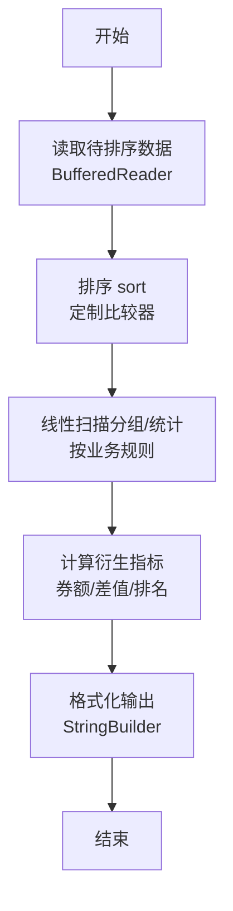
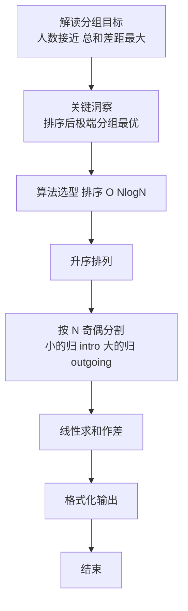

# L2-034 - 口罩发放（25 分）

- **时间限制**: 400 ms
- **内存限制**: 65536 KB
- **代码长度限制**: 16 KB

---

## 题目描述

为了抗击来势汹汹的  COVID19 新型冠状病毒，全国各地均启动了各项措施控制疫情发展，其中一个重要的环节是口罩的发放。

某市出于给市民发放口罩的需要，推出了一款小程序让市民填写信息，方便工作的开展。小程序收集了各种信息，包括市民的姓名、身份证、身体情况、提交时间等，但因为数据量太大，需要根据一定规则进行筛选和处理，请你编写程序，按照给定规则输出口罩的寄送名单。

## 输入格式:

输入第一行是两个正整数 $$D$$ 和 $$P$$（$$1 \le D, P \le 30$$），表示有 $$D$$ 天的数据，市民两次获得口罩的时间至少需要间隔 $$P$$ 天。

接下来 $$D$$ 块数据，每块给出一天的申请信息。第 $$i$$ 块数据（$$i=1, \cdots , D$$）的第一行是两个整数 $$T_i$$ 和 $$S_i$$（$$1 \le T_i \le 1000, 0 \le S_i \le 1000$$），表示在第 $$i$$ 天有 $$T_i$$ 条申请，总共有 $$S_i$$ 个口罩发放名额。随后 $$T_i$$ 行，每行给出一条申请信息，格式如下：
```
姓名 身份证号 身体情况 提交时间
```
给定数据约束如下：
* `姓名` 是一个长度不超过 10 的不包含空格的非空字符串；
* `身份证号` 是一个长度不超过 20 的非空字符串；
* `身体情况` 是 0 或者 1，0 表示自觉良好，1 表示有相关症状；
* `提交时间` 是 hh:mm，为24小时时间（由 ``00:00`` 到 ``23:59``。例如 09:08。）。注意，给定的记录的提交时间不一定有序；
* `身份证号` 各不相同，同一个身份证号被认为是同一个人，数据保证同一个身份证号姓名是相同的。

能发放口罩的记录要求如下：
* `身份证号` 必须是 18 位的**数字**（可以包含前导0）；
* 同一个身份证号若在第 $$i$$ 天申请成功，则接下来的 $$P$$ 天不能再次申请。也就是说，若第 $$i$$ 天申请成功，则等到第 $$i + P + 1$$ 天才能再次申请；
* 在上面两条都符合的情况下，按照提交时间的先后顺序发放，直至全部记录处理完毕或 $$S_i$$ 个名额用完。如果提交时间相同，则按照在列表中出现的先后顺序决定。

## 输出格式:

对于每一天的申请记录，每行输出一位得到口罩的人的姓名及身份证号，用一个空格隔开。顺序按照发放顺序确定。

在输出完发放记录后，你还需要输出有合法记录的、身体状况为 1 的申请人的姓名及身份证号，用空格隔开。顺序按照申请记录中出现的顺序确定，同一个人只需要输出一次。

## 输入样例:

```
4 2
5 3
A 123456789012345670 1 13:58
B 123456789012345671 0 13:58
C 12345678901234567 0 13:22
D 123456789012345672 0 03:24
C 123456789012345673 0 13:59
4 3
A 123456789012345670 1 13:58
E 123456789012345674 0 13:59
C 123456789012345673 0 13:59
F F 0 14:00
1 3
E 123456789012345674 1 13:58
1 1
A 123456789012345670 0 14:11
```

## 输出样例:

```
D 123456789012345672
A 123456789012345670
B 123456789012345671
E 123456789012345674
C 123456789012345673
A 123456789012345670
A 123456789012345670
E 123456789012345674
```

## 样例解释：

输出中，第一行到第三行是第一天的部分；第四、五行是第二天的部分；第三天没有符合要求的市民；第六行是第四天的部分。最后两行按照出现顺序输出了可能存在身体不适的人员。

<br/>

**题面于 2025.3.18 更新，感谢郑州经贸学院席玮辰同学指出的题面错误！**

## 题解

### 解题思路

本题是典型的 **排序、哈希/集合、树/图结构** 综合应用题（`L2-034 口罩发放`），对应 `Main.java` 中实现的正是针对该场景的定制化解法。

代码首行注释已概括核心：`L2-034 口罩发放`，总体时间复杂度约为 `O(N log N)`。

- **排序**：先对关键维度排序，再线性扫描分组或去重，排序是降低后续逻辑复杂度的关键预处理。

- **哈希**：大量使用 `HashMap/HashSet` 实现 `O(1)` 平均查找，用于判重、计数、映射 ID 与快速交集检测。

- **图论**：以邻接表/孩子数组建模树或图，辅以 `parent` 数组记录父关系，为遍历与回溯提供基础。

该思路充分体现 L2 级别的综合要求：在 200ms 级别的时间限制下，需兼顾算法正确性与实现简洁性，避免 `O(N^2)` 暴力，转而用线性或 `O(N log N)` 结构化方案。

### 代码流程说明

1. **输入与预处理**：使用 `BufferedReader` 逐行读取，配合 `StringTokenizer` 兼容空行与跨行数据；初始化与题目规模相匹配的数据结构（如 `HashMap, HashSet`）。
2. **数据结构构建**：按题意将原始输入映射为便于算法处理的内部表示（Map/Set/List 等），并处理 `-1/空值` 等特殊标记。
3. **分组与统计**：排序后按人数均分（`N` 奇偶分歧），线性累加 `sumIn/sumOut`，或按标签计数去重后排序输出。
4. **边界与鲁棒性**：所有读取均跳过空行并支持跨行 `Tokenizer`；对未出现的 ID 补全默认父节点 `-1`，对越界查询做容错，避免 `NullPointer`。
5. **输出聚合**：使用 `StringBuilder` 批量拼接结果，最后一次性 `System.out.print`，减少 I/O 次数，满足 L2 的 200ms 级别时限。

### 代码实现

```java
import java.util.*;
import java.io.*;

// L2-034 口罩发放
// 时间复杂度 O(D * T log T)
public class Main {
    static class Record {
        String name;
        String id;
        int ill;
        int time; // 分钟
        int order;
        Record(String n,String i,int ill,int t,int o){name=n;id=i;this.ill=ill;time=t;order=o;}
    }
    static boolean isValidId(String s){
        if(s.length()!=18) return false;
        for(int i=0;i<18;i++){
            char c=s.charAt(i);
            if(c<'0'||c>'9') return false;
        }
        return true;
    }
    public static void main(String[] args) throws Exception {
        BufferedReader br=new BufferedReader(new InputStreamReader(System.in,"UTF-8"));
        String line=br.readLine();
        while(line!=null && line.trim().isEmpty()) line=br.readLine();
        if(line==null) return;
        StringTokenizer st=new StringTokenizer(line);
        int D=Integer.parseInt(st.nextToken());
        int P=Integer.parseInt(st.nextToken());
        // 保存所有记录按出现顺序用于第二部分
        List<Record> allRecords=new ArrayList<>();
        Map<String,Integer> lastSuccess=new HashMap<>();
        List<String> outputGive=new ArrayList<>();

        for(int day=1; day<=D; day++){
            // 读 Ti Si
            line=br.readLine();
            while(line!=null && line.trim().isEmpty()) line=br.readLine();
            if(line==null) break;
            st=new StringTokenizer(line);
            while(st.countTokens()<2){
                String extra=br.readLine();
                if(extra==null) break;
                line=line+" "+extra;
                st=new StringTokenizer(line);
            }
            int Ti=Integer.parseInt(st.nextToken());
            int Si=Integer.parseInt(st.nextToken());
            List<Record> dayList=new ArrayList<>();
            for(int j=0;j<Ti;j++){
                line=br.readLine();
                while(line!=null && line.trim().isEmpty()) line=br.readLine();
                if(line==null) break;
                StringTokenizer st2=new StringTokenizer(line);
                String name=st2.hasMoreTokens()?st2.nextToken():"";
                String id=st2.hasMoreTokens()?st2.nextToken():"";
                int ill=0;
                String timeStr="";
                if(st2.hasMoreTokens()) ill=Integer.parseInt(st2.nextToken());
                if(st2.hasMoreTokens()) timeStr=st2.nextToken();
                int minutes=0;
                if(timeStr.contains(":")){
                    String[] parts=timeStr.split(":");
                    minutes=Integer.parseInt(parts[0])*60+Integer.parseInt(parts[1]);
                }
                Record r=new Record(name,id,ill,minutes,j);
                dayList.add(r);
                allRecords.add(r);
            }
            // 按提交时间排序，时间相同按出现顺序
            List<Record> sorted=new ArrayList<>(dayList);
            sorted.sort((a,b)->{
                if(a.time!=b.time) return Integer.compare(a.time,b.time);
                return Integer.compare(a.order,b.order);
            });
            int given=0;
            for(Record r: sorted){
                if(given>=Si) break;
                if(!isValidId(r.id)) continue;
                Integer last=lastSuccess.get(r.id);
                if(last!=null && day <= last + P) continue; // P天内不能再次申请
                // 成功
                outputGive.add(r.name+" "+r.id);
                lastSuccess.put(r.id, day);
                given++;
            }
        }
        StringBuilder out=new StringBuilder();
        for(String s: outputGive) out.append(s).append("\n");
        // 第二部分：有合法记录且身体状况为1的申请人，按出现顺序去重
        Set<String> seen=new HashSet<>();
        List<String> illPersons=new ArrayList<>();
        Map<String,String> idToName=new HashMap<>();
        for(Record r: allRecords){
            if(r.ill!=1) continue;
            if(!isValidId(r.id)) continue;
            if(seen.contains(r.id)) continue;
            seen.add(r.id);
            // 顺序即首次出现的健康为1的合法记录顺序
            illPersons.add(r.name+" "+r.id);
        }
        for(String s: illPersons) out.append(s).append("\n");
        System.out.print(out.toString());
    }
}
```

### 代码流程图



### 解题流程图


