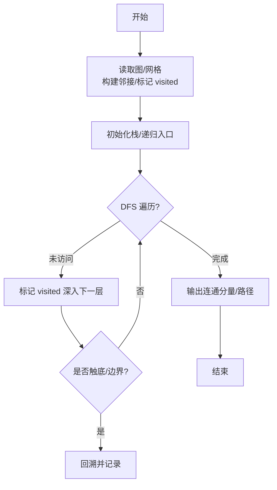
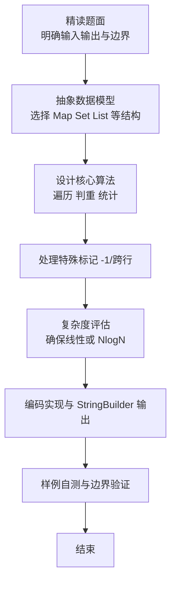

# L2-035 - 完全二叉树的层序遍历（25 分）

- **时间限制**: 400 ms
- **内存限制**: 65536 KB
- **代码长度限制**: 16 KB

---

## 题目描述


一个二叉树，如果每一个层的结点数都达到最大值，则这个二叉树就是**完美二叉树**。对于深度为 $$D$$ 的，有 $$N$$ 个结点的二叉树，若其结点对应于相同深度完美二叉树的层序遍历的前 $$N$$ 个结点，这样的树就是**完全二叉树**。

给定一棵完全二叉树的后序遍历，请你给出这棵树的层序遍历结果。

### 输入格式:

输入在第一行中给出正整数 $$N$$（$$\le 30$$），即树中结点个数。第二行给出后序遍历序列，为 $$N$$ 个不超过 100 的正整数。同一行中所有数字都以空格分隔。

### 输出格式:

在一行中输出该树的层序遍历序列。所有数字都以 1 个空格分隔，行首尾不得有多余空格。

### 输入样例:
```in
8
91 71 2 34 10 15 55 18
```

### 输出样例:
```out
18 34 55 71 2 10 15 91
```

## 示例

### 示例 1

**输入:**
```
8
91 71 2 34 10 15 55 18
```

**输出:**
```
18 34 55 71 2 10 15 91
```

### 解题思路

本题是典型的 **DFS、树/图结构** 综合应用题（`L2-035 完全二叉树的层序遍历`），对应 `Main.java` 中实现的正是针对该场景的定制化解法。

代码首行注释已概括核心：`L2-035 完全二叉树的层序遍历 - 由后序还原完全二叉树`，总体时间复杂度约为 `O(N log N)`。

- **DFS**：通过深度优先搜索递归/显式栈遍历整棵树或图，能够回溯记录路径，适合求最长链、判定连通分量与字典序比较。

- **图论**：以邻接表/孩子数组建模树或图，辅以 `parent` 数组记录父关系，为遍历与回溯提供基础。

该思路充分体现 L2 级别的综合要求：在 200ms 级别的时间限制下，需兼顾算法正确性与实现简洁性，避免 `O(N^2)` 暴力，转而用线性或 `O(N log N)` 结构化方案。

### 代码流程说明

1. **输入与预处理**：使用 `BufferedReader` 逐行读取，兼容空行与跨行输入。
2. **数据结构构建**：按题意将原始输入映射为便于算法处理的内部表示（Map/Set/List 等），并处理 `-1/空值` 等特殊标记。
3. **DFS/递归遍历**：从根出发深度优先探查，利用递归或显式栈回溯，合并子路径信息并按长度/字典序择优。
4. **边界与鲁棒性**：所有读取均跳过空行并支持跨行 `Tokenizer`；对未出现的 ID 补全默认父节点 `-1`，对越界查询做容错，避免 `NullPointer`。
5. **输出聚合**：使用 `StringBuilder` 批量拼接结果，最后一次性 `System.out.print`，减少 I/O 次数，满足 L2 的 200ms 级别时限。

### 代码实现

```java
import java.util.*;
import java.io.*;

// L2-035 完全二叉树的层序遍历 - 由后序还原完全二叉树
// 思路：完全二叉树的数组表示中下标准确，后序遍历对应对该数组的后序访问顺序
// 用DFS按后序填层序数组
// 时间复杂度 O(N)
public class Main {
    static int N;
    static int[] post;
    static int[] level;
    static int idx;
    static void dfs(int p){
        if(p >= N) return;
        dfs(2*p+1);
        dfs(2*p+2);
        level[p]=post[idx++];
    }
    public static void main(String[] args) throws Exception {
        BufferedReader br=new BufferedReader(new InputStreamReader(System.in,"UTF-8"));
        String line=br.readLine();
        while(line!=null && line.trim().isEmpty()) line=br.readLine();
        if(line==null) return;
        N=Integer.parseInt(line.trim());
        post=new int[N];
        level=new int[N];
        int cnt=0;
        while(cnt<N){
            line=br.readLine();
            if(line==null) break;
            if(line.trim().isEmpty()) continue;
            StringTokenizer st=new StringTokenizer(line);
            while(st.hasMoreTokens() && cnt<N){
                post[cnt++]=Integer.parseInt(st.nextToken());
            }
        }
        idx=0;
        dfs(0);
        StringBuilder sb=new StringBuilder();
        for(int i=0;i<N;i++){
            if(i>0) sb.append(' ');
            sb.append(level[i]);
        }
        System.out.println(sb.toString());
    }
}
```

### 代码流程图



### 解题流程图


