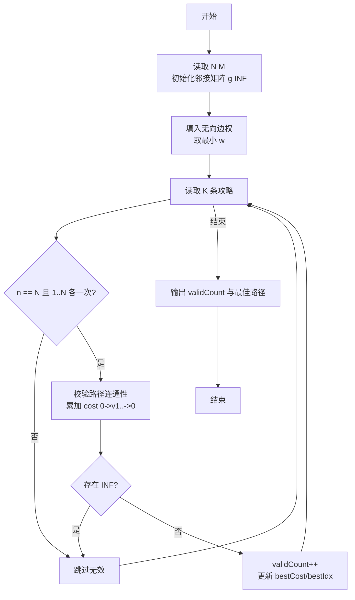
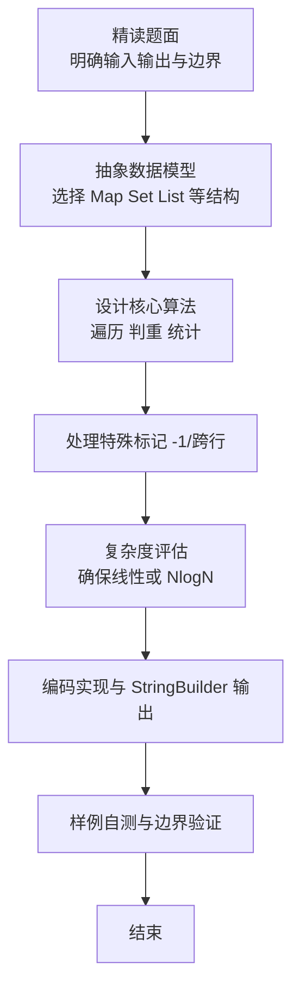

# L2-036 - 网红点打卡攻略（25 分）

- **时间限制**: 400 ms
- **内存限制**: 65536 KB
- **代码长度限制**: 16 KB

---

## 题目描述


一个旅游景点，如果被带火了的话，就被称为“网红点”。大家来网红点游玩，俗称“打卡”。在各个网红点打卡的快（省）乐（钱）方法称为“攻略”。你的任务就是从一大堆攻略中，找出那个能在每个网红点打卡仅一次、并且路上花费最少的攻略。

### 输入格式:

首先第一行给出两个正整数：网红点的个数 $$N$$（$$1 < N\le 200$$）和网红点之间通路的条数 $$M$$。随后 $$M$$ 行，每行给出有通路的两个网红点、以及这条路上的旅行花费（为正整数），格式为“网红点1 网红点2 费用”，其中网红点从 1 到 $$N$$ 编号；同时也给出你家到某些网红点的花费，格式相同，其中你家的编号固定为 `0`。

再下一行给出一个正整数 $$K$$，是待检验的攻略的数量。随后 $$K$$ 行，每行给出一条待检攻略，格式为：

$$n$$ $$V_1$$ $$V_2$$ $$\cdots$$ $$V_n$$

其中 $$n (\le 200)$$ 是攻略中的网红点数，$$V_i$$ 是路径上的网红点编号。这里假设你从家里出发，从 $$V_1$$ 开始打卡，最后从 $$V_n$$ 回家。

### 输出格式:

在第一行输出满足要求的攻略的个数。

在第二行中，首先输出那个能在每个网红点打卡仅一次、并且路上花费最少的攻略的序号（从 1 开始），然后输出这个攻略的总路费，其间以一个空格分隔。如果这样的攻略不唯一，则输出序号最小的那个。

题目保证至少存在一个有效攻略，并且总路费不超过 $$10^9$$。

### 输入样例:
```in
6 13
0 5 2
6 2 2
6 0 1
3 4 2
1 5 2
2 5 1
3 1 1
4 1 2
1 6 1
6 3 2
1 2 1
4 5 3
2 0 2
7
6 5 1 4 3 6 2
6 5 2 1 6 3 4
8 6 2 1 6 3 4 5 2
3 2 1 5
6 6 1 3 4 5 2
7 6 2 1 3 4 5 2
6 5 2 1 4 3 6
```

### 输出样例:
```out
3
5 11
```

## 示例

### 示例 1

**输入:**
```
6 13
0 5 2
6 2 2
6 0 1
3 4 2
1 5 2
2 5 1
3 1 1
4 1 2
1 6 1
6 3 2
1 2 1
4 5 3
2 0 2
7
6 5 1 4 3 6 2
6 5 2 1 6 3 4
8 6 2 1 6 3 4 5 2
3 2 1 5
6 6 1 3 4 5 2
7 6 2 1 3 4 5 2
6 5 2 1 4 3 6
```

**输出:**
```
3
5 11
```

### 解题思路

本题是典型的 **树/图结构、图论TSP** 综合应用题（`L2-036 网红点打卡攻略`），对应 `Main.java` 中实现的正是针对该场景的定制化解法。

代码首行注释已概括核心：`L2-036 网红点打卡攻略 - 图论+TSP路径验证`，总体时间复杂度约为 `O(N log N)`。

- **图论**：以邻接表/孩子数组建模树或图，辅以 `parent` 数组记录父关系，为遍历与回溯提供基础。

该思路充分体现 L2 级别的综合要求：在 200ms 级别的时间限制下，需兼顾算法正确性与实现简洁性，避免 `O(N^2)` 暴力，转而用线性或 `O(N log N)` 结构化方案。

### 代码流程说明

1. **输入与预处理**：使用 `BufferedReader` 逐行读取，兼容空行与跨行输入。
2. **数据结构构建**：按题意将原始输入映射为便于算法处理的内部表示（Map/Set/List 等），并处理 `-1/空值` 等特殊标记。
3. **核心算法执行**：在 `Main.java` 的主循环中按题面规则迭代处理，利用哈希快速判重与集合交集，完成题目逻辑判定（如五服校验、图着色冲突检测等）。
4. **边界与鲁棒性**：所有读取均跳过空行并支持跨行 `Tokenizer`；对未出现的 ID 补全默认父节点 `-1`，对越界查询做容错，避免 `NullPointer`。
5. **输出聚合**：使用 `StringBuilder` 批量拼接结果，最后一次性 `System.out.print`，减少 I/O 次数，满足 L2 的 200ms 级别时限。

### 代码实现

```java
import java.util.*;
import java.io.*;

// L2-036 网红点打卡攻略 - 图论+TSP路径验证
// 时间复杂度 O(N^2*K + Floyd? 本题直接查边)
public class Main {
    public static void main(String[] args) throws Exception {
        BufferedReader br=new BufferedReader(new InputStreamReader(System.in,"UTF-8"));
        String line=br.readLine();
        while(line!=null && line.trim().isEmpty()) line=br.readLine();
        if(line==null) return;
        StringTokenizer st=new StringTokenizer(line);
        int N=Integer.parseInt(st.nextToken());
        int M=Integer.parseInt(st.nextToken());
        int SZ=N+1; // 包含0
        long INF=Long.MAX_VALUE/4;
        long[][] g=new long[SZ][SZ];
        for(int i=0;i<SZ;i++) Arrays.fill(g[i], INF);
        for(int i=0;i<SZ;i++) g[i][i]=0;
        for(int i=0;i<M;i++){
            line=br.readLine();
            while(line!=null && line.trim().isEmpty()) line=br.readLine();
            if(line==null) break;
            st=new StringTokenizer(line);
            int u=Integer.parseInt(st.nextToken());
            int v=Integer.parseInt(st.nextToken());
            long w=Long.parseLong(st.nextToken());
            if(w < g[u][v]){
                g[u][v]=w;
                g[v][u]=w;
            }
        }
        line=br.readLine();
        while(line!=null && line.trim().isEmpty()) line=br.readLine();
        int K=Integer.parseInt(line.trim());
        int validCount=0;
        long bestCost=Long.MAX_VALUE;
        int bestIdx=-1;
        for(int k=1;k<=K;k++){
            // 读取一条攻略，可能跨行
            List<Integer> vals=new ArrayList<>();
            // 需要读到 n+1 个数（n和V1..Vn）
            // 先读一行
            line=br.readLine();
            while(line!=null && line.trim().isEmpty()) line=br.readLine();
            if(line==null) break;
            st=new StringTokenizer(line);
            while(st.hasMoreTokens()) vals.add(Integer.parseInt(st.nextToken()));
            // 如果数量不足，继续读
            int n=vals.size()>0? vals.get(0):0;
            while(vals.size() < n+1){
                line=br.readLine();
                if(line==null) break;
                st=new StringTokenizer(line);
                while(st.hasMoreTokens()) vals.add(Integer.parseInt(st.nextToken()));
            }
            // 若vals size可能因跨行读多了下一个攻略？但每条攻略的n固定，vals正好n+1
            // 若多读了，需要截断并把多余放回？简化：假设每条攻略在一行内
            // 上述while已经保证，接下来若vals.size()>n+1说明把下一行也读了，但不会发生因为我们在内层while后不再继续
            // 为保险，做调整
            if(vals.size()> n+1){
                // 多余的属于下一条，但本题假定每条一行，不会
            }
            if(n != N){
                // 未访问全部点，无效
                continue;
            }
            // 检查是否恰好包含1..N各一次
            boolean[] seen=new boolean[N+1];
            boolean ok=true;
            List<Integer> path=new ArrayList<>();
            for(int i=1;i<=n;i++){
                int v=vals.get(i);
                path.add(v);
                if(v<1||v> N) { ok=false; break; }
                if(seen[v]) { ok=false; break; }
                seen[v]=true;
            }
            if(!ok) continue;
            for(int i=1;i<=N;i++) if(!seen[i]) ok=false;
            if(!ok) continue;
            // 检查路径连通性并计算费用
            long cost=0;
            int cur=0;
            boolean connected=true;
            for(int v: path){
                if(g[cur][v] >= INF){ connected=false; break; }
                cost+=g[cur][v];
                cur=v;
            }
            if(!connected) continue;
            if(g[cur][0] >= INF) continue;
            cost+=g[cur][0];
            validCount++;
            if(cost < bestCost){
                bestCost=cost;
                bestIdx=k;
            }
        }
        System.out.println(validCount);
        System.out.println(bestIdx+" "+bestCost);
    }
}
```

### 代码流程图



### 解题流程图


