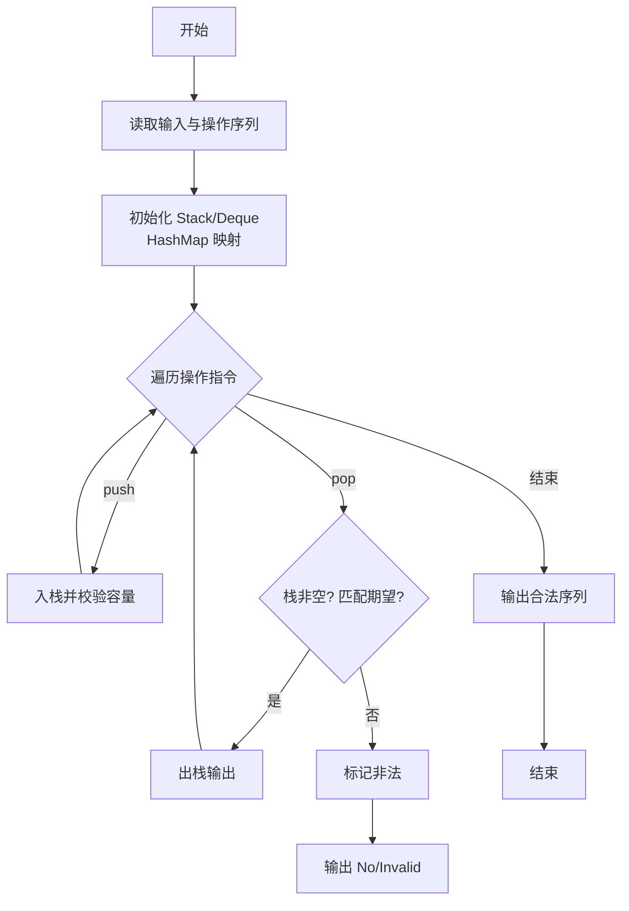
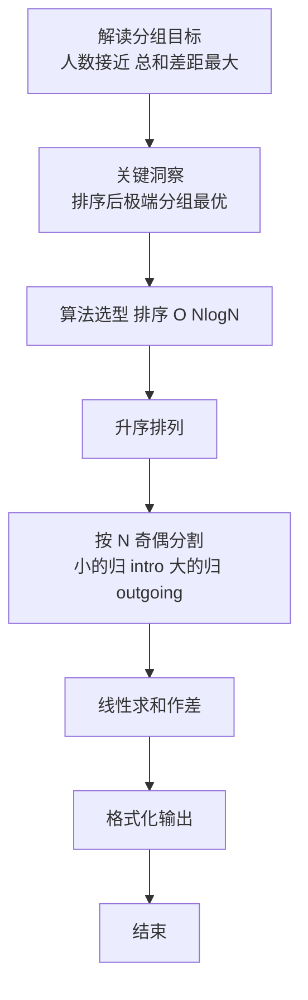

# L2-038 - 病毒溯源（25 分）

- **时间限制**: 400 ms
- **内存限制**: 65536 KB
- **代码长度限制**: 16 KB

---

## 题目描述


病毒容易发生变异。某种病毒可以通过突变产生若干变异的毒株，而这些变异的病毒又可能被诱发突变产生第二代变异，如此继续不断变化。

现给定一些病毒之间的变异关系，要求你找出其中最长的一条变异链。

在此假设给出的变异都是由突变引起的，不考虑复杂的基因重组变异问题 —— 即每一种病毒都是由唯一的一种病毒突变而来，并且不存在循环变异的情况。

### 输入格式:

输入在第一行中给出一个正整数 $$N$$（$$\le 10^4$$），即病毒种类的总数。于是我们将所有病毒从 0 到 $$N-1$$ 进行编号。

随后 $$N$$ 行，每行按以下格式描述一种病毒的变异情况：

```
k 变异株1 …… 变异株k
```

其中 `k` 是该病毒产生的变异毒株的种类数，后面跟着每种变异株的编号。第 $$i$$ 行对应编号为 $$i$$ 的病毒（$$0\le i <N$$）。题目保证病毒源头有且仅有一个。

### 输出格式:

首先输出从源头开始最长变异链的长度。

在第二行中输出从源头开始最长的一条变异链，编号间以 1 个空格分隔，行首尾不得有多余空格。如果最长链不唯一，则输出最小序列。

注：我们称序列 { $$a_1, \cdots , a_n$$ } 比序列 { $$b_1, \cdots , b_n$$ } “小”，如果存在 $$1\le k \le n$$ 满足 $$a_i = b_i$$ 对所有 $$i<k$$ 成立，且 $$a_k < b_k$$。

### 输入样例:
```in
10
3 6 4 8
0
0
0
2 5 9
0
1 7
1 2
0
2 3 1
```

### 输出样例:
```out
4
0 4 9 1
```

## 示例

### 示例 1

**输入:**
```
10
3 6 4 8
0
0
0
2 5 9
0
1 7
1 2
0
2 3 1
```

**输出:**
```
4
0 4 9 1
```

### 解题思路

本题是典型的 **栈、排序、树/图结构、动态规划** 综合应用题（`L2-038 病毒溯源`），对应 `Main.java` 中实现的正是针对该场景的定制化解法。

代码首行注释已概括核心：`L2-038 病毒溯源 - 树最长链+字典序最小`，总体时间复杂度约为 `O(N log N)`。

- **栈**：通过栈模拟后进先出的操作序列，如括号匹配、瓶/包装机调度，能够精确还原实际操作顺序。

- **排序**：先对关键维度排序，再线性扫描分组或去重，排序是降低后续逻辑复杂度的关键预处理。

- **图论**：以邻接表/孩子数组建模树或图，辅以 `parent` 数组记录父关系，为遍历与回溯提供基础。

- **DP**：采用动态规划自底向上合并子问题结果，通过 `bestLen/bestPath` 等数组记忆化，避免重复计算。

该思路充分体现 L2 级别的综合要求：在 200ms 级别的时间限制下，需兼顾算法正确性与实现简洁性，避免 `O(N^2)` 暴力，转而用线性或 `O(N log N)` 结构化方案。

### 代码流程说明

1. **输入与预处理**：使用 `BufferedReader` 逐行读取，配合 `StringTokenizer` 兼容空行与跨行数据；初始化与题目规模相匹配的数据结构（如 `邻接表/孩子数组, 栈`）。
2. **建模建图**：根据输入的父子/边关系构建 `parent` 数组与 `children` 邻接表，标记 `hasParent/visited` 以定位根节点，并对子节点排序保证字典序。
3. **分组与统计**：排序后按人数均分（`N` 奇偶分歧），线性累加 `sumIn/sumOut`，或按标签计数去重后排序输出。
4. **边界与鲁棒性**：所有读取均跳过空行并支持跨行 `Tokenizer`；对未出现的 ID 补全默认父节点 `-1`，对越界查询做容错，避免 `NullPointer`。
5. **输出聚合**：使用 `StringBuilder` 批量拼接结果，最后一次性 `System.out.print`，减少 I/O 次数，满足 L2 的 200ms 级别时限。

### 代码实现

```java
import java.util.*;
import java.io.*;

// L2-038 病毒溯源 - 树最长链+字典序最小
// 时间复杂度 O(N log N)
public class Main {
    public static void main(String[] args) throws Exception {
        BufferedReader br=new BufferedReader(new InputStreamReader(System.in,"UTF-8"));
        String line=br.readLine();
        while(line!=null && line.trim().isEmpty()) line=br.readLine();
        if(line==null) return;
        int N=Integer.parseInt(line.trim());
        List<Integer>[] children=new ArrayList[N];
        for(int i=0;i<N;i++) children[i]=new ArrayList<>();
        boolean[] hasParent=new boolean[N];
        for(int i=0;i<N;i++){
            line=br.readLine();
            while(line!=null && line.trim().isEmpty()) line=br.readLine();
            if(line==null) line="0";
            StringTokenizer st=new StringTokenizer(line);
            int k=Integer.parseInt(st.nextToken());
            for(int j=0;j<k;j++){
                while(!st.hasMoreTokens()){
                    line=br.readLine();
                    if(line==null) break;
                    st=new StringTokenizer(line);
                }
                int v=Integer.parseInt(st.nextToken());
                children[i].add(v);
                if(v>=0 && v<N) hasParent[v]=true;
            }
        }
        for(int i=0;i<N;i++) Collections.sort(children[i]);

        int root=0;
        for(int i=0;i<N;i++) if(!hasParent[i]) {root=i; break;}

        // 迭代获得后序
        List<Integer> order=new ArrayList<>();
        Deque<Integer> stack=new ArrayDeque<>();
        stack.push(root);
        while(!stack.isEmpty()){
            int u=stack.pop();
            order.add(u);
            for(int v: children[u]) stack.push(v);
        }
        Collections.reverse(order);
        int[] bestLen=new int[N];
        List<Integer>[] bestPath=new ArrayList[N];
        for(int i=0;i<N;i++){ bestLen[i]=1; bestPath[i]=new ArrayList<>(Arrays.asList(i)); }

        for(int u: order){
            if(children[u].isEmpty()){
                bestLen[u]=1;
                bestPath[u]=new ArrayList<>(Arrays.asList(u));
            }else{
                int maxL=-1;
                List<Integer> best=null;
                for(int v: children[u]){
                    int cand=bestLen[v];
                    if(cand>maxL){
                        maxL=cand;
                        best=bestPath[v];
                    }else if(cand==maxL){
                        // 字典序比较
                        if(compareList(bestPath[v], best) < 0){
                            best=bestPath[v];
                        }
                    }
                }
                bestLen[u]=maxL+1;
                List<Integer> newPath=new ArrayList<>();
                newPath.add(u);
                newPath.addAll(best);
                bestPath[u]=newPath;
            }
        }
        System.out.println(bestLen[root]);
        List<Integer> ansPath=bestPath[root];
        StringBuilder sb=new StringBuilder();
        for(int i=0;i<ansPath.size();i++){
            if(i>0) sb.append(' ');
            sb.append(ansPath.get(i));
        }
        System.out.println(sb.toString());
    }
    static int compareList(List<Integer> a, List<Integer> b){
        int n=Math.min(a.size(), b.size());
        for(int i=0;i<n;i++){
            int av=a.get(i), bv=b.get(i);
            if(av!=bv) return Integer.compare(av,bv);
        }
        return Integer.compare(a.size(), b.size());
    }
}
```

### 代码流程图



### 解题流程图


