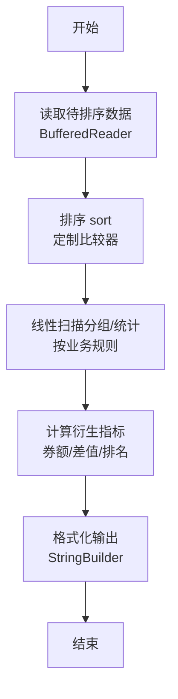
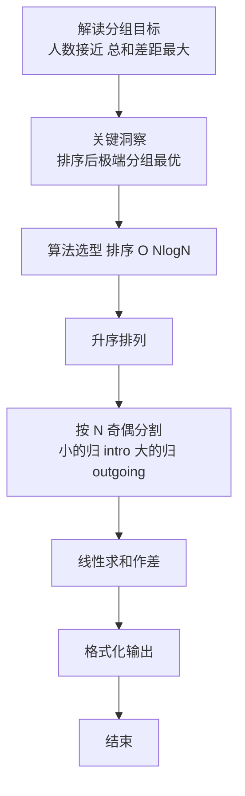

# L2-039 - 清点代码库（25 分）

- **时间限制**: 500 ms
- **内存限制**: 65536 KB
- **代码长度限制**: 16 KB

---

## 题目描述


上图转自新浪微博：“阿里代码库有几亿行代码，但其中有很多功能重复的代码，比如单单快排就被重写了几百遍。请设计一个程序，能够将代码库中所有功能重复的代码找出。各位大佬有啥想法，我当时就懵了，然后就挂了。。。”

这里我们把问题简化一下：首先假设两个功能模块如果接受同样的输入，总是给出同样的输出，则它们就是功能重复的；其次我们把每个模块的输出都简化为一个整数（在 **int** 范围内）。于是我们可以设计一系列输入，检查所有功能模块的对应输出，从而查出功能重复的代码。你的任务就是设计并实现这个简化问题的解决方案。

### 输入格式:

输入在第一行中给出 2 个正整数，依次为 $$N$$（$$\le 10^4$$）和 $$M$$（$$\le 10^2$$），对应功能模块的个数和系列测试输入的个数。

随后 $$N$$ 行，每行给出一个功能模块的 $$M$$ 个对应输出，数字间以空格分隔。

### 输出格式:

首先在第一行输出不同功能的个数 $$K$$。随后 $$K$$ 行，每行给出具有这个功能的模块的个数，以及这个功能的对应输出。数字间以 1 个空格分隔，行首尾不得有多余空格。输出首先按模块个数非递增顺序，如果有并列，则按输出序列的递增序给出。

注：所谓数列 { $$A_1$$, ..., $$A_M$$ } 比 { $$B_1$$, ..., $$B_M$$ } 大，是指存在 $$1\le i <M$$，使得 $$A_1=B_1$$，...，$$A_i=B_i$$ 成立，且 $$A_{i+1} > B_{i+1}$$。

### 输入样例:
```in
7 3
35 28 74
-1 -1 22
28 74 35
-1 -1 22
11 66 0
35 28 74
35 28 74
```

### 输出样例:
```out
4
3 35 28 74
2 -1 -1 22
1 11 66 0
1 28 74 35
```

## 示例

### 示例 1

**输入:**
```
7 3
35 28 74
-1 -1 22
28 74 35
-1 -1 22
11 66 0
35 28 74
35 28 74
```

**输出:**
```
4
3 35 28 74
2 -1 -1 22
1 11 66 0
1 28 74 35
```

### 解题思路

本题是典型的 **排序、哈希/集合、树/图结构** 综合应用题（`L2-039 清点代码库`），对应 `Main.java` 中实现的正是针对该场景的定制化解法。

代码首行注释已概括核心：`L2-039 清点代码库 - 去重+排序`，总体时间复杂度约为 `O(N log N)`。

- **排序**：先对关键维度排序，再线性扫描分组或去重，排序是降低后续逻辑复杂度的关键预处理。

- **哈希**：大量使用 `HashMap/HashSet` 实现 `O(1)` 平均查找，用于判重、计数、映射 ID 与快速交集检测。

- **图论**：以邻接表/孩子数组建模树或图，辅以 `parent` 数组记录父关系，为遍历与回溯提供基础。

该思路充分体现 L2 级别的综合要求：在 200ms 级别的时间限制下，需兼顾算法正确性与实现简洁性，避免 `O(N^2)` 暴力，转而用线性或 `O(N log N)` 结构化方案。

### 代码流程说明

1. **输入与预处理**：使用 `BufferedReader` 逐行读取，配合 `StringTokenizer` 兼容空行与跨行数据；初始化与题目规模相匹配的数据结构（如 `HashMap`）。
2. **数据结构构建**：按题意将原始输入映射为便于算法处理的内部表示（Map/Set/List 等），并处理 `-1/空值` 等特殊标记。
3. **分组与统计**：排序后按人数均分（`N` 奇偶分歧），线性累加 `sumIn/sumOut`，或按标签计数去重后排序输出。
4. **边界与鲁棒性**：所有读取均跳过空行并支持跨行 `Tokenizer`；对未出现的 ID 补全默认父节点 `-1`，对越界查询做容错，避免 `NullPointer`。
5. **输出聚合**：使用 `StringBuilder` 批量拼接结果，最后一次性 `System.out.print`，减少 I/O 次数，满足 L2 的 200ms 级别时限。

### 代码实现

```java
import java.util.*;
import java.io.*;

// L2-039 清点代码库 - 去重+排序
// 时间复杂度 O(N log N * M)
public class Main {
    static class Entry{
        int cnt;
        int[] vec;
        Entry(int c,int[] v){cnt=c; vec=v;}
    }
    public static void main(String[] args) throws Exception {
        BufferedReader br=new BufferedReader(new InputStreamReader(System.in,"UTF-8"));
        String line=br.readLine();
        while(line!=null && line.trim().isEmpty()) line=br.readLine();
        if(line==null) return;
        StringTokenizer st=new StringTokenizer(line);
        int N=Integer.parseInt(st.nextToken());
        int M=Integer.parseInt(st.nextToken());
        Map<String,int[]> vecMap=new HashMap<>();
        Map<String,Integer> cntMap=new HashMap<>();

        // 读取 N 行，每行 M 个整数
        for(int i=0;i<N;i++){
            int[] vec=new int[M];
            int filled=0;
            while(filled < M){
                line=br.readLine();
                if(line==null) break;
                if(line.trim().isEmpty()) continue;
                StringTokenizer st2=new StringTokenizer(line);
                while(st2.hasMoreTokens() && filled<M){
                    vec[filled++]=Integer.parseInt(st2.nextToken());
                }
            }
            String key=buildKey(vec);
            if(cntMap.containsKey(key)){
                cntMap.put(key, cntMap.get(key)+1);
            }else{
                cntMap.put(key,1);
                vecMap.put(key, vec);
            }
        }
        List<Entry> list=new ArrayList<>();
        for(String k: cntMap.keySet()){
            list.add(new Entry(cntMap.get(k), vecMap.get(k)));
        }
        list.sort((a,b)->{
            if(a.cnt!=b.cnt) return Integer.compare(b.cnt, a.cnt);
            for(int i=0;i<M;i++){
                if(a.vec[i]!=b.vec[i]) return Integer.compare(a.vec[i], b.vec[i]);
            }
            return 0;
        });
        StringBuilder sb=new StringBuilder();
        sb.append(list.size()).append("\n");
        for(Entry e: list){
            sb.append(e.cnt);
            for(int v: e.vec) sb.append(' ').append(v);
            sb.append("\n");
        }
        System.out.print(sb.toString());
    }
    static String buildKey(int[] vec){
        StringBuilder sb=new StringBuilder();
        for(int i=0;i<vec.length;i++){
            if(i>0) sb.append(',');
            sb.append(vec[i]);
        }
        return sb.toString();
    }
}
```

### 代码流程图



### 解题流程图


