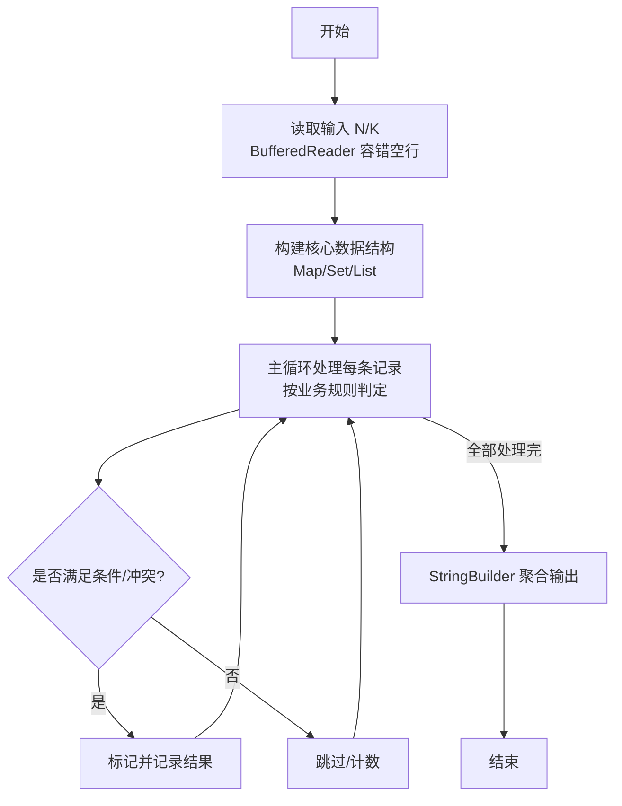
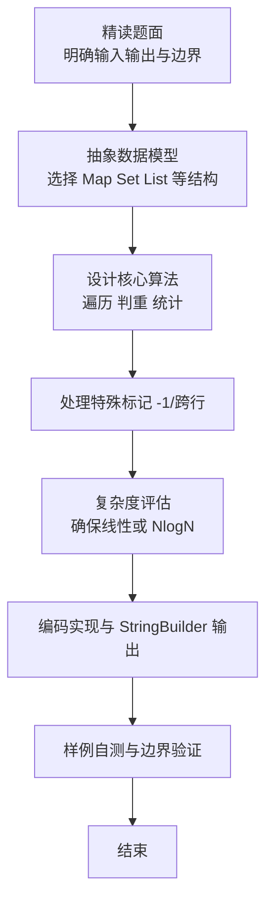

# L2-040 - 哲哲打游戏（25 分）

- **时间限制**: 400 ms
- **内存限制**: 65536 KB
- **代码长度限制**: 16 KB

---

## 题目描述


哲哲是一位硬核游戏玩家。最近一款名叫《达诺达诺》的新游戏刚刚上市，哲哲自然要快速攻略游戏，守护硬核游戏玩家的一切！

为简化模型，我们不妨假设游戏有 $$N$$ 个剧情点，通过游戏里不同的操作或选择可以从某个剧情点去往另外一个剧情点。此外，游戏还设置了一些**存档**，在某个剧情点可以将玩家的游戏进度保存在一个档位上，读取存档后可以回到剧情点，重新进行操作或者选择，到达不同的剧情点。

为了追踪硬核游戏玩家哲哲的攻略进度，你打算写一个程序来完成这个工作。假设你已经知道了游戏的全部剧情点和流程，以及哲哲的游戏操作，请你输出哲哲的游戏进度。

### 输入格式:

输入第一行是两个正整数 $$N$$ 和 $$M$$ ($$1\le N , M \le 10^5$$)，表示总共有 $$N$$ 个剧情点，哲哲有 $$M$$ 个游戏操作。

接下来的 $$N$$ 行，每行对应一个剧情点的发展设定。第 $$i$$ 行的第一个数字是 $$K_i$$，表示剧情点 $$i$$ 通过一些操作或选择能去往下面 $$K_i$$ 个剧情点；接下来有 $$K_i$$ 个数字，第 $$k$$ 个数字表示做第 $$k$$ 个操作或选择可以去往的剧情点编号。

最后有 $$M$$ 行，每行第一个数字是 0、1 或 2，分别表示：

* 0 表示哲哲做出了某个操作或选择，后面紧接着一个数字 $$j$$，表示哲哲在当前剧情点做出了第 $$j$$ 个选择。我们保证哲哲的选择永远是合法的。
* 1 表示哲哲进行了一次存档，后面紧接着是一个数字 $$j$$，表示存档放在了第 $$j$$ 个档位上。
* 2 表示哲哲进行了一次读取存档的操作，后面紧接着是一个数字 $$j$$，表示读取了放在第 $$j$$ 个位置的存档。

约定：所有操作或选择以及剧情点编号都从 1 号开始。存档的档位不超过 100 个，编号也从 1 开始。游戏默认从 1 号剧情点开始。总的选项数（即 $$\sum K_i$$）不超过 $$10^6$$。

### 输出格式:

对于每个 1（即存档）操作，在一行中输出存档的剧情点编号。

最后一行输出哲哲最后到达的剧情点编号。

### 输入样例:
```in
10 11
3 2 3 4
1 6
3 4 7 5
1 3
1 9
2 3 5
3 1 8 5
1 9
2 8 10
0
1 1
0 3
0 1
1 2
0 2
0 2
2 2
0 3
0 1
1 1
0 2
```

### 输出样例:
```out
1
3
9
10
```

## 示例

### 示例 1

**输入:**
```
10 11
3 2 3 4
1 6
3 4 7 5
1 3
1 9
2 3 5
3 1 8 5
1 9
2 8 10
0
1 1
0 3
0 1
1 2
0 2
0 2
2 2
0 3
0 1
1 1
0 2
```

**输出:**
```
1
3
9
10
```

### 解题思路

本题是典型的 **树/图结构** 综合应用题（`L2-040 哲哲打游戏`），对应 `Main.java` 中实现的正是针对该场景的定制化解法。

代码首行注释已概括核心：`L2-040 哲哲打游戏 - 模拟存档读档`，总体时间复杂度约为 `O(N log N)`。

- **图论**：以邻接表/孩子数组建模树或图，辅以 `parent` 数组记录父关系，为遍历与回溯提供基础。

该思路充分体现 L2 级别的综合要求：在 200ms 级别的时间限制下，需兼顾算法正确性与实现简洁性，避免 `O(N^2)` 暴力，转而用线性或 `O(N log N)` 结构化方案。

### 代码流程说明

1. **输入与预处理**：使用 `BufferedReader` 逐行读取，兼容空行与跨行输入。
2. **数据结构构建**：按题意将原始输入映射为便于算法处理的内部表示（Map/Set/List 等），并处理 `-1/空值` 等特殊标记。
3. **核心算法执行**：在 `Main.java` 的主循环中按题面规则迭代处理，利用哈希快速判重与集合交集，完成题目逻辑判定（如五服校验、图着色冲突检测等）。
4. **边界与鲁棒性**：所有读取均跳过空行并支持跨行 `Tokenizer`；对未出现的 ID 补全默认父节点 `-1`，对越界查询做容错，避免 `NullPointer`。
5. **输出聚合**：使用 `StringBuilder` 批量拼接结果，最后一次性 `System.out.print`，减少 I/O 次数，满足 L2 的 200ms 级别时限。

### 代码实现

```java
import java.util.*;
import java.io.*;

// L2-040 哲哲打游戏 - 模拟存档读档
// 时间复杂度 O(N + M + sum K)
public class Main {
    public static void main(String[] args) throws Exception {
        BufferedReader br=new BufferedReader(new InputStreamReader(System.in,"UTF-8"));
        String line=br.readLine();
        while(line!=null && line.trim().isEmpty()) line=br.readLine();
        if(line==null) return;
        StringTokenizer st=new StringTokenizer(line);
        int N=Integer.parseInt(st.nextToken());
        int M=Integer.parseInt(st.nextToken());
        List<int[]> next=new ArrayList<>(N+1);
        next.add(new int[0]); // 0
        for(int i=1;i<=N;i++){
            // 读剧情点i的设定，可能跨行
            List<Integer> vals=new ArrayList<>();
            while(vals.isEmpty()){
                line=br.readLine();
                if(line==null) break;
                if(line.trim().isEmpty()) continue;
                StringTokenizer st2=new StringTokenizer(line);
                while(st2.hasMoreTokens()) vals.add(Integer.parseInt(st2.nextToken()));
            }
            int K=vals.get(0);
            // 如果 vals 数量不足 K+1，继续读
            while(vals.size() < K+1){
                line=br.readLine();
                if(line==null) break;
                StringTokenizer st2=new StringTokenizer(line);
                while(st2.hasMoreTokens()) vals.add(Integer.parseInt(st2.nextToken()));
            }
            int[] arr=new int[K];
            for(int j=0;j<K;j++) arr[j]=vals.get(j+1);
            next.add(arr);
        }
        int cur=1;
        int[] save=new int[105]; // 档位1..100
        StringBuilder out=new StringBuilder();
        for(int i=0;i<M;i++){
            line=br.readLine();
            while(line!=null && line.trim().isEmpty()) line=br.readLine();
            if(line==null) break;
            StringTokenizer st2=new StringTokenizer(line);
            int type=Integer.parseInt(st2.nextToken());
            int j=0;
            if(st2.hasMoreTokens()) j=Integer.parseInt(st2.nextToken());
            else{
                // 读下一行？但理论上同行
                line=br.readLine();
                if(line!=null) j=Integer.parseInt(line.trim());
            }
            if(type==0){
                // 选择
                int[] arr=next.get(cur);
                // j是第j个选择，1-indexed
                cur=arr[j-1];
            }else if(type==1){
                save[j]=cur;
                out.append(cur).append("\n");
            }else if(type==2){
                cur=save[j];
            }
        }
        out.append(cur).append("\n");
        System.out.print(out.toString());
    }
}
```

### 代码流程图



### 解题流程图


