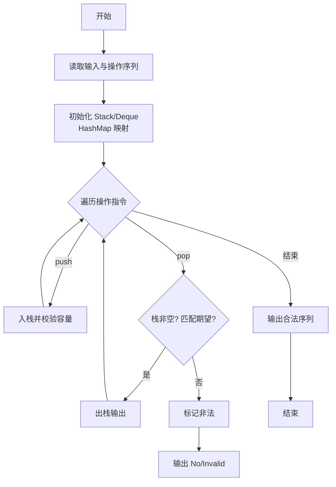
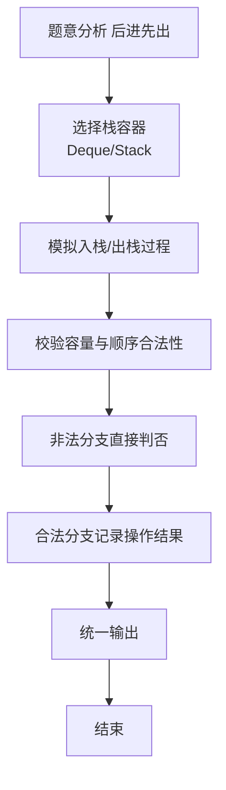

# L2-041 - 插松枝（25 分）

- **时间限制**: 400 ms
- **内存限制**: 65536 KB
- **代码长度限制**: 16 KB

---

## 题目描述


人造松枝加工场的工人需要将各种尺寸的塑料松针插到松枝干上，做成大大小小的松枝。他们的工作流程（并不）是这样的：

- 每人手边有一只小盒子，初始状态为空。
- 每人面前有用不完的松枝干和一个推送器，每次推送一片随机型号的松针片。
- 工人首先捡起一根空的松枝干，从小盒子里摸出最上面的一片松针 —— 如果小盒子是空的，就从推送器上取一片松针。将这片松针插到枝干的最下面。
- 工人在插后面的松针时，需要保证，每一步插到一根非空松枝干上的松针片，不能比前一步插上的松针片大。如果小盒子中最上面的松针满足要求，就取之插好；否则去推送器上取一片。如果推送器上拿到的仍然不满足要求，就把拿到的这片堆放到小盒子里，继续去推送器上取下一片。注意这里假设小盒子里的松针片是按放入的顺序堆叠起来的，工人每次只能取出最上面（即最后放入）的一片。
- 当下列三种情况之一发生时，工人会结束手里的松枝制作，开始做下一个：

（1）小盒子已经满了，但推送器上取到的松针仍然不满足要求。此时将手中的松枝放到成品篮里，推送器上取到的松针压回推送器，开始下一根松枝的制作。

（2）小盒子中最上面的松针不满足要求，但推送器上已经没有松针了。此时将手中的松枝放到成品篮里，开始下一根松枝的制作。

（3）手中的松枝干上已经插满了松针，将之放到成品篮里，开始下一根松枝的制作。

现在给定推送器上顺序传过来的 $$N$$ 片松针的大小，以及小盒子和松枝的容量，请你编写程序自动列出每根成品松枝的信息。

### 输入格式:

输入在第一行中给出 3 个正整数：$$N$$（$$\le 10^3$$），为推送器上松针片的数量；$$M$$（$$\le 20$$）为小盒子能存放的松针片的最大数量；$$K$$（$$\le 5$$）为一根松枝干上能插的松针片的最大数量。

随后一行给出 $$N$$ 个不超过 $$100$$ 的正整数，为推送器上顺序推出的松针片的大小。

### 输出格式:

每支松枝成品的信息占一行，顺序给出自底向上每片松针的大小。数字间以 1 个空格分隔，行首尾不得有多余空格。

### 输入样例:
```in
8 3 4
20 25 15 18 20 18 8 5
```

### 输出样例:
```out
20 15
20 18 18 8
25 5
```

## 示例

### 示例 1

**输入:**
```
8 3 4
20 25 15 18 20 18 8 5
```

**输出:**
```
20 15
20 18 18 8
25 5
```

### 解题思路

本题是典型的 **栈、树/图结构** 综合应用题（`L2-041 插松枝`），对应 `Main.java` 中实现的正是针对该场景的定制化解法。

代码首行注释已概括核心：`L2-041 插松枝 - 栈+队列模拟`，总体时间复杂度约为 `O(N log N)`。

- **栈**：通过栈模拟后进先出的操作序列，如括号匹配、瓶/包装机调度，能够精确还原实际操作顺序。

- **图论**：以邻接表/孩子数组建模树或图，辅以 `parent` 数组记录父关系，为遍历与回溯提供基础。

该思路充分体现 L2 级别的综合要求：在 200ms 级别的时间限制下，需兼顾算法正确性与实现简洁性，避免 `O(N^2)` 暴力，转而用线性或 `O(N log N)` 结构化方案。

### 代码流程说明

1. **输入与预处理**：使用 `BufferedReader` 逐行读取，兼容空行与跨行输入。
2. **数据结构构建**：按题意将原始输入映射为便于算法处理的内部表示（Map/Set/List 等），并处理 `-1/空值` 等特殊标记。
3. **栈模拟**：按给定的操作序列 `push/pop` 模拟栈行为，校验出栈顺序合法性或还原包装机状态，非法时即时判否。
4. **边界与鲁棒性**：所有读取均跳过空行并支持跨行 `Tokenizer`；对未出现的 ID 补全默认父节点 `-1`，对越界查询做容错，避免 `NullPointer`。
5. **输出聚合**：使用 `StringBuilder` 批量拼接结果，最后一次性 `System.out.print`，减少 I/O 次数，满足 L2 的 200ms 级别时限。

### 代码实现

```java
import java.util.*;
import java.io.*;

// L2-041 插松枝 - 栈+队列模拟
// 时间复杂度 O(N*M)
public class Main {
    public static void main(String[] args) throws Exception {
        BufferedReader br=new BufferedReader(new InputStreamReader(System.in,"UTF-8"));
        String line=br.readLine();
        while(line!=null && line.trim().isEmpty()) line=br.readLine();
        if(line==null) return;
        StringTokenizer st=new StringTokenizer(line);
        int N=Integer.parseInt(st.nextToken());
        int M=Integer.parseInt(st.nextToken());
        int K=Integer.parseInt(st.nextToken());
        int[] a=new int[N];
        int filled=0;
        while(filled<N){
            line=br.readLine();
            if(line==null) break;
            if(line.trim().isEmpty()) continue;
            StringTokenizer st2=new StringTokenizer(line);
            while(st2.hasMoreTokens() && filled<N){
                a[filled++]=Integer.parseInt(st2.nextToken());
            }
        }
        Deque<Integer> box=new ArrayDeque<>();
        List<Integer> cur=new ArrayList<>();
        List<List<Integer>> result=new ArrayList<>();
        int idx=0;
        while(true){
            // 判断终止：推送器空、盒子空、当前枝空 => 完成
            if(idx>=N && box.isEmpty() && cur.isEmpty()) break;

            boolean boxCan = !box.isEmpty() && (cur.isEmpty() || box.peek() <= cur.get(cur.size()-1));
            if(boxCan){
                int v=box.pop();
                cur.add(v);
                if(cur.size()==K){
                    result.add(new ArrayList<>(cur));
                    cur.clear();
                }
                continue;
            }else{
                if(idx>=N){
                    // 推送器空且盒子不可用
                    if(!cur.isEmpty()){
                        result.add(new ArrayList<>(cur));
                        cur.clear();
                        // 循环继续，若盒子仍有则下一轮会从盒子取
                        if(box.isEmpty()) break;
                        continue;
                    }else{
                        if(box.isEmpty()) break;
                        // cur空但盒子有，下一轮boxCan会成立，继续
                        continue;
                    }
                }else{
                    int c=a[idx++];
                    boolean canInsert = cur.isEmpty() || c <= cur.get(cur.size()-1);
                    if(canInsert){
                        cur.add(c);
                        if(cur.size()==K){
                            result.add(new ArrayList<>(cur));
                            cur.clear();
                        }
                    }else{
                        if(box.size() >= M){
                            // 盒子满，结束当前枝，C压回
                            if(!cur.isEmpty()){
                                result.add(new ArrayList<>(cur));
                                cur.clear();
                            }else{
                                // cur为空但盒子满且C不满足，是否也算结束空枝？此时不应产生空行，直接压回并继续
                                // 但按题意“小盒子已经满了，但推送器上取到的松针仍然不满足要求。此时将手中的松枝放到成品篮里”
                                // 若cur为空，可能产生空行？实际不会因为cur为空时盒子满但C比null? cur为空时任何C满足canInsert，所以不会进入此分支
                            }
                            idx--; // 压回
                            // 若cur为空且idx回退，可能无限循环？但此情况理论上不会出现
                            // 若cur为空，加保护避免死循环
                            if(cur.isEmpty() && box.size()>=M && idx < N){
                                // 实际上此时canInsert应为true，所以不会到这
                            }
                        }else{
                            box.push(c);
                        }
                    }
                }
            }
        }
        // 输出
        StringBuilder sb=new StringBuilder();
        for(List<Integer> branch: result){
            for(int i=0;i<branch.size();i++){
                if(i>0) sb.append(' ');
                sb.append(branch.get(i));
            }
            sb.append("\n");
        }
        System.out.print(sb.toString());
    }
}
```

### 代码流程图



### 解题流程图


