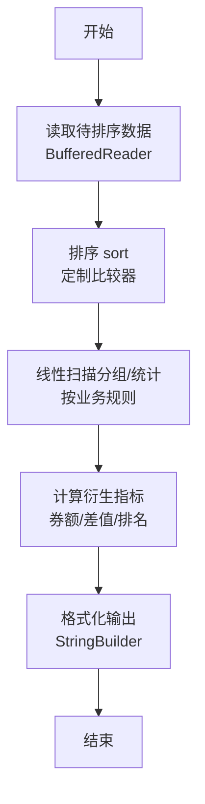
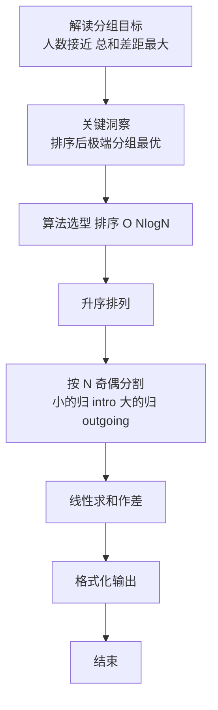

# L2-042 - 老板的作息表（25 分）

- **时间限制**: 200 ms
- **内存限制**: 65536 KB
- **代码长度限制**: 16 KB

---

## 题目描述


新浪微博上有人发了某老板的作息时间表，表示其每天 4:30 就起床了。但立刻有眼尖的网友问：这时间表不完整啊，早上九点到下午一点干啥了？

本题就请你编写程序，检查任意一张时间表，找出其中没写出来的时间段。

### 输入格式:

输入第一行给出一个正整数 $$N$$，为作息表上列出的时间段的个数。随后 $$N$$ 行，每行给出一个时间段，格式为：

```
hh:mm:ss - hh:mm:ss
```
其中 `hh`、`mm`、`ss` 分别是两位数表示的小时、分钟、秒。第一个时间是开始时间，第二个是结束时间。题目保证所有时间都在一天之内（即从 00:00:00 到 23:59:59）；每个区间间隔至少 1 秒；并且任意两个给出的时间区间最多只在一个端点有重合，没有区间重叠的情况。

### 输出格式:

按照时间顺序列出时间表中没有出现的区间，每个区间占一行，格式与输入相同。题目保证至少存在一个区间需要输出。

### 输入样例:
```in
8
13:00:00 - 18:00:00
00:00:00 - 01:00:05
08:00:00 - 09:00:00
07:10:59 - 08:00:00
01:00:05 - 04:30:00
06:30:00 - 07:10:58
05:30:00 - 06:30:00
18:00:00 - 19:00:00
```

### 输出样例:
```out
04:30:00 - 05:30:00
07:10:58 - 07:10:59
09:00:00 - 13:00:00
19:00:00 - 23:59:59
```

## 示例

### 示例 1

**输入:**
```
8
13:00:00 - 18:00:00
00:00:00 - 01:00:05
08:00:00 - 09:00:00
07:10:59 - 08:00:00
01:00:05 - 04:30:00
06:30:00 - 07:10:58
05:30:00 - 06:30:00
18:00:00 - 19:00:00
```

**输出:**
```
04:30:00 - 05:30:00
07:10:58 - 07:10:59
09:00:00 - 13:00:00
19:00:00 - 23:59:59
```

### 解题思路

本题是典型的 **排序、树/图结构** 综合应用题（`L2-042 老板的作息表`），对应 `Main.java` 中实现的正是针对该场景的定制化解法。

代码首行注释已概括核心：`L2-042 老板的作息表 - 区间查漏`，总体时间复杂度约为 `O(N log N)`。

- **排序**：先对关键维度排序，再线性扫描分组或去重，排序是降低后续逻辑复杂度的关键预处理。

- **图论**：以邻接表/孩子数组建模树或图，辅以 `parent` 数组记录父关系，为遍历与回溯提供基础。

该思路充分体现 L2 级别的综合要求：在 200ms 级别的时间限制下，需兼顾算法正确性与实现简洁性，避免 `O(N^2)` 暴力，转而用线性或 `O(N log N)` 结构化方案。

### 代码流程说明

1. **输入与预处理**：使用 `BufferedReader` 逐行读取，兼容空行与跨行输入。
2. **排序预处理**：将活跃度/记录数组 `Arrays.sort` 升序排列，为后续分组与差值计算奠定有序基础。
3. **分组与统计**：排序后按人数均分（`N` 奇偶分歧），线性累加 `sumIn/sumOut`，或按标签计数去重后排序输出。
4. **边界与鲁棒性**：所有读取均跳过空行并支持跨行 `Tokenizer`；对未出现的 ID 补全默认父节点 `-1`，对越界查询做容错，避免 `NullPointer`。
5. **输出聚合**：使用 `StringBuilder` 批量拼接结果，最后一次性 `System.out.print`，减少 I/O 次数，满足 L2 的 200ms 级别时限。

### 代码实现

```java
import java.util.*;
import java.io.*;

// L2-042 老板的作息表 - 区间查漏
// 时间复杂度 O(N log N)
public class Main {
    static int toSec(String s){
        String[] p=s.split(":");
        return Integer.parseInt(p[0])*3600 + Integer.parseInt(p[1])*60 + Integer.parseInt(p[2]);
    }
    static String toStr(int sec){
        int h=sec/3600;
        int m=(sec%3600)/60;
        int s=sec%60;
        return String.format("%02d:%02d:%02d", h,m,s);
    }
    public static void main(String[] args) throws Exception {
        BufferedReader br=new BufferedReader(new InputStreamReader(System.in,"UTF-8"));
        String line=br.readLine();
        while(line!=null && line.trim().isEmpty()) line=br.readLine();
        if(line==null) return;
        int N=Integer.parseInt(line.trim());
        int[][] segs=new int[N][2];
        for(int i=0;i<N;i++){
            line=br.readLine();
            while(line!=null && line.trim().isEmpty()) line=br.readLine();
            if(line==null) break;
            // 格式 hh:mm:ss - hh:mm:ss
            // 可能空格不固定，用正则分割
            String[] parts=line.split("-");
            // parts[0] 含开始时间，parts[1] 结束
            String start=parts[0].trim();
            String end=parts[1].trim();
            segs[i][0]=toSec(start);
            segs[i][1]=toSec(end);
        }
        Arrays.sort(segs, (a,b)-> Integer.compare(a[0], b[0]));
        StringBuilder out=new StringBuilder();
        int DAY_START=0;
        int DAY_END=23*3600+59*60+59;
        // 起始前的空隙
        if(segs[0][0] != DAY_START){
            out.append(toStr(DAY_START)).append(" - ").append(toStr(segs[0][0])).append("\n");
        }
        for(int i=0;i<N-1;i++){
            int end=segs[i][1];
            int nextStart=segs[i+1][0];
            if(end != nextStart){
                out.append(toStr(end)).append(" - ").append(toStr(nextStart)).append("\n");
            }
        }
        if(segs[N-1][1] != DAY_END){
            out.append(toStr(segs[N-1][1])).append(" - ").append(toStr(DAY_END)).append("\n");
        }
        System.out.print(out.toString());
    }
}
```

### 代码流程图



### 解题流程图


