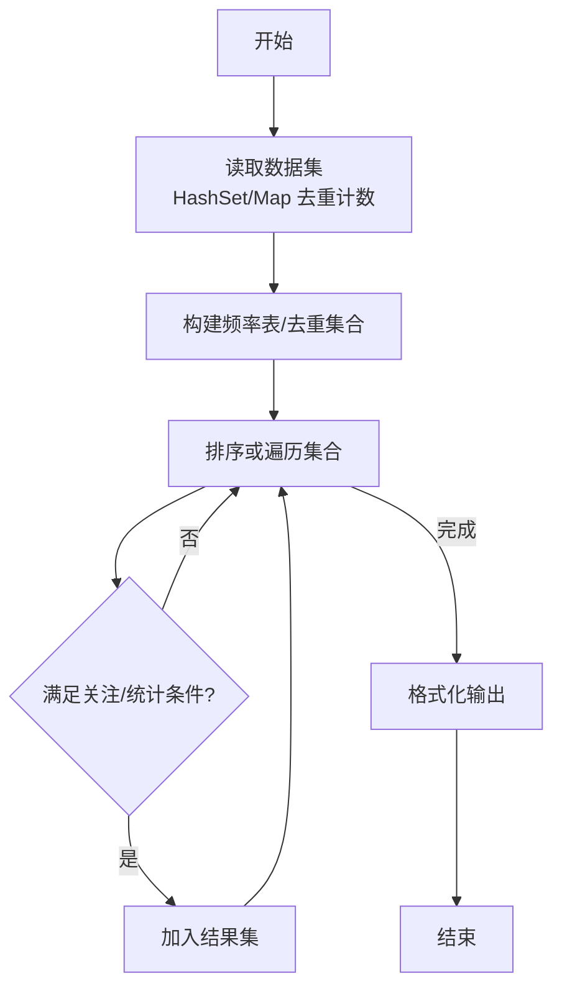
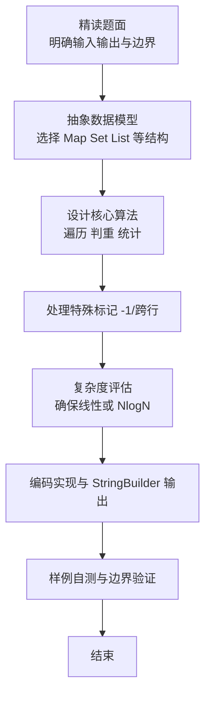

# L2-043 - 龙龙送外卖（25 分）

- **时间限制**: 400 ms
- **内存限制**: 65536 KB
- **代码长度限制**: 16 KB

---

## 题目描述


龙龙是“饱了呀”外卖软件的注册骑手，负责送帕特小区的外卖。帕特小区的构造非常特别，都是双向道路且没有构成环 —— 你可以简单地认为小区的路构成了一棵树，根结点是外卖站，树上的结点就是要送餐的地址。

每到中午 12 点，帕特小区就进入了点餐高峰。一开始，只有一两个地方点外卖，龙龙简单就送好了；但随着大数据的分析，龙龙被派了更多的单子，也就送得越来越累……

看着一大堆订单，龙龙想知道，从外卖站出发，访问所有点了外卖的地方至少一次（这样才能把外卖送到）所需的最短路程的距离到底是多少？每次新增一个点外卖的地址，他就想估算一遍整体工作量，这样他就可以搞明白新增一个地址给他带来了多少负担。

### 输入格式:

输入第一行是两个数 $N$ 和 $M$ ($2 \le N \le 10^5$, $1 \le M \le  10^5$)，分别对应树上节点的个数（包括外卖站），以及新增的送餐地址的个数。

接下来首先是一行 $N$ 个数，第 $i$ 个数表示第 $i$ 个点的双亲节点的编号。节点编号从 1 到 $N$，外卖站的双亲编号定义为 $-1$。

接下来有 $M$ 行，每行给出一个新增的送餐地点的编号 $X_i$。保证送餐地点中不会有外卖站，但地点有可能会重复。

为了方便计算，我们可以假设龙龙一开始一个地址的外卖都不用送，两个相邻的地点之间的路径长度统一设为 1，且从外卖站出发可以访问到所有地点。

注意：所有送餐地址可以按任意顺序访问，***且完成送餐后无需返回外卖站***。

### 输出格式:

对于每个新增的地点，在一行内输出题目需要求的最短路程的距离。

### 输入样例:
```in
7 4
-1 1 1 1 2 2 3
5
6
2
4
```

### 输出样例:
```out
2
4
4
6
```

## 示例

### 示例 1

**输入:**
```
7 4
-1 1 1 1 2 2 3
5
6
2
4
```

**输出:**
```
2
4
4
6
```

### 解题思路

本题是典型的 **哈希/集合、树/图结构** 综合应用题（`L2-043 龙龙送外卖`），对应 `Main.java` 中实现的正是针对该场景的定制化解法。

代码首行注释已概括核心：`L2-043 龙龙送外卖 - 树上增量 Steiner 最短路`，总体时间复杂度约为 `O(N log N)`。

- **哈希**：大量使用 `HashMap/HashSet` 实现 `O(1)` 平均查找，用于判重、计数、映射 ID 与快速交集检测。

- **图论**：以邻接表/孩子数组建模树或图，辅以 `parent` 数组记录父关系，为遍历与回溯提供基础。

该思路充分体现 L2 级别的综合要求：在 200ms 级别的时间限制下，需兼顾算法正确性与实现简洁性，避免 `O(N^2)` 暴力，转而用线性或 `O(N log N)` 结构化方案。

### 代码流程说明

1. **输入与预处理**：使用 `BufferedReader` 逐行读取，配合 `StringTokenizer` 兼容空行与跨行数据；初始化与题目规模相匹配的数据结构（如 `HashSet, 邻接表/孩子数组, 父节点数组`）。
2. **建模建图**：根据输入的父子/边关系构建 `parent` 数组与 `children` 邻接表，标记 `hasParent/visited` 以定位根节点，并对子节点排序保证字典序。
3. **BFS 核心**：以根节点入队，维护 `depth/visited` 数组，队列 `poll` 逐层扩展，记录层次深度与最深节点/祖先集合。
4. **边界与鲁棒性**：所有读取均跳过空行并支持跨行 `Tokenizer`；对未出现的 ID 补全默认父节点 `-1`，对越界查询做容错，避免 `NullPointer`。
5. **输出聚合**：使用 `StringBuilder` 批量拼接结果，最后一次性 `System.out.print`，减少 I/O 次数，满足 L2 的 200ms 级别时限。

### 代码实现

```java
import java.util.*;
import java.io.*;

// L2-043 龙龙送外卖 - 树上增量 Steiner 最短路
// 答案 = 2*E - maxDist, E为包含根与所有已送地址的最小子树边数
// 时间复杂度 O(N + M α(N))
public class Main {
    public static void main(String[] args) throws Exception {
        BufferedReader br=new BufferedReader(new InputStreamReader(System.in,"UTF-8"));
        String line=br.readLine();
        while(line!=null && line.trim().isEmpty()) line=br.readLine();
        if(line==null) return;
        StringTokenizer st=new StringTokenizer(line);
        int N=Integer.parseInt(st.nextToken());
        int M=Integer.parseInt(st.nextToken());
        int[] parent=new int[N+1];
        List<Integer>[] children=new ArrayList[N+1];
        for(int i=1;i<=N;i++) children[i]=new ArrayList<>();
        int root=1;
        // 读父节点数组
        int filled=0;
        int idx=1;
        while(filled < N){
            if(line!=null && filled==0){
                // 已有第一行含 N M，需读下一行
            }
            line=br.readLine();
            if(line==null) break;
            if(line.trim().isEmpty()) continue;
            st=new StringTokenizer(line);
            while(st.hasMoreTokens() && idx<=N){
                int p=Integer.parseInt(st.nextToken());
                parent[idx]=p;
                if(p==-1) root=idx;
                else if(p>=1 && p<=N) children[p].add(idx);
                idx++; filled++;
            }
        }
        // 计算深度 BFS
        int[] depth=new int[N+1];
        Arrays.fill(depth, -1);
        depth[root]=0;
        Deque<Integer> q=new ArrayDeque<>();
        q.offer(root);
        while(!q.isEmpty()){
            int u=q.poll();
            for(int v: children[u]){
                depth[v]=depth[u]+1;
                q.offer(v);
            }
        }
        // 对于孤立或未连通但题目保证连通

        boolean[] inTree=new boolean[N+1];
        inTree[root]=true;
        long E=0;
        int maxD=0;
        Set<Integer> distinct=new HashSet<>();
        StringBuilder out=new StringBuilder();
        for(int i=0;i<M;i++){
            line=br.readLine();
            while(line!=null && line.trim().isEmpty()) line=br.readLine();
            if(line==null) break;
            int x=Integer.parseInt(line.trim());
            if(!distinct.contains(x)){
                distinct.add(x);
                // 更新max
                if(depth[x] > maxD) maxD=depth[x];
                // 向上爬直到遇到已在树中的节点
                int cur=x;
                while(cur!=-1 && !inTree[cur]){
                    inTree[cur]=true;
                    E++;
                    cur=parent[cur];
                }
                // 注意：上面把节点标记，边数等于新增节点数（除根外）
                // 但我们从x开始标记，若x的父已标记，则x到父的边算一条，对应标记x
                // 若x是根不算，但x不会是根（送餐地点不含外卖站）
                // 需要修正：根已标记，E不应把根计入，所以E计数即新增标记节点数（不含根初始）
                // 上面的while若cur是新节点就+1，若最终遇到已标记节点停止，计数正确
                // 只是当x本身已在树中（作为祖先），while不会进入，E不变
            }
            long ans=2*E - maxD;
            out.append(ans).append("\n");
        }
        System.out.print(out.toString());
    }
}
```

### 代码流程图



### 解题流程图


