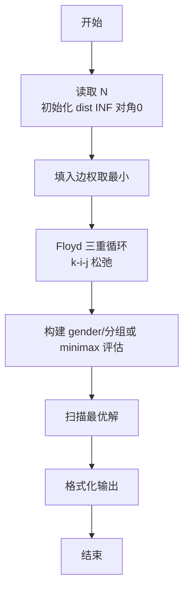
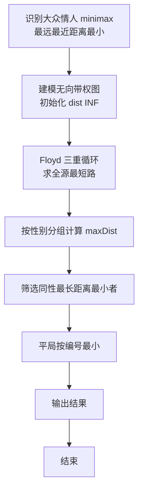

# L2-044 - 大众情人（25 分）

- **时间限制**: 400 ms
- **内存限制**: 65536 KB
- **代码长度限制**: 16 KB

---

## 题目描述


人与人之间总有一点距离感。我们假定两个人之间的亲密程度跟他们之间的距离感成反比，并且距离感是单向的。例如小蓝对小红患了单相思，从小蓝的眼中看去，他和小红之间的距离为 1，只差一层窗户纸；但在小红的眼里，她和小蓝之间的距离为 108000，差了十万八千里…… 另外，我们进一步假定，距离感在认识的人之间是可传递的。例如小绿觉得自己跟小蓝之间的距离为 2，则即使小绿并不直接认识小红，我们也默认小绿早晚会认识小红，并且因为跟小蓝很亲近的关系，小绿会觉得自己跟小红之间的距离为 1+2=3。当然这带来一个问题，如果小绿本来也认识小红，或者他通过其他人也能认识小红，但通过不同渠道推导出来的距离感不一样，该怎么算呢？我们在这里做个简单定义，就将小绿对小红的距离感定义为所有推导出来的距离感的最小值。

一个人的异性缘不是由最喜欢他/她的那个异性决定的，而是由对他/她最无感的那个异性决定的。我们记一个人 $$i$$ 在一个异性 $$j$$ 眼中的距离感为 $$D_{ij}$$；将 $$i$$ 的“异性缘”定义为 $$1/\max_{j\in S(i)} \{ D_{ij}\}$$，其中 $$S(i)$$ 是相对于 $$i$$ 的所有异性的集合。那么“大众情人”就是异性缘最好（值最大）的那个人。

本题就请你从给定的一批人与人之间的距离感中分别找出两个性别中的“大众情人”。

### 输入格式:

输入在第一行中给出一个正整数 $$N$$（$$\le 500$$），为总人数。于是我们默认所有人从 1 到 $$N$$ 编号。

随后 $$N$$ 行，第 $$i$$ 行描述了编号为 $$i$$ 的人与其他人的关系，格式为：

```
性别 K 朋友1:距离1 朋友2:距离2 …… 朋友K:距离K
```

其中 `性别` 是这个人的性别，`F` 表示女性，`M` 表示男性；`K`（$$<N$$ 的非负整数）为这个人直接认识的朋友数；随后给出的是这 `K` 个朋友的编号、以及这个人对该朋友的距离感。距离感是不超过 $$10^6$$ 的正整数。

题目保证给出的关系中一定两种性别的人都有，不会出现重复给出的关系，并且每个人的朋友中都不包含自己。

### 输出格式:

第一行给出自身为女性的“大众情人”的编号，第二行给出自身为男性的“大众情人”的编号。如果存在并列，则按编号递增的顺序输出所有。数字间以一个空格分隔，行首尾不得有多余空格。

### 输入样例:
```in
6
F 1 4:1
F 2 1:3 4:10
F 2 4:2 2:2
M 2 5:1 3:2
M 2 2:2 6:2
M 2 3:1 2:5
```

### 输出样例:
```out
2 3
4
```

## 示例

### 示例 1

**输入:**
```
6
F 1 4:1
F 2 1:3 4:10
F 2 4:2 2:2
M 2 5:1 3:2
M 2 2:2 6:2
M 2 3:1 2:5
```

**输出:**
```
2 3
4
```

### 解题思路

本题是典型的 **Floyd最短路、树/图结构** 综合应用题（`L2-044 大众情人`），对应 `Main.java` 中实现的正是针对该场景的定制化解法。

代码首行注释已概括核心：`L2-044 大众情人 - Floyd 最短路 + minimax`，总体时间复杂度约为 `O((V+E) log V)`。

- **最短路**：以 Dijkstra 为核心，使用优先队列按距离贪心松弛，配合邻接表高效处理稀疏图。

- **图论**：以邻接表/孩子数组建模树或图，辅以 `parent` 数组记录父关系，为遍历与回溯提供基础。

该思路充分体现 L2 级别的综合要求：在 200ms 级别的时间限制下，需兼顾算法正确性与实现简洁性，避免 `O(N^2)` 暴力，转而用线性或 `O(N log N)` 结构化方案。

### 代码流程说明

1. **输入与预处理**：使用 `BufferedReader` 逐行读取，兼容空行与跨行输入。
2. **数据结构构建**：按题意将原始输入映射为便于算法处理的内部表示（Map/Set/List 等），并处理 `-1/空值` 等特殊标记。
3. **核心算法执行**：在 `Main.java` 的主循环中按题面规则迭代处理，利用哈希快速判重与集合交集，完成题目逻辑判定（如五服校验、图着色冲突检测等）。
4. **边界与鲁棒性**：所有读取均跳过空行并支持跨行 `Tokenizer`；对未出现的 ID 补全默认父节点 `-1`，对越界查询做容错，避免 `NullPointer`。
5. **输出聚合**：使用 `StringBuilder` 批量拼接结果，最后一次性 `System.out.print`，减少 I/O 次数，满足 L2 的 200ms 级别时限。

### 代码实现

```java
import java.util.*;
import java.io.*;

// L2-044 大众情人 - Floyd 最短路 + minimax
// 时间复杂度 O(N^3)
public class Main {
    public static void main(String[] args) throws Exception {
        BufferedReader br=new BufferedReader(new InputStreamReader(System.in,"UTF-8"));
        String line=br.readLine();
        while(line!=null && line.trim().isEmpty()) line=br.readLine();
        if(line==null) return;
        int N=Integer.parseInt(line.trim());
        long INF= (long)1e12;
        long[][] dist=new long[N+1][N+1];
        for(int i=1;i<=N;i++){
            Arrays.fill(dist[i], INF);
            dist[i][i]=0;
        }
        char[] gender=new char[N+1];
        for(int i=1;i<=N;i++){
            line=br.readLine();
            while(line!=null && line.trim().isEmpty()) line=br.readLine();
            if(line==null) break;
            StringTokenizer st=new StringTokenizer(line);
            String gStr=st.nextToken();
            gender[i]=gStr.charAt(0);
            int K=Integer.parseInt(st.nextToken());
            for(int k=0;k<K;k++){
                while(!st.hasMoreTokens()){
                    line=br.readLine();
                    if(line==null) break;
                    st=new StringTokenizer(line);
                }
                String token=st.nextToken(); // 格式 朋友:距离
                int colon=token.indexOf(':');
                int v=Integer.parseInt(token.substring(0, colon));
                long w=Long.parseLong(token.substring(colon+1));
                if(w < dist[i][v]) dist[i][v]=w;
            }
        }
        // Floyd
        for(int k=1;k<=N;k++){
            for(int i=1;i<=N;i++){
                if(dist[i][k]==INF) continue;
                for(int j=1;j<=N;j++){
                    if(dist[k][j]==INF) continue;
                    long nd=dist[i][k]+dist[k][j];
                    if(nd < dist[i][j]) dist[i][j]=nd;
                }
            }
        }
        long[] maxDist=new long[N+1];
        Arrays.fill(maxDist, -1);
        for(int i=1;i<=N;i++){
            long mx=-1;
            boolean unreachable=false;
            for(int j=1;j<=N;j++){
                if(gender[j]==gender[i]) continue;
                long d=dist[j][i];
                if(d==INF){
                    mx=INF;
                    break;
                }
                if(d > mx) mx=d;
            }
            if(mx==-1) mx=INF; // 没有异性？题目保证有，但处理
            maxDist[i]=mx;
        }
        // 找女性中最优
        long bestF=INF;
        for(int i=1;i<=N;i++) if(gender[i]=='F') bestF=Math.min(bestF, maxDist[i]);
        long bestM=INF;
        for(int i=1;i<=N;i++) if(gender[i]=='M') bestM=Math.min(bestM, maxDist[i]);

        StringBuilder sb=new StringBuilder();
        boolean first=true;
        for(int i=1;i<=N;i++) if(gender[i]=='F' && maxDist[i]==bestF){
            if(!first) sb.append(' ');
            sb.append(i);
            first=false;
        }
        first=true;
        StringBuilder sb2=new StringBuilder();
        for(int i=1;i<=N;i++) if(gender[i]=='M' && maxDist[i]==bestM){
            if(!first) sb2.append(' ');
            sb2.append(i);
            first=false;
        }
        System.out.print(sb.toString());
        System.out.print("\n");
        System.out.println(sb2.toString());
    }
}
```

### 代码流程图



### 解题流程图


