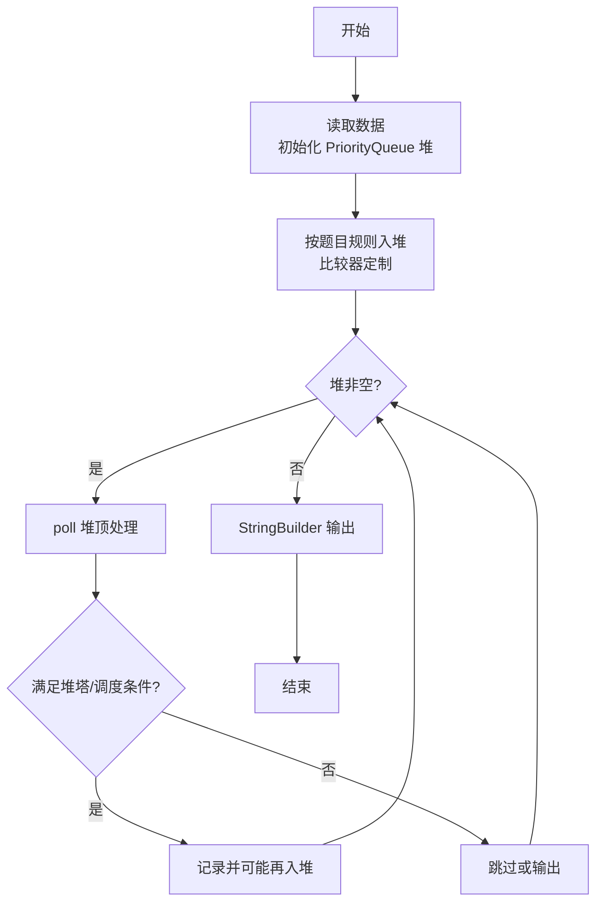
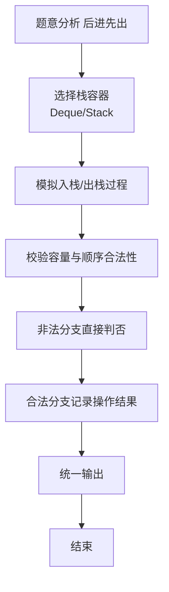

# L2-045 - 堆宝塔（25 分）

- **时间限制**: 400 ms
- **内存限制**: 65536 KB
- **代码长度限制**: 16 KB

---

## 题目描述


堆宝塔游戏是让小朋友根据抓到的彩虹圈的直径大小，按照从大到小的顺序堆起宝塔。但彩虹圈不一定是按照直径的大小顺序抓到的。聪明宝宝采取的策略如下：
- 首先准备两根柱子，一根 A 柱串宝塔，一根 B 柱用于临时叠放。
- 把第 1 块彩虹圈作为第 1 座宝塔的基座，在 A 柱放好。
- 将抓到的下一块彩虹圈 C 跟当前 A 柱宝塔最上面的彩虹圈比一下，如果比最上面的小，就直接放上去；否则把 C 跟 B 柱最上面的彩虹圈比一下：
-- 如果 B 柱是空的、或者 C 大，就在 B 柱上放好；
-- 否则把 A 柱上串好的宝塔取下来作为一件成品；然后把 B 柱上所有比 C 大的彩虹圈逐一取下放到 A 柱上，最后把 C 也放到 A 柱上。

重复此步骤，直到所有的彩虹圈都被抓完。最后 A 柱上剩下的宝塔作为一件成品，B 柱上剩下的彩虹圈被逐一取下，堆成另一座宝塔。问：宝宝一共堆出了几个宝塔？最高的宝塔有多少层？

### 输入格式:

输入第一行给出一个正整数 $$N$$（$$\le 10^3$$），为彩虹圈的个数。第二行按照宝宝抓取的顺序给出 $$N$$ 个不超过 100 的正整数，对应每个彩虹圈的直径。

### 输出格式:

在一行中输出宝宝堆出的宝塔个数，和最高的宝塔的层数。数字间以 1 个空格分隔，行首尾不得有多余空格。

### 输入样例:
```in
11
10 8 9 5 12 11 4 3 1 9 15
```

### 输出样例:
```out
4 5
```

## 示例

### 示例 1

**输入:**
```
11
10 8 9 5 12 11 4 3 1 9 15
```

**输出:**
```
4 5
```

### 解题思路

本题是典型的 **堆/优先队列、栈、树/图结构** 综合应用题（`L2-045 堆宝塔`），对应 `Main.java` 中实现的正是针对该场景的定制化解法。

代码首行注释已概括核心：`L2-045 堆宝塔 - 双柱模拟`，总体时间复杂度约为 `O(N log N)`。

- **堆**：利用优先队列（堆）动态维护最值，支持 `O(log N)` 的插入与弹出，适配贪心选择与多路归并。

- **栈**：通过栈模拟后进先出的操作序列，如括号匹配、瓶/包装机调度，能够精确还原实际操作顺序。

- **图论**：以邻接表/孩子数组建模树或图，辅以 `parent` 数组记录父关系，为遍历与回溯提供基础。

该思路充分体现 L2 级别的综合要求：在 200ms 级别的时间限制下，需兼顾算法正确性与实现简洁性，避免 `O(N^2)` 暴力，转而用线性或 `O(N log N)` 结构化方案。

### 代码流程说明

1. **输入与预处理**：使用 `BufferedReader` 逐行读取，兼容空行与跨行输入。
2. **数据结构构建**：按题意将原始输入映射为便于算法处理的内部表示（Map/Set/List 等），并处理 `-1/空值` 等特殊标记。
3. **栈模拟**：按给定的操作序列 `push/pop` 模拟栈行为，校验出栈顺序合法性或还原包装机状态，非法时即时判否。
4. **边界与鲁棒性**：所有读取均跳过空行并支持跨行 `Tokenizer`；对未出现的 ID 补全默认父节点 `-1`，对越界查询做容错，避免 `NullPointer`。
5. **输出聚合**：使用 `StringBuilder` 批量拼接结果，最后一次性 `System.out.print`，减少 I/O 次数，满足 L2 的 200ms 级别时限。

### 代码实现

```java
import java.util.*;
import java.io.*;

// L2-045 堆宝塔 - 双柱模拟
// 时间复杂度 O(N^2) 最坏但 N<=1000
public class Main {
    public static void main(String[] args) throws Exception {
        BufferedReader br=new BufferedReader(new InputStreamReader(System.in,"UTF-8"));
        String line=br.readLine();
        while(line!=null && line.trim().isEmpty()) line=br.readLine();
        if(line==null) return;
        int N=Integer.parseInt(line.trim());
        int[] a=new int[N];
        int cnt=0;
        while(cnt<N){
            line=br.readLine();
            if(line==null) break;
            if(line.trim().isEmpty()) continue;
            StringTokenizer st=new StringTokenizer(line);
            while(st.hasMoreTokens() && cnt<N) a[cnt++]=Integer.parseInt(st.nextToken());
        }
        if(N==0){
            System.out.println("0 0");
            return;
        }
        Deque<Integer> A=new ArrayDeque<>();
        Deque<Integer> B=new ArrayDeque<>();
        List<Integer> heights=new ArrayList<>();
        A.push(a[0]);
        for(int i=1;i<N;i++){
            int C=a[i];
            if(!A.isEmpty() && C < A.peek()){
                A.push(C);
            }else{
                if(B.isEmpty() || C > B.peek()){
                    B.push(C);
                }else{
                    // 完成 A 宝塔
                    heights.add(A.size());
                    A.clear();
                    // 把 B 中比 C 大的移到 A
                    while(!B.isEmpty() && B.peek() > C){
                        A.push(B.pop());
                    }
                    A.push(C);
                }
            }
        }
        if(!A.isEmpty()) heights.add(A.size());
        if(!B.isEmpty()) heights.add(B.size());
        int towerCount=heights.size();
        int maxH=0;
        for(int h: heights) maxH=Math.max(maxH, h);
        System.out.println(towerCount+" "+maxH);
    }
}
```

### 代码流程图



### 解题流程图


