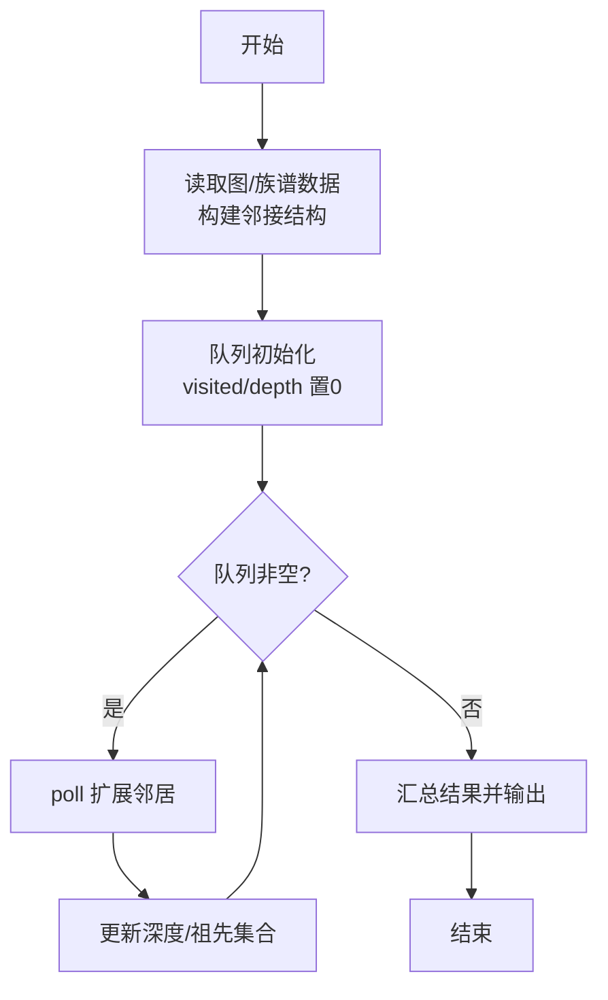
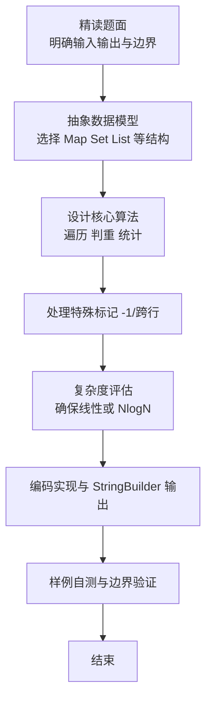

# L2-046 - 天梯赛的赛场安排（25 分）

- **时间限制**: 400 ms
- **内存限制**: 65536 KB
- **代码长度限制**: 16 KB

---

## 题目描述


天梯赛使用 OMS 监考系统，需要将参赛队员安排到系统中的虚拟赛场里，并为每个赛场分配一位监考老师。每位监考老师需要联系自己赛场内队员对应的教练们，以便发放比赛账号。为了尽可能减少教练和监考的沟通负担，我们要求赛场的安排满足以下条件：

* 每位监考老师负责的赛场里，队员人数不得超过赛场规定容量 $C$；
* 每位教练需要联系的监考人数尽可能少 —— 这里假设每所参赛学校只有一位负责联系的教练，且每个赛场的监考老师都不相同。

为此我们设计了多轮次排座算法，按照尚未安排赛场的队员人数从大到小的顺序，每一轮对当前未安排的人数最多的学校进行处理。记当前待处理的学校未安排人数为 $n$：

* 如果 $n\ge C$，则新开一个赛场，将 $C$ 位队员安排进去。剩下的人继续按人数规模排队，等待下一轮处理；
* 如果 $n<C$，则寻找剩余空位数大于等于 $n$ 的编号最小的赛场，将队员安排进去；
* 如果 $n<C$，且找不到任何非空的、剩余空位数大于等于 $n$ 的赛场了，则新开一个赛场，将队员安排进去。

由于近年来天梯赛的参赛人数快速增长，2023年超过了 480 所学校 1.6 万人，所以我们必须写个程序来处理赛场安排问题。

### 输入格式:

输入第一行给出两个正整数 $N$ 和 $C$，分别为参赛学校数量和每个赛场的规定容量，其中 $0<N\le 5000$，$10\le C \le 50$。随后 $N$ 行，每行给出一个学校的缩写（为长度不超过 6 的非空小写英文字母串）和该校参赛人数（不超过 500 的正整数），其间以空格分隔。题目保证每所学校只有一条记录。

### 输出格式:

按照输入的顺序，对每一所参赛高校，在一行中输出学校缩写和该校需要联系的监考人数，其间以 1 空格分隔。\
最后在一行中输出系统中应该开设多少个赛场。

### 输入样例:
```in
10 30
zju 30
hdu 93
pku 39
hbu 42
sjtu 21
abdu 10
xjtu 36
nnu 15
hnu 168
hsnu 20
```

### 输出样例:
```out
zju 1
hdu 4
pku 2
hbu 2
sjtu 1
abdu 1
xjtu 2
nnu 1
hnu 6
hsnu 1
16
```

## 示例

### 示例 1

**输入:**
```
10 30
zju 30
hdu 93
pku 39
hbu 42
sjtu 21
abdu 10
xjtu 36
nnu 15
hnu 168
hsnu 20
```

**输出:**
```
zju 1
hdu 4
pku 2
hbu 2
sjtu 1
abdu 1
xjtu 2
nnu 1
hnu 6
hsnu 1
16
```

### 解题思路

本题是典型的 **堆/优先队列、队列/BFS、哈希/集合、树/图结构** 综合应用题（`L2-046 天梯赛的赛场安排`），对应 `Main.java` 中实现的正是针对该场景的定制化解法。

总体时间复杂度约为 `O(N log N)`，空间与输入规模线性相关。

- **堆**：利用优先队列（堆）动态维护最值，支持 `O(log N)` 的插入与弹出，适配贪心选择与多路归并。

- **BFS**：采用广度优先搜索逐层扩展，借助队列保证先访问浅层节点，天然适配最短路、层级遍历与限定深度祖先收集等需求。

- **哈希**：大量使用 `HashMap/HashSet` 实现 `O(1)` 平均查找，用于判重、计数、映射 ID 与快速交集检测。

- **图论**：以邻接表/孩子数组建模树或图，辅以 `parent` 数组记录父关系，为遍历与回溯提供基础。

该思路充分体现 L2 级别的综合要求：在 200ms 级别的时间限制下，需兼顾算法正确性与实现简洁性，避免 `O(N^2)` 暴力，转而用线性或 `O(N log N)` 结构化方案。

### 代码流程说明

1. **输入与预处理**：使用 `BufferedReader` 逐行读取，配合 `StringTokenizer` 兼容空行与跨行数据；初始化与题目规模相匹配的数据结构（如 `HashSet, 队列, 优先队列`）。
2. **数据结构构建**：按题意将原始输入映射为便于算法处理的内部表示（Map/Set/List 等），并处理 `-1/空值` 等特殊标记。
3. **核心算法执行**：在 `Main.java` 的主循环中按题面规则迭代处理，利用哈希快速判重与集合交集，完成题目逻辑判定（如五服校验、图着色冲突检测等）。
4. **边界与鲁棒性**：所有读取均跳过空行并支持跨行 `Tokenizer`；对未出现的 ID 补全默认父节点 `-1`，对越界查询做容错，避免 `NullPointer`。
5. **输出聚合**：使用 `StringBuilder` 批量拼接结果，最后一次性 `System.out.print`，减少 I/O 次数，满足 L2 的 200ms 级别时限。

### 代码实现

```java
import java.io.*;
import java.util.*;

/**
 * L2-046 天梯赛的赛场安排
 * 算法：优先队列按剩余人数降序调度 + 赛场剩余容量管理
 *  - 使用最大堆每次取未安排人数最多的学校
 *  - 对于 n>=C 直接新开满赛场
 *  - 对于 n<C 在已有非满赛场中寻找剩余容量 >=n 的编号最小赛场（C<=50，用按剩余容量分组的 TreeSet 实现 O(C log R) 查询）
 *  - 每个学校至多一个零散块，故联系数 = 满块数 + (是否还有零散块)
 * 时间复杂度：O((总分配次数)*(log N + C log R))，总分配次数 <= 总人数/C + N <= 2.5e5
 * 空间复杂度：O(N + R)
 */
public class Main {
    public static void main(String[] args) throws Exception {
        BufferedReader br = new BufferedReader(new InputStreamReader(System.in, "UTF-8"));
        String line;
        // 读第一行，跳过空行
        while ((line = br.readLine()) != null && line.trim().isEmpty()) {}
        if (line == null) return;
        StringTokenizer st = new StringTokenizer(line);
        int N = Integer.parseInt(st.nextToken());
        int C = Integer.parseInt(st.nextToken());

        String[] names = new String[N];
        int[] cnt = new int[N];
        for (int i = 0; i < N; i++) {
            line = br.readLine();
            while (line != null && line.trim().isEmpty()) line = br.readLine();
            st = new StringTokenizer(line);
            names[i] = st.nextToken();
            cnt[i] = Integer.parseInt(st.nextToken());
        }

        int[] remain = Arrays.copyOf(cnt, N);
        int[] contact = new int[N];

        // 最大堆：剩余大优先，剩余相同编号小优先（确定性）
        PriorityQueue<Integer> pq = new PriorityQueue<>((a, b) -> {
            if (remain[a] != remain[b]) return Integer.compare(remain[b], remain[a]);
            return Integer.compare(a, b);
        });
        for (int i = 0; i < N; i++) if (remain[i] > 0) pq.offer(i);

        // 赛场管理：roomRemain[1..R]，按剩余容量分组的 TreeSet
        // 下标1开始，方便取最小编号
        ArrayList<Integer> roomRem = new ArrayList<>();
        roomRem.add(0); // 占位
        @SuppressWarnings("unchecked")
        TreeSet<Integer>[] sets = new TreeSet[C];
        for (int i = 0; i < C; i++) sets[i] = new TreeSet<>();
        int roomCnt = 0;

        while (!pq.isEmpty()) {
            int idx = pq.poll();
            int n = remain[idx];
            if (n <= 0) continue;
            // 可能存在堆中过期条目（已更新后重复入堆），但我们是取出后直接处理并重入，无过期问题
            // 由于我们只在 remain 变化时重入，且堆中只有一个条目每学校，暂时不需要惰性校验
            // 然而为了安全，若堆顶 remain 已改变（因为我们直接用数组作比较），比较器会乱；所以每次 poll 后校验
            // 实际上 PriorityQueue 的 ordering 在 remain 变化后不会自动调整，故需要重新入堆后保持正确
            // 我们保证 remain 修改后会重新 offer，因此堆内元素 remain 与存储一致
            if (n >= C) {
                // 新开满赛场
                roomCnt++;
                roomRem.add(0); // 剩余0
                // 满场不加入 sets
                contact[idx]++;
                remain[idx] -= C;
                if (remain[idx] > 0) pq.offer(idx);
            } else {
                // n < C，寻找可用赛场
                int bestIdx = -1;
                int bestRoom = Integer.MAX_VALUE;
                for (int r = n; r < C; r++) {
                    if (!sets[r].isEmpty()) {
                        int cand = sets[r].first();
                        if (cand < bestRoom) {
                            bestRoom = cand;
                            bestIdx = r;
                        }
                    }
                }
                if (bestRoom != Integer.MAX_VALUE) {
                    // 找到
                    int roomId = bestRoom;
                    int oldRem = bestIdx;
                    sets[oldRem].remove(roomId);
                    int newRem = oldRem - n;
                    roomRem.set(roomId, newRem);
                    if (newRem > 0) sets[newRem].add(roomId);
                    contact[idx]++;
                    remain[idx] -= n;
                    if (remain[idx] > 0) pq.offer(idx);
                } else {
                    // 新开赛场装 n
                    roomCnt++;
                    int newRem = C - n;
                    roomRem.add(newRem);
                    if (newRem > 0) sets[newRem].add(roomCnt);
                    contact[idx]++;
                    remain[idx] -= n;
                    if (remain[idx] > 0) pq.offer(idx);
                }
            }
        }

        StringBuilder sb = new StringBuilder();
        for (int i = 0; i < N; i++) {
            sb.append(names[i]).append(' ').append(contact[i]).append('\n');
        }
        sb.append(roomCnt).append('\n');
        System.out.print(sb.toString());
    }
}
```

### 代码流程图



### 解题流程图


