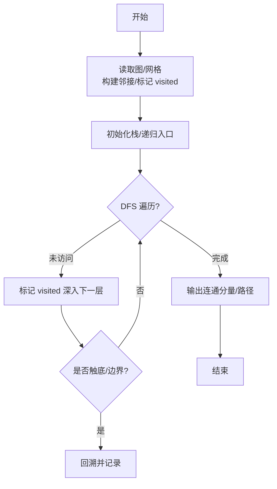
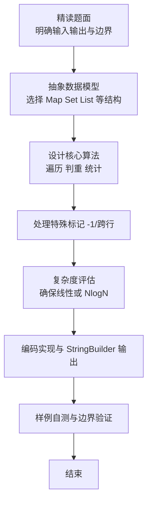

# L2-047 - 锦标赛（25 分）

- **时间限制**: 400 ms
- **内存限制**: 65536 KB
- **代码长度限制**: 16 KB

---

## 题目描述


有 $2^k$ 名选手将要参加一场锦标赛。锦标赛共有 $k$ 轮，其中第 $i$ 轮的比赛共有 $2^{k - i}$ 场，每场比赛恰有两名选手参加并从中产生一名胜者。每场比赛的安排如下：

* 对于第 $1$ 轮的第 $j$ 场比赛，由第 $(2j - 1)$ 名选手对抗第 $2j$ 名选手。
* 对于第 $i$ 轮的第 $j$ 场比赛（$i > 1$），由第 $(i - 1)$ 轮第 $(2j - 1)$ 场比赛的胜者对抗第 $(i - 1)$ 轮第 $2j$ 场比赛的胜者。

第 $k$ 轮唯一一场比赛的胜者就是整个锦标赛的最终胜者。\
举个例子，假如共有 $8$ 名选手参加锦标赛，则比赛的安排如下：

* 第 $1$ 轮共 $4$ 场比赛：选手 $1$ vs 选手 $2$，选手 $3$ vs 选手 $4$，选手 $5$ vs 选手 $6$，选手 $7$ vs 选手 $8$。
* 第 $2$ 轮共 $2$ 场比赛：第 $1$ 轮第 $1$ 场的胜者 vs 第 $1$ 轮第 $2$ 场的胜者，第 $1$ 轮第 $3$ 场的胜者 vs 第 $1$ 轮第 $4$ 场的胜者。
* 第 $3$ 轮共 $1$ 场比赛：第 $2$ 轮第 $1$ 场的胜者 vs 第 $2$ 轮第 $2$ 场的胜者。

已知每一名选手都有一个能力值，其中第 $i$ 名选手的能力值为 $a_i$。在一场比赛中，若两名选手的能力值不同，则能力值较大的选手一定会打败能力值较小的选手；若两名选手的能力值相同，则两名选手都有可能成为胜者。

令 $l_{i, j}$ 表示第 $i$ 轮第 $j$ 场比赛 **败者** 的能力值，令 $w$ 表示整个锦标赛最终胜者的能力值。给定所有满足 $1 \le i \le k$ 且 $1 \le j \le 2^{k - i}$ 的 $l_{i, j}$ 以及 $w$，请还原出 $a_1, a_2, \cdots, a_n$。

### 输入格式:

第一行输入一个整数 $k$（$1 \le k \le 18$）表示锦标赛的轮数。\
对于接下来 $k$ 行，第 $i$ 行输入 $2^{k - i}$ 个整数 $l_{i, 1}, l_{i, 2}, \cdots, l_{i, 2^{k - i}}$（$1 \le l_{i, j} \le 10^9$），其中 $l_{i, j}$ 表示第 $i$ 轮第 $j$ 场比赛 **败者** 的能力值。\
接下来一行输入一个整数 $w$（$1 \le w \le 10^9$）表示锦标赛最终胜者的能力值。

### 输出格式:

输出一行 $n$ 个由单个空格分隔的整数 $a_1, a_2, \cdots, a_n$，其中 $a_i$ 表示第 $i$ 名选手的能力值。如果有多种合法答案，请输出任意一种。如果无法还原出能够满足输入数据的答案，输出一行 `No Solution`。\
请勿在行末输出多余空格。

### 输入样例 1：
```in
3
4 5 8 5
7 6
8
9
```

### 输出样例 1：
```out
7 4 8 5 9 8 6 5
```

### 输入样例 2：
```in
2
5 8
3
9
```

### 输出样例 2：
```out
No Solution
```

## 示例

### 示例 1

**输入:**
```
3
4 5 8 5
7 6
8
9
```

**输出:**
```
7 4 8 5 9 8 6 5
```

### 示例 2

**输入:**
```
2
5 8
3
9
```

**输出:**
```
No Solution
```

### 解题思路

本题是典型的 **树/图结构** 综合应用题（`L2-047 锦标赛`），对应 `Main.java` 中实现的正是针对该场景的定制化解法。

总体时间复杂度约为 `O(N log N)`，空间与输入规模线性相关。

- **图论**：以邻接表/孩子数组建模树或图，辅以 `parent` 数组记录父关系，为遍历与回溯提供基础。

该思路充分体现 L2 级别的综合要求：在 200ms 级别的时间限制下，需兼顾算法正确性与实现简洁性，避免 `O(N^2)` 暴力，转而用线性或 `O(N log N)` 结构化方案。

### 代码流程说明

1. **输入与预处理**：使用 `BufferedReader` 逐行读取，兼容空行与跨行输入。
2. **数据结构构建**：按题意将原始输入映射为便于算法处理的内部表示（Map/Set/List 等），并处理 `-1/空值` 等特殊标记。
3. **核心算法执行**：在 `Main.java` 的主循环中按题面规则迭代处理，利用哈希快速判重与集合交集，完成题目逻辑判定（如五服校验、图着色冲突检测等）。
4. **边界与鲁棒性**：所有读取均跳过空行并支持跨行 `Tokenizer`；对未出现的 ID 补全默认父节点 `-1`，对越界查询做容错，避免 `NullPointer`。
5. **输出聚合**：使用 `StringBuilder` 批量拼接结果，最后一次性 `System.out.print`，减少 I/O 次数，满足 L2 的 200ms 级别时限。

### 代码实现

```java
import java.io.*;
import java.util.*;

/**
 * L2-047 锦标赛
 * 思路：自底向上计算每个区间节点所需的最小胜者能力值 need[i][j]，然后自顶向下按 need 分配胜者/败者
 * need 定义：使子树可行所需的最小根胜者值
 * 递推：设节点(i,j)败者 L=l[i][j]，左右子树 need 为 a,b，令 small=min(a,b), large=max(a,b)
 *      若 small > L => need=INF（无解）
 *      否则 need = max(L, large)
 * 可行性由 need 自底向上决定，构造时按 small 对应 L、large 对应 W 的贪心分配保证成功（单调性）
 * 时间复杂度 O(n)，n=2^k <=262144
 * 空间复杂度 O(n)
 */
public class Main {
    static final long INF = Long.MAX_VALUE / 4;

    public static void main(String[] args) throws Exception {
        BufferedReader br = new BufferedReader(new InputStreamReader(System.in, "UTF-8"));
        String line;
        // 读 k
        while ((line = br.readLine()) != null && line.trim().isEmpty()) {}
        if (line == null) return;
        int k = Integer.parseInt(line.trim());
        int n = 1 << k; // 选手数
        // l[i][j] i=1..k, j=1..2^{k-i}
        long[][] l = new long[k + 1][];
        for (int i = 1; i <= k; i++) {
            int sz = 1 << (k - i);
            l[i] = new long[sz + 1]; // 1-indexed
            // 需要读取足够的整数，可能跨行
            int filled = 0;
            while (filled < sz) {
                line = br.readLine();
                if (line == null) break;
                if (line.trim().isEmpty()) continue;
                StringTokenizer st = new StringTokenizer(line);
                while (st.hasMoreTokens() && filled < sz) {
                    l[i][++filled] = Long.parseLong(st.nextToken());
                }
            }
        }
        // 读 w
        long w = 0;
        while ((line = br.readLine()) != null && line.trim().isEmpty()) {}
        if (line != null) w = Long.parseLong(line.trim());

        // need[i][j]
        long[][] need = new long[k + 1][];
        for (int i = 1; i <= k; i++) {
            int sz = 1 << (k - i);
            need[i] = new long[sz + 1];
            Arrays.fill(need[i], INF);
        }

        for (int i = 1; i <= k; i++) {
            int sz = 1 << (k - i);
            for (int j = 1; j <= sz; j++) {
                long L = l[i][j];
                if (i == 1) {
                    need[i][j] = L; // 叶子间比赛，胜者至少要 >=败者
                } else {
                    long a = need[i - 1][2 * j - 1];
                    long b = need[i - 1][2 * j];
                    if (a >= INF || b >= INF) {
                        need[i][j] = INF;
                    } else {
                        long small = Math.min(a, b);
                        long large = Math.max(a, b);
                        if (small > L) {
                            need[i][j] = INF;
                        } else {
                            need[i][j] = Math.max(L, large);
                        }
                    }
                }
            }
        }

        if (k >= 1 && need[k][1] >= INF || w < need[k][1]) {
            System.out.println("No Solution");
            return;
        }
        // 特例 k=0 不存在（k>=1）

        long[] ans = new long[n + 1]; // 1-indexed

        // 递归构造
        construct(k, 1, w, l, need, ans, n);

        StringBuilder sb = new StringBuilder();
        for (int i = 1; i <= n; i++) {
            if (i > 1) sb.append(' ');
            sb.append(ans[i]);
        }
        System.out.println(sb.toString());
    }

    static void construct(int lev, int idx, long W, long[][] l, long[][] need, long[] ans, int n) {
        if (lev == 0) {
            // 叶子节点 idx 对应选手编号
            ans[idx] = W;
            return;
        }
        if (lev == 1) {
            long L = l[1][idx];
            // 两个叶子 2*idx-1, 2*idx
            int leftLeaf = 2 * idx - 1;
            int rightLeaf = 2 * idx;
            // 任意分配 W/L 到左右，因无更深约束；固定 W 在左
            ans[leftLeaf] = W;
            ans[rightLeaf] = L;
            return;
        }
        long L = l[lev][idx];
        int leftIdx = 2 * idx - 1;
        int rightIdx = 2 * idx;
        long leftNeed = need[lev - 1][leftIdx];
        long rightNeed = need[lev - 1][rightIdx];

        // 按 need 小的分配 L，大的分配 W
        // 判断两种分配是否可行，优先按排序选择
        boolean leftSmaller = leftNeed <= rightNeed;
        // 期望分配：small->L, large->W
        long smallNeed = Math.min(leftNeed, rightNeed);
        long largeNeed = Math.max(leftNeed, rightNeed);
        // 检查排序分配是否满足 L>=smallNeed && W>=largeNeed
        // 如果满足，则按排序分配
        if (smallNeed <= L && largeNeed <= W) {
            if (leftSmaller) {
                // left small -> L, right large -> W
                construct(lev - 1, leftIdx, L, l, need, ans, n);
                construct(lev - 1, rightIdx, W, l, need, ans, n);
            } else {
                construct(lev - 1, leftIdx, W, l, need, ans, n);
                construct(lev - 1, rightIdx, L, l, need, ans, n);
            }
        } else {
            // 理论上不应出现，因为 need[lev][idx] 已保证可行且 W>=need
            // 尝试另一种分配作为兜底
            if (leftNeed <= W && rightNeed <= L) {
                construct(lev - 1, leftIdx, W, l, need, ans, n);
                construct(lev - 1, rightIdx, L, l, need, ans, n);
            } else if (rightNeed <= W && leftNeed <= L) {
                construct(lev - 1, leftIdx, L, l, need, ans, n);
                construct(lev - 1, rightIdx, W, l, need, ans, n);
            }
        }
    }
}
```

### 代码流程图



### 解题流程图


