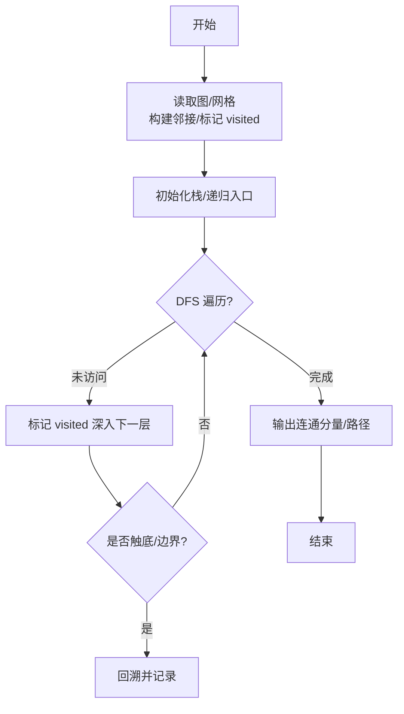
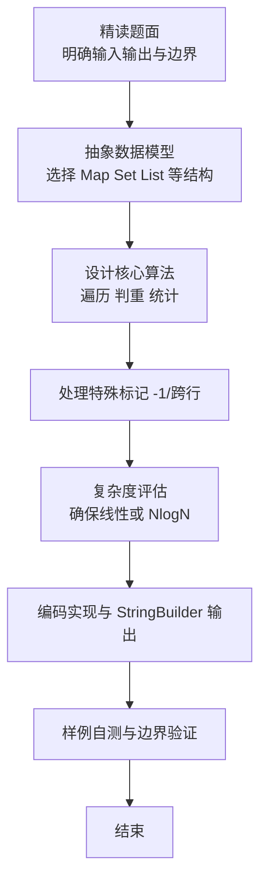

# L2-048 - 寻宝图（25 分）

- **时间限制**: 400 ms
- **内存限制**: 65536 KB
- **代码长度限制**: 16 KB

---

## 题目描述


给定一幅地图，其中有水域，有陆地。被水域完全环绕的陆地是岛屿。有些岛屿上埋藏有宝藏，这些有宝藏的点也被标记出来了。本题就请你统计一下，给定的地图上一共有多少岛屿，其中有多少是有宝藏的岛屿。

### 输入格式:

输入第一行给出 2 个正整数 $N$ 和 $M$（$1 < N\times M\le 10^5$），是地图的尺寸，表示地图由 $N$ 行 $M$ 列格子构成。随后 $N$ 行，每行给出 $M$ 位个位数，其中 `0` 表示水域，`1` 表示陆地，`2`\-`9` 表示宝藏。\
注意：两个格子共享一条边时，才是“相邻”的。宝藏都埋在陆地上。默认地图外围全是水域。

### 输出格式:

在一行中输出 2 个整数，分别是岛屿的总数量和有宝藏的岛屿的数量。

### 输入样例:
```in
10 11
01000000151
11000000111
00110000811
00110100010
00000000000
00000111000
00114111000
00110010000
00019000010
00120000001
```

### 输出样例:
```out
7 2
```

## 示例

### 示例 1

**输入:**
```
10 11
01000000151
11000000111
00110000811
00110100010
00000000000
00000111000
00114111000
00110010000
00019000010
00120000001
```

**输出:**
```
7 2
```

### 解题思路

本题是典型的 **DFS、树/图结构** 综合应用题（`L2-048 寻宝图`），对应 `Main.java` 中实现的正是针对该场景的定制化解法。

总体时间复杂度约为 `O(N log N)`，空间与输入规模线性相关。

- **DFS**：通过深度优先搜索递归/显式栈遍历整棵树或图，能够回溯记录路径，适合求最长链、判定连通分量与字典序比较。

- **图论**：以邻接表/孩子数组建模树或图，辅以 `parent` 数组记录父关系，为遍历与回溯提供基础。

该思路充分体现 L2 级别的综合要求：在 200ms 级别的时间限制下，需兼顾算法正确性与实现简洁性，避免 `O(N^2)` 暴力，转而用线性或 `O(N log N)` 结构化方案。

### 代码流程说明

1. **输入与预处理**：使用 `BufferedReader` 逐行读取，兼容空行与跨行输入。
2. **数据结构构建**：按题意将原始输入映射为便于算法处理的内部表示（Map/Set/List 等），并处理 `-1/空值` 等特殊标记。
3. **BFS 核心**：以根节点入队，维护 `depth/visited` 数组，队列 `poll` 逐层扩展，记录层次深度与最深节点/祖先集合。
4. **边界与鲁棒性**：所有读取均跳过空行并支持跨行 `Tokenizer`；对未出现的 ID 补全默认父节点 `-1`，对越界查询做容错，避免 `NullPointer`。
5. **输出聚合**：使用 `StringBuilder` 批量拼接结果，最后一次性 `System.out.print`，减少 I/O 次数，满足 L2 的 200ms 级别时限。

### 代码实现

```java
import java.io.*;
import java.util.*;

/**
 * L2-048 寻宝图
 * 统计连通分量：格子中字符 != '0' 为陆地（含宝藏），4邻接，外围视为水
 * BFS/DFS 计数总岛屿数与含宝藏岛屿数
 * 时间复杂度 O(N*M)，空间 O(N*M)
 */
public class Main {
    public static void main(String[] args) throws Exception {
        BufferedReader br = new BufferedReader(new InputStreamReader(System.in, "UTF-8"));
        String line;
        while ((line = br.readLine()) != null && line.trim().isEmpty()) {}
        if (line == null) return;
        StringTokenizer st = new StringTokenizer(line);
        int N = Integer.parseInt(st.nextToken());
        int M = Integer.parseInt(st.nextToken());
        char[][] g = new char[N][M];
        for (int i = 0; i < N; i++) {
            String s = br.readLine();
            // 可能存在空行或长度不足，需处理
            while (s != null && s.length() < M) {
                // 如果行中含空格则去掉空格
                s = s.replace(" ", "");
                if (s.length() < M) {
                    String extra = br.readLine();
                    if (extra == null) break;
                    s += extra.trim();
                } else break;
            }
            if (s == null) s = "";
            s = s.trim();
            // 若长度仍不足，可能是以空格分隔的数字？题面为连续位
            // 确保长度M
            for (int j = 0; j < M; j++) {
                g[i][j] = j < s.length() ? s.charAt(j) : '0';
            }
        }

        boolean[][] vis = new boolean[N][M];
        int total = 0, withTreasure = 0;
        int[] dx = {-1, 1, 0, 0};
        int[] dy = {0, 0, -1, 1};
        ArrayDeque<int[]> q = new ArrayDeque<>();

        for (int i = 0; i < N; i++) {
            for (int j = 0; j < M; j++) {
                if (g[i][j] != '0' && !vis[i][j]) {
                    total++;
                    boolean has = false;
                    q.clear();
                    q.add(new int[]{i, j});
                    vis[i][j] = true;
                    if (g[i][j] >= '2' && g[i][j] <= '9') has = true;
                    while (!q.isEmpty()) {
                        int[] cur = q.poll();
                        int x = cur[0], y = cur[1];
                        for (int d = 0; d < 4; d++) {
                            int nx = x + dx[d], ny = y + dy[d];
                            if (nx < 0 || nx >= N || ny < 0 || ny >= M) continue;
                            if (vis[nx][ny]) continue;
                            if (g[nx][ny] == '0') continue;
                            vis[nx][ny] = true;
                            if (g[nx][ny] >= '2' && g[nx][ny] <= '9') has = true;
                            q.add(new int[]{nx, ny});
                        }
                    }
                    if (has) withTreasure++;
                }
            }
        }
        System.out.println(total + " " + withTreasure);
    }
}
```

### 代码流程图



### 解题流程图


