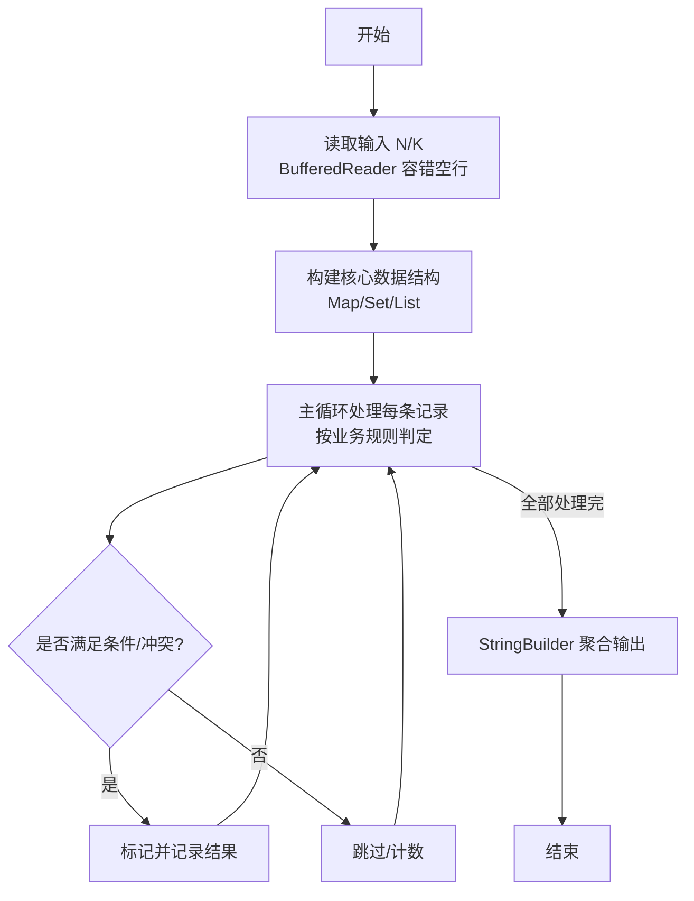
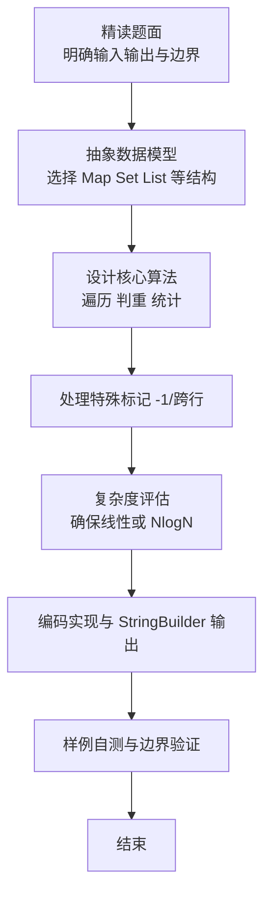

# L2-049 - 鱼与熊掌（25 分）

- **时间限制**: 400 ms
- **内存限制**: 65536 KB
- **代码长度限制**: 16 KB

---

## 题目描述


《孟子 · 告子上》有名言：“鱼，我所欲也，熊掌，亦我所欲也；二者不可得兼，舍鱼而取熊掌者也。”但这世界上还是有一些人可以做到鱼与熊掌兼得的。
给定 $n$ 个人对 $m$ 种物品的拥有关系。对其中任意一对物品种类（例如“鱼与熊掌”），请你统计有多少人能够兼得？

### 输入格式:

输入首先在第一行给出 2 个正整数，分别是：$n$（$\le 10^5$）为总人数（所有人从 1 到 $n$ 编号）、$m$（$2\le m \le 10^5$）为物品种类的总数（所有物品种类从 1 到 $m$ 编号）。
随后 $n$ 行，第 $i$ 行（$1\le i \le n$）给出编号为 $i$ 的人所拥有的物品种类清单，格式为：
```
K M[1] M[2] ... M[K]
```
其中 `K`（$\le 10^3$）是该人拥有的物品种类数量，后面的 `M[*]` 是物品种类的编号。题目保证每个人的物品种类清单中都没有重复给出的种类。
最后是查询信息：首先在一行中给出查询总量 $Q$（$\le 100$），随后 $Q$ 行，每行给出一对物品种类编号，其间以空格分隔。题目保证物品种类编号都是合法存在的。

### 输出格式:

对每一次查询，在一行中输出两种物品兼得的人数。

### 输入样例:
```in
4 8
3 4 1 8
4 7 1 8 4
5 6 5 1 2 3
4 3 2 4 8
3
2 3
7 6
8 4
```

### 输出样例:
```out
2
0
3
```

## 示例

### 示例 1

**输入:**
```
4 8
3 4 1 8
4 7 1 8 4
5 6 5 1 2 3
4 3 2 4 8
3
2 3
7 6
8 4
```

**输出:**
```
2
0
3
```

### 解题思路

本题是典型的 **树/图结构** 综合应用题（`L2-049 鱼与熊掌`），对应 `Main.java` 中实现的正是针对该场景的定制化解法。

总体时间复杂度约为 `O(N log N)`，空间与输入规模线性相关。

- **图论**：以邻接表/孩子数组建模树或图，辅以 `parent` 数组记录父关系，为遍历与回溯提供基础。

该思路充分体现 L2 级别的综合要求：在 200ms 级别的时间限制下，需兼顾算法正确性与实现简洁性，避免 `O(N^2)` 暴力，转而用线性或 `O(N log N)` 结构化方案。

### 代码流程说明

1. **输入与预处理**：使用 `BufferedReader` 逐行读取，兼容空行与跨行输入。
2. **数据结构构建**：按题意将原始输入映射为便于算法处理的内部表示（Map/Set/List 等），并处理 `-1/空值` 等特殊标记。
3. **核心算法执行**：在 `Main.java` 的主循环中按题面规则迭代处理，利用哈希快速判重与集合交集，完成题目逻辑判定（如五服校验、图着色冲突检测等）。
4. **边界与鲁棒性**：所有读取均跳过空行并支持跨行 `Tokenizer`；对未出现的 ID 补全默认父节点 `-1`，对越界查询做容错，避免 `NullPointer`。
5. **输出聚合**：使用 `StringBuilder` 批量拼接结果，最后一次性 `System.out.print`，减少 I/O 次数，满足 L2 的 200ms 级别时限。

### 代码实现

```java
import java.io.*;
import java.util.*;

/**
 * L2-049 鱼与熊掌
 * 倒排索引：对每种物品记录拥有该物品的人员列表（已按人员编号升序）
 * 查询 (a,b) 时对两列表求交集大小，双指针归并 O(|A|+|B|)
 * 总体时间 O(总拥有条目 + Q*(平均列表长))，Q<=100 时非常轻量
 * 空间 O(总条目)
 */
public class Main {
    // 快速扫描器
    static class FastScanner {
        private final InputStream in;
        private final byte[] buffer = new byte[1 << 16];
        private int ptr = 0, len = 0;
        FastScanner(InputStream in) { this.in = in; }
        private int readByte() throws IOException {
            if (ptr >= len) {
                len = in.read(buffer);
                ptr = 0;
                if (len <= 0) return -1;
            }
            return buffer[ptr++];
        }
        int nextInt() throws IOException {
            int c, sign = 1, val = 0;
            do { c = readByte(); } while (c <= ' ' && c != -1);
            if (c == '-') { sign = -1; c = readByte(); }
            while (c > ' ') { val = val * 10 + (c - '0'); c = readByte(); }
            return val * sign;
        }
    }

    public static void main(String[] args) throws Exception {
        FastScanner fs = new FastScanner(System.in);
        int n, m;
        try { n = fs.nextInt(); } catch (Exception e) { return; }
        m = fs.nextInt();

        @SuppressWarnings("unchecked")
        ArrayList<Integer>[] inv = new ArrayList[m + 1];
        for (int i = 1; i <= m; i++) inv[i] = new ArrayList<>();

        for (int person = 1; person <= n; person++) {
            int K = fs.nextInt();
            for (int k = 0; k < K; k++) {
                int item = fs.nextInt();
                if (item >= 1 && item <= m) inv[item].add(person);
            }
        }
        int Q = fs.nextInt();
        StringBuilder sb = new StringBuilder();
        for (int qi = 0; qi < Q; qi++) {
            int a = fs.nextInt();
            int b = fs.nextInt();
            // 若 a==b 则拥有该物品的人数即为答案（兼得视为同种？题面说任意一对，可能a!=b，但防一下）
            if (a == b) {
                sb.append(inv[a].size()).append('\n');
                continue;
            }
            List<Integer> A = inv[a];
            List<Integer> B = inv[b];
            // 双指针求交
            int i = 0, j = 0, cnt = 0;
            int szA = A.size(), szB = B.size();
            // 为提升速度，让 A 为较短者可提前跳？双指针本身对长度不敏感
            while (i < szA && j < szB) {
                int va = A.get(i), vb = B.get(j);
                if (va == vb) { cnt++; i++; j++; }
                else if (va < vb) i++;
                else j++;
            }
            sb.append(cnt).append('\n');
        }
        System.out.print(sb.toString());
    }
}
```

### 代码流程图



### 解题流程图


