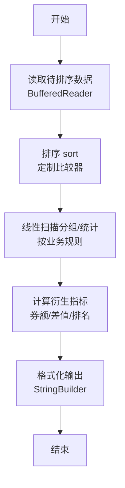
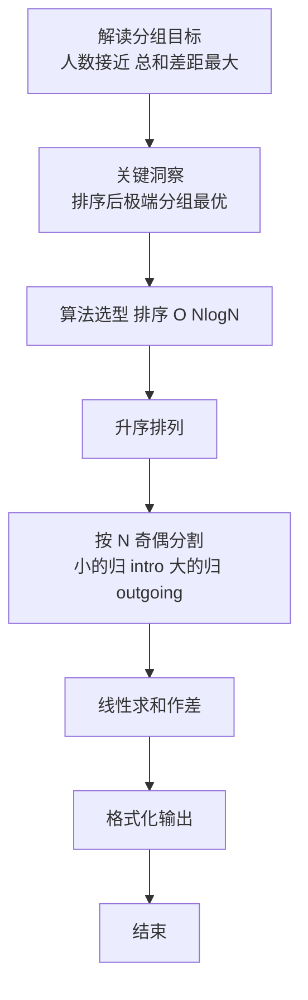

# L2-050 - 懂蛇语（25 分）

- **时间限制**: 400 ms
- **内存限制**: 65536 KB
- **代码长度限制**: 16 KB

---

## 题目描述


在《一年一度喜剧大赛》第二季中有一部作品叫《警察和我之蛇我其谁》，其中“毒蛇帮”内部用了一种加密语言，称为“蛇语”。蛇语的规则是，在说一句话 A 时，首先提取 A 的每个字的首字母，然后把整句话替换为另一句话 B，B 中每个字的首字母与 A 中提取出的字母依次相同。例如二当家说“九点下班哈”，对应首字母缩写是 `JDXBH`，他们解释为实际想说的是“京东新百货”……
本题就请你写一个蛇语的自动翻译工具，将输入的蛇语转换为实际要表达的句子。

### 输入格式:

输入第一行给出一个正整数 $$N$$（$$\le 10^5$$），为蛇语词典中句子的个数。随后 $$N$$ 行，每行用汉语拼音给出一句话。每句话由小写英文字母和空格组成，每个字的拼音由不超过 6 个小写英文字母组成，两个字的拼音之间用空格分隔。题目保证每句话总长度不超过 50 个字符，用回车结尾。注意：回车不算句中字符。
随后在一行中给出一个正整数 $$M$$（$$\le 10^3$$），为查询次数。后面跟 $$M$$ 行，每行用汉语拼音给出需要查询的一句话，格式同上。

### 输出格式:

对每一句查询，在一行中输出其对应的句子。如果句子不唯一，则按整句的字母序输出，句子间用 `|` 分隔。如果查不到，则将输入的句子原样输出。
注意：输出句子时，必须保持句中所有字符不变，包括空格。

### 输入样例:
```in
8
yong yuan de shen
yong yuan de she
jing dong xin bai huo
she yu wo ye hui shuo yi dian dian
liang wei bu yao chong dong
yi  dian dian
ni hui shuo she yu a
yong yuan de sha
7
jiu dian xia ban ha
shao ye wu ya he shui you dian duo
liu wan bu yao ci dao
ni hai shi su yan a
yao diao deng
sha ye ting bu jian
y y d s
```

### 输出样例:
```out
jing dong xin bai huo
she yu wo ye hui shuo yi dian dian
liang wei bu yao chong dong
ni hui shuo she yu a
yi  dian dian
sha ye ting bu jian
yong yuan de sha|yong yuan de she|yong yuan de shen
```

## 示例

### 示例 1

**输入:**
```
8
yong yuan de shen
yong yuan de she
jing dong xin bai huo
she yu wo ye hui shuo yi dian dian
liang wei bu yao chong dong
yi  dian dian
ni hui shuo she yu a
yong yuan de sha
7
jiu dian xia ban ha
shao ye wu ya he shui you dian duo
liu wan bu yao ci dao
ni hai shi su yan a
yao diao deng
sha ye ting bu jian
y y d s
```

**输出:**
```
jing dong xin bai huo
she yu wo ye hui shuo yi dian dian
liang wei bu yao chong dong
ni hui shuo she yu a
yi  dian dian
sha ye ting bu jian
yong yuan de sha|yong yuan de she|yong yuan de shen
```

### 解题思路

本题是典型的 **排序、哈希/集合、树/图结构** 综合应用题（`L2-050 懂蛇语`），对应 `Main.java` 中实现的正是针对该场景的定制化解法。

总体时间复杂度约为 `O(N log N)`，空间与输入规模线性相关。

- **排序**：先对关键维度排序，再线性扫描分组或去重，排序是降低后续逻辑复杂度的关键预处理。

- **哈希**：大量使用 `HashMap/HashSet` 实现 `O(1)` 平均查找，用于判重、计数、映射 ID 与快速交集检测。

- **图论**：以邻接表/孩子数组建模树或图，辅以 `parent` 数组记录父关系，为遍历与回溯提供基础。

该思路充分体现 L2 级别的综合要求：在 200ms 级别的时间限制下，需兼顾算法正确性与实现简洁性，避免 `O(N^2)` 暴力，转而用线性或 `O(N log N)` 结构化方案。

### 代码流程说明

1. **输入与预处理**：使用 `BufferedReader` 逐行读取，配合 `StringTokenizer` 兼容空行与跨行数据；初始化与题目规模相匹配的数据结构（如 `HashMap`）。
2. **数据结构构建**：按题意将原始输入映射为便于算法处理的内部表示（Map/Set/List 等），并处理 `-1/空值` 等特殊标记。
3. **分组与统计**：排序后按人数均分（`N` 奇偶分歧），线性累加 `sumIn/sumOut`，或按标签计数去重后排序输出。
4. **边界与鲁棒性**：所有读取均跳过空行并支持跨行 `Tokenizer`；对未出现的 ID 补全默认父节点 `-1`，对越界查询做容错，避免 `NullPointer`。
5. **输出聚合**：使用 `StringBuilder` 批量拼接结果，最后一次性 `System.out.print`，减少 I/O 次数，满足 L2 的 200ms 级别时限。

### 代码实现

```java
import java.io.*;
import java.util.*;

/**
 * L2-050 懂蛇语
 * 关键：提取每句首字母缩写作为 key（按空格分词，取每词首字母，支持多空格）
 * 词典句映射 key -> 列表，预排序；查询时直接查表
 * 时间复杂度 O(N * L + M * L + 排序)，空间 O(N)
 */
public class Main {
    static String getKey(String s) {
        StringBuilder kb = new StringBuilder();
        int n = s.length();
        for (int i = 0; i < n; i++) {
            char c = s.charAt(i);
            if (c != ' ' && (i == 0 || s.charAt(i - 1) == ' ')) {
                kb.append(c);
            }
        }
        return kb.toString();
    }

    public static void main(String[] args) throws Exception {
        BufferedReader br = new BufferedReader(new InputStreamReader(System.in, "UTF-8"));
        String line = br.readLine();
        if (line == null) return;
        line = line.trim();
        if (line.isEmpty()) return;
        int N = Integer.parseInt(line);
        Map<String, List<String>> map = new HashMap<>();
        for (int i = 0; i < N; i++) {
            String s = br.readLine();
            if (s == null) s = "";
            // 保留原始行（不做 trim，以免丢失首尾空格语义；但题面句首尾无空格）
            // 去掉可能的行尾 \r
            // s 保持原样（含内部多空格）
            String key = getKey(s);
            map.computeIfAbsent(key, k -> new ArrayList<>()).add(s);
        }
        // 预排序
        for (List<String> lst : map.values()) {
            Collections.sort(lst);
        }
        String mLine = br.readLine();
        while (mLine != null && mLine.trim().isEmpty()) mLine = br.readLine();
        if (mLine == null) return;
        int M = Integer.parseInt(mLine.trim());
        StringBuilder out = new StringBuilder();
        for (int i = 0; i < M; i++) {
            String q = br.readLine();
            if (q == null) q = "";
            String key = getKey(q);
            List<String> lst = map.get(key);
            if (lst == null) {
                out.append(q).append('\n');
            } else if (lst.size() == 1) {
                out.append(lst.get(0)).append('\n');
            } else {
                for (int k = 0; k < lst.size(); k++) {
                    if (k > 0) out.append('|');
                    out.append(lst.get(k));
                }
                out.append('\n');
            }
        }
        System.out.print(out.toString());
    }
}
```

### 代码流程图



### 解题流程图


