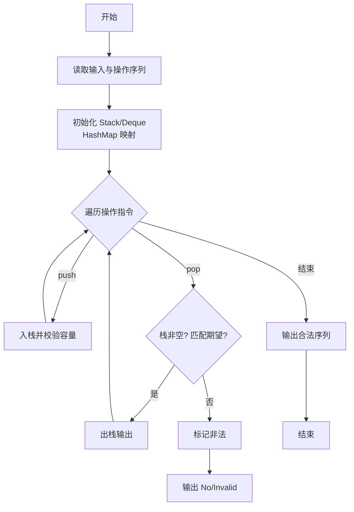
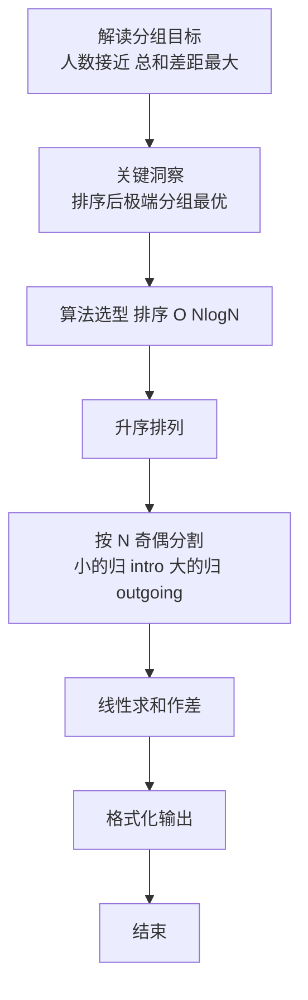

# L2-051 - 满树的遍历（25 分）

- **时间限制**: 400 ms
- **内存限制**: 65536 KB
- **代码长度限制**: 16 KB

---

## 题目描述


一棵“$k$ 阶满树”是指树中所有非叶结点的度都是 $k$ 的树。给定一棵树，你需要判断其是否为 $k$ 阶满树，并输出其前序遍历序列。

注：树中结点的度是其拥有的子树的个数，而树的度是树内各结点的度的最大值。

### 输入格式:

输入首先在第一行给出一个正整数 $n$（$\le 10^5$），是树中结点的个数。于是设所有结点从 1 到 $n$ 编号。
随后 $n$ 行，第 $i$ 行（$1\le i \le n$）给出第 $i$ 个结点的父结点编号。根结点没有父结点，则对应的父结点编号为 `0`。题目保证给出的是一棵合法多叉树，只有唯一根结点。

### 输出格式:

首先在一行中输出该树的度。如果输入的树是 $k$ 阶满树，则加 1 个空格后输出 `yes`，否则输出 `no`。最后在第二行输出该树的前序遍历序列，数字间以 1 个空格分隔，行首尾不得有多余空格。
注意：兄弟结点按编号升序访问。

### 输入样例 1：
```in
7
6
5
5
6
6
0
5
```

### 输出样例 1：
```out
3 yes
6 1 4 5 2 3 7
```

### 输入样例 2：
```in
7
6
5
5
6
6
0
4
```

### 输出样例 2：
```out
3 no
6 1 4 7 5 2 3
```

## 示例

### 示例 1

**输入:**
```
7
6
5
5
6
6
0
5
```

**输出:**
```
3 yes
6 1 4 5 2 3 7
```

### 示例 2

**输入:**
```
7
6
5
5
6
6
0
4
```

**输出:**
```
3 no
6 1 4 7 5 2 3
```

### 解题思路

本题是典型的 **栈、排序、树/图结构** 综合应用题（`L2-051 满树的遍历`），对应 `Main.java` 中实现的正是针对该场景的定制化解法。

总体时间复杂度约为 `O(N log N)`，空间与输入规模线性相关。

- **栈**：通过栈模拟后进先出的操作序列，如括号匹配、瓶/包装机调度，能够精确还原实际操作顺序。

- **排序**：先对关键维度排序，再线性扫描分组或去重，排序是降低后续逻辑复杂度的关键预处理。

- **图论**：以邻接表/孩子数组建模树或图，辅以 `parent` 数组记录父关系，为遍历与回溯提供基础。

该思路充分体现 L2 级别的综合要求：在 200ms 级别的时间限制下，需兼顾算法正确性与实现简洁性，避免 `O(N^2)` 暴力，转而用线性或 `O(N log N)` 结构化方案。

### 代码流程说明

1. **输入与预处理**：使用 `BufferedReader` 逐行读取，配合 `StringTokenizer` 兼容空行与跨行数据；初始化与题目规模相匹配的数据结构（如 `邻接表/孩子数组, 栈`）。
2. **建模建图**：根据输入的父子/边关系构建 `parent` 数组与 `children` 邻接表，标记 `hasParent/visited` 以定位根节点，并对子节点排序保证字典序。
3. **分组与统计**：排序后按人数均分（`N` 奇偶分歧），线性累加 `sumIn/sumOut`，或按标签计数去重后排序输出。
4. **边界与鲁棒性**：所有读取均跳过空行并支持跨行 `Tokenizer`；对未出现的 ID 补全默认父节点 `-1`，对越界查询做容错，避免 `NullPointer`。
5. **输出聚合**：使用 `StringBuilder` 批量拼接结果，最后一次性 `System.out.print`，减少 I/O 次数，满足 L2 的 200ms 级别时限。

### 代码实现

```java
import java.io.*;
import java.util.*;

/**
 * L2-051 满树的遍历
 * 建树统计度，判断满树：所有非叶节点度相等且等于最大度
 * 前序遍历：根 -> 孩子按编号升序
 * 时间复杂度 O(n log n)（排序孩子），空间 O(n)
 */
public class Main {
    public static void main(String[] args) throws Exception {
        BufferedReader br = new BufferedReader(new InputStreamReader(System.in, "UTF-8"));
        String line;
        while ((line = br.readLine()) != null && line.trim().isEmpty()) {}
        if (line == null) return;
        int n = Integer.parseInt(line.trim());
        List<Integer>[] children = new ArrayList[n + 1];
        for (int i = 1; i <= n; i++) children[i] = new ArrayList<>();
        int root = -1;
        for (int i = 1; i <= n; i++) {
            line = br.readLine();
            while (line != null && line.trim().isEmpty()) line = br.readLine();
            if (line == null) break;
            int p = Integer.parseInt(line.trim());
            if (p == 0) root = i;
            else children[p].add(i);
        }
        int maxDeg = 0;
        for (int i = 1; i <= n; i++) maxDeg = Math.max(maxDeg, children[i].size());

        boolean isFull = true;
        if (maxDeg == 0) {
            isFull = true; // 单节点视为满
        } else {
            for (int i = 1; i <= n; i++) {
                int d = children[i].size();
                if (d != 0 && d != maxDeg) { isFull = false; break; }
            }
        }

        // 孩子按编号升序
        for (int i = 1; i <= n; i++) Collections.sort(children[i]);

        // 迭代前序
        List<Integer> order = new ArrayList<>(n);
        Deque<Integer> stack = new ArrayDeque<>();
        stack.push(root);
        while (!stack.isEmpty()) {
            int u = stack.pop();
            order.add(u);
            List<Integer> ch = children[u];
            for (int i = ch.size() - 1; i >= 0; i--) stack.push(ch.get(i));
        }

        StringBuilder sb = new StringBuilder();
        sb.append(maxDeg).append(' ').append(isFull ? "yes" : "no").append('\n');
        for (int i = 0; i < order.size(); i++) {
            if (i > 0) sb.append(' ');
            sb.append(order.get(i));
        }
        sb.append('\n');
        System.out.print(sb.toString());
    }
}
```

### 代码流程图



### 解题流程图


