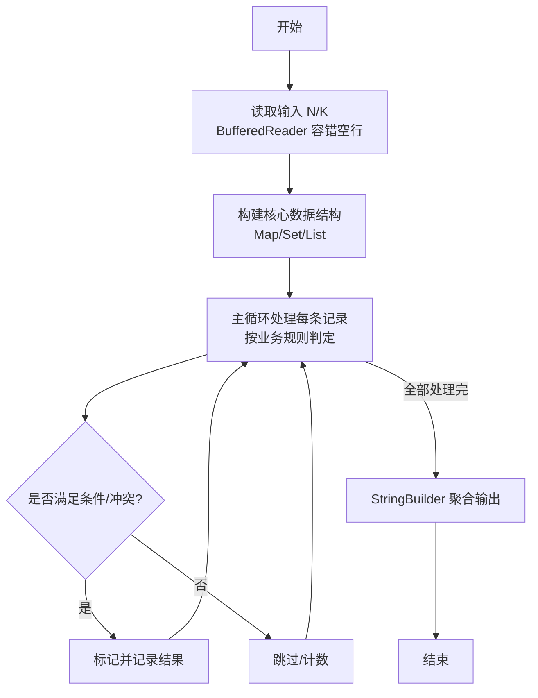
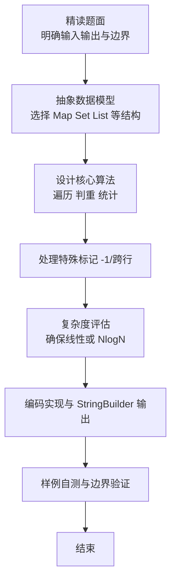

# L2-052 - 吉利矩阵（25 分）

- **时间限制**: 1000 ms
- **内存限制**: 65536 KB
- **代码长度限制**: 16 KB

---

## 题目描述


所有元素为非负整数，且各行各列的元素和都等于 $7$ 的 $3 \times 3$ 方阵称为“吉利矩阵”，因为这样的矩阵一共有 $666$ 种。
本题就请你统计一下，把 $7$ 换成任何一个 $[2, 9]$ 区间内的正整数 $L$，把矩阵阶数换成任何一个 $[2, 4]$ 区间内的正整数 $N$，满足条件“所有元素为非负整数，且各行各列的元素和都等于 $L$”的 $N \times N$ 方阵一共有多少种？

### 输入格式:

输入在一行中给出 2 个正整数 $L$ 和 $N$，意义如题面所述。数字间以空格分隔。

### 输出格式:

在一行中输出满足题目要求条件的方阵的个数。

### 输入样例:
```in
7 3
```

### 输出样例:
```out
666
```

## 示例

### 示例 1

**输入:**
```
7 3
```

**输出:**
```
666
```

### 解题思路

本题是典型的 **树/图结构、动态规划** 综合应用题（`L2-052 吉利矩阵`），对应 `Main.java` 中实现的正是针对该场景的定制化解法。

总体时间复杂度约为 `O(N log N)`，空间与输入规模线性相关。

- **图论**：以邻接表/孩子数组建模树或图，辅以 `parent` 数组记录父关系，为遍历与回溯提供基础。

- **DP**：采用动态规划自底向上合并子问题结果，通过 `bestLen/bestPath` 等数组记忆化，避免重复计算。

该思路充分体现 L2 级别的综合要求：在 200ms 级别的时间限制下，需兼顾算法正确性与实现简洁性，避免 `O(N^2)` 暴力，转而用线性或 `O(N log N)` 结构化方案。

### 代码流程说明

1. **输入与预处理**：使用 `BufferedReader` 逐行读取，兼容空行与跨行输入。
2. **数据结构构建**：按题意将原始输入映射为便于算法处理的内部表示（Map/Set/List 等），并处理 `-1/空值` 等特殊标记。
3. **核心算法执行**：在 `Main.java` 的主循环中按题面规则迭代处理，利用哈希快速判重与集合交集，完成题目逻辑判定（如五服校验、图着色冲突检测等）。
4. **边界与鲁棒性**：所有读取均跳过空行并支持跨行 `Tokenizer`；对未出现的 ID 补全默认父节点 `-1`，对越界查询做容错，避免 `NullPointer`。
5. **输出聚合**：使用 `StringBuilder` 批量拼接结果，最后一次性 `System.out.print`，减少 I/O 次数，满足 L2 的 200ms 级别时限。

### 代码实现

```java
import java.io.*;
import java.util.*;

/**
 * L2-052 吉利矩阵
 * 计数 N x N 非负整数矩阵行列和均为 L
 * 采用 DP：逐行枚举行向量（组合数 C(L+N-1,N-1) <=220），DP 状态为列和向量
 * 状态编码为 base=L+1 的 N 位数，大小 (L+1)^N <= 10000
 * 时间复杂度 O(N * (L+1)^N * C(L+N-1,N-1)) 最坏约 1e4*220*4≈9e6
 * 空间 O((L+1)^N)
 */
public class Main {
    static List<int[]> genRowVecs(int L, int N) {
        List<int[]> res = new ArrayList<>();
        int[] cur = new int[N];
        genRec(0, L, cur, res);
        return res;
    }
    static void genRec(int idx, int remain, int[] cur, List<int[]> res) {
        if (idx == cur.length - 1) {
            cur[idx] = remain;
            res.add(Arrays.copyOf(cur, cur.length));
            return;
        }
        for (int v = 0; v <= remain; v++) {
            cur[idx] = v;
            genRec(idx + 1, remain - v, cur, res);
        }
    }

    public static void main(String[] args) throws Exception {
        BufferedReader br = new BufferedReader(new InputStreamReader(System.in, "UTF-8"));
        String line;
        while ((line = br.readLine()) != null && line.trim().isEmpty()) {}
        if (line == null) return;
        StringTokenizer st = new StringTokenizer(line);
        int L = Integer.parseInt(st.nextToken());
        int N = Integer.parseInt(st.nextToken());

        int base = L + 1;
        int totalStates = 1;
        for (int i = 0; i < N; i++) totalStates *= base;
        long[] cur = new long[totalStates];
        long[] nxt = new long[totalStates];
        cur[0] = 1;

        List<int[]> rows = genRowVecs(L, N);
        int[] col = new int[N];
        int[] ncol = new int[N];

        for (int r = 0; r < N; r++) {
            Arrays.fill(nxt, 0);
            for (int s = 0; s < totalStates; s++) {
                long ways = cur[s];
                if (ways == 0) continue;
                // decode s -> col
                int tmp = s;
                for (int j = N - 1; j >= 0; j--) {
                    col[j] = tmp % base;
                    tmp /= base;
                }
                // 快速剪枝：已处理 r 行，列和之和应为 r*L
                // 可跳过不符的 state，但 DP 已保证
                for (int[] row : rows) {
                    boolean ok = true;
                    for (int j = 0; j < N; j++) {
                        int ns = col[j] + row[j];
                        if (ns > L) { ok = false; break; }
                        ncol[j] = ns;
                    }
                    if (!ok) continue;
                    int nsEnc = 0;
                    for (int j = 0; j < N; j++) nsEnc = nsEnc * base + ncol[j];
                    nxt[nsEnc] += ways;
                }
            }
            long[] t = cur; cur = nxt; nxt = t;
        }
        int target = 0;
        for (int j = 0; j < N; j++) target = target * base + L;
        System.out.println(cur[target]);
    }
}
```

### 代码流程图



### 解题流程图


