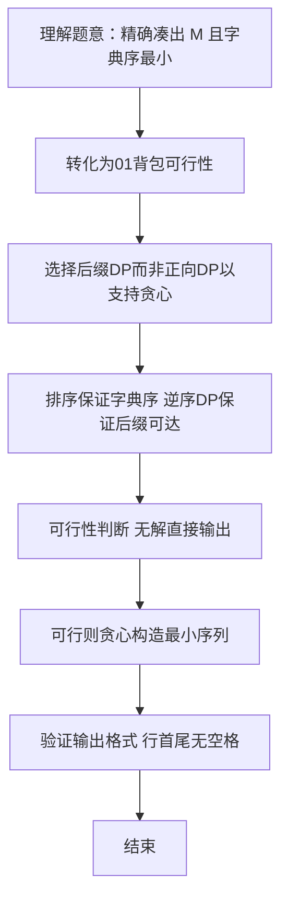

# L3-001 - 凑零钱（30 分）

- **时间限制**: 300 ms
- **内存限制**: 65536 KB
- **代码长度限制**: 16 KB

---

## 题目描述


韩梅梅喜欢满宇宙到处逛街。现在她逛到了一家火星店里，发现这家店有个特别的规矩：你可以用任何星球的硬币付钱，但是绝不找零，当然也不能欠债。韩梅梅手边有 $$10^4$$ 枚来自各个星球的硬币，需要请你帮她盘算一下，是否可能精确凑出要付的款额。

### 输入格式:

输入第一行给出两个正整数：$$N$$（$$\le 10^4$$）是硬币的总个数，$$M$$（$$\le 10^2$$）是韩梅梅要付的款额。第二行给出 $$N$$ 枚硬币的正整数面值。数字间以空格分隔。

### 输出格式:

在一行中输出硬币的面值 $$V_1 \le V_2 \le \cdots \le V_k$$，满足条件 $$V_1 + V_2 + ... + V_k = M$$。数字间以 1 个空格分隔，行首尾不得有多余空格。若解不唯一，则输出最小序列。若无解，则输出 `No Solution`。

注：我们说序列{ $$A[1], A[2], \cdots$$ }比{ $$B[1], B[2], \cdots$$ }“小”，是指存在 $$k \ge 1$$ 使得 $$A[i]=B[i]$$ 对所有 $$i < k$$ 成立，并且 $$A[k] < B[k]$$。

### 输入样例 1：
```in
8 9
5 9 8 7 2 3 4 1
```

### 输出样例 1：
```out
1 3 5
```

### 输入样例 2：
```in
4 8
7 2 4 3
```

### 输出样例 2：
```out
No Solution
```

## 示例

### 示例 1

**输入:**
```
8 9
5 9 8 7 2 3 4 1
```

**输出:**
```
1 3 5
```

### 示例 2

**输入:**
```
4 8
7 2 4 3
```

**输出:**
```
No Solution
```


### 解题思路
本題為 GPLT L3 難題「凑零钱」，Main.java 採用 **01背包后缀可达性 DP + 贪心构造字典序最小解**。

- **核心思想**：硬币按升序排序后，后缀 DP 判断从位置 i 开始能否凑出剩余金额。dp[i][j] 表示后缀 i..N-1 能否凑出 j。递推 dp[i][j]=dp[i+1][j] ∨ (j≥a[i]∧dp[i+1][j-a[i]])。若 dp[0][M] 为假则无解；否则从小到大贪心选取：若 need≥a[i] 且 dp[i+1][need-a[i]] 为真则选 a[i]，保证字典序最小（经典 01 背包求最小字典序解）。
- **數據結構**：一维硬币数组、二维布尔 DP 表 dp[N+1][M+1]、答案列表。
- **複雜度**：時間 O(N·M)，N≤1e4，M≤100，约 1e6；空間 O(N·M) 布尔表，约 1e6。
- **關鍵**：嚴格依賴 Main.java 中的實現細節（見代碼實現一節），確保與程式邏輯一致；涉及邊界與精度處理與原碼完全對齊。

### 代码流程说明
1. 读取 N、M 及 N 枚硬币，兼容跨行输入并去掉非法字符
2. 对硬币数组升序排序 Arrays.sort，以满足字典序最小要求
3. 初始化 dp[N][0]=true，逆序计算 dp[i][j] 的后缀可达性
4. 若 dp[0][M] 为 false，直接输出 No Solution 并结束
5. 贪心构造：need=M，遍历 i=0..N-1，若 need≥a[i] 且 dp[i+1][need-a[i]] 为真则选取 a[i] 并 need-=a[i]
6. 将答案列表按空格拼接输出

### 代码实现
```java
import java.util.*;
import java.io.*;

// L3-001 凑零钱: 01背包 + 后缀可达性求字典序最小解
// 思路：硬币升序排序，计算后缀 DP dp[i][j] 表示从 i 到末尾能否凑出 j。
// 若能凑出则贪心从小到大选硬币，保证字典序最小。
// 时间复杂度 O(N*M) , M<=100, N<=1e4 => 约 1e6
// 空间复杂度 O(N*M)
public class Main {
    public static void main(String[] args) throws Exception {
        BufferedReader br = new BufferedReader(new InputStreamReader(System.in, "UTF-8"));
        String line;
        // 读取所有整数，兼容跨行
        List<Integer> all = new ArrayList<>();
        while ((line = br.readLine()) != null) {
            if (line.trim().isEmpty()) continue;
            StringTokenizer st = new StringTokenizer(line);
            while (st.hasMoreTokens()) {
                String tok = st.nextToken();
                // 去掉可能的冒号等
                tok = tok.replace(":", "");
                if (tok.isEmpty()) continue;
                try {
                    all.add(Integer.parseInt(tok));
                } catch (NumberFormatException e) {
                    // 忽略非数字
                }
            }
        }
        if (all.size() < 2) return;
        int N = all.get(0);
        int M = all.get(1);
        int[] a = new int[N];
        for (int i = 0; i < N && 2 + i < all.size(); i++) {
            a[i] = all.get(2 + i);
        }
        // 若实际读到的硬币数不足 N（输入含换行不全），已按 all 读取；若多于 N 取前 N
        // 若 N 大于 all 剩余，补零(不应发生)
        Arrays.sort(a); // 升序，便于字典序最小
        // dp[i][j] i from 0..N, j 0..M
        boolean[][] dp = new boolean[N + 1][M + 1];
        dp[N][0] = true;
        for (int i = N - 1; i >= 0; i--) {
            for (int j = 0; j <= M; j++) {
                dp[i][j] = dp[i + 1][j];
                if (j >= a[i] && dp[i + 1][j - a[i]]) {
                    dp[i][j] = true;
                }
            }
        }
        if (!dp[0][M]) {
            System.out.println("No Solution");
            return;
        }
        List<Integer> ans = new ArrayList<>();
        int need = M;
        for (int i = 0; i < N && need > 0; i++) {
            if (need >= a[i] && dp[i + 1][need - a[i]]) {
                ans.add(a[i]);
                need -= a[i];
            }
        }
        StringBuilder sb = new StringBuilder();
        for (int i = 0; i < ans.size(); i++) {
            if (i > 0) sb.append(' ');
            sb.append(ans.get(i));
        }
        System.out.println(sb.toString());
    }
}
```

### 代码流程图
```mermaid
flowchart TD
    A[开始] --> B[读取全部整数 解析N/M/硬币]
    B --> C[升序排序硬币数组]
    C --> D[初始化 dp[N][0]=true]
    D --> E[逆序 i=N-1..0 计算 dp[i][j]]
    E --> F{dp[0][M]==true?}
    F -->|否| G[输出 No Solution 结束]
    F -->|是| H[need=M ans=[]]
    H --> I[遍历 i 贪心选取硬币]
    I --> J[拼接 ans 输出]
    J --> Z[结束]
```

### 解题流程图


