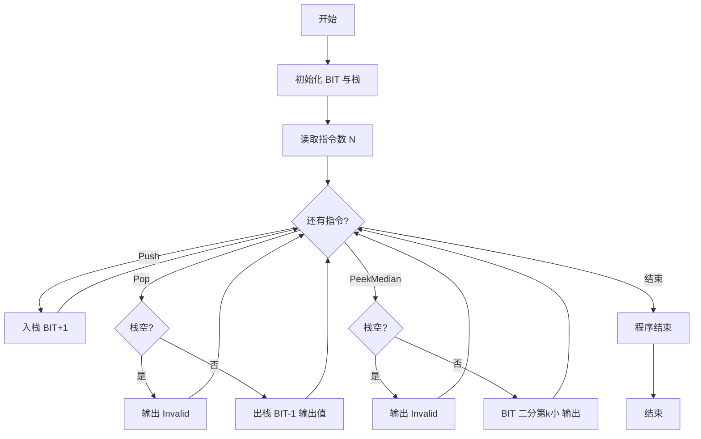

# L3-002 - 特殊堆栈（30 分）

- **时间限制**: 400 ms
- **内存限制**: 65536 KB
- **代码长度限制**: 16 KB

---

## 题目描述


堆栈是一种经典的后进先出的线性结构，相关的操作主要有“入栈”（在堆栈顶插入一个元素）和“出栈”（将栈顶元素返回并从堆栈中删除）。本题要求你实现另一个附加的操作：“取中值”——即返回所有堆栈中元素键值的中值。给定 N 个元素，如果 N 是偶数，则中值定义为第 N/2 小元；若是奇数，则为第 (N+1)/2 小元。

### 输入格式:

输入的第一行是正整数 N（$$\le 10^5$$）。随后 N 行，每行给出一句指令，为以下 3 种之一：

```
Push key
Pop
PeekMedian
```

其中 `key` 是不超过 $$10^5$$ 的正整数；`Push` 表示“入栈”；`Pop` 表示“出栈”；`PeekMedian` 表示“取中值”。

### 输出格式:

对每个 `Push` 操作，将 `key` 插入堆栈，无需输出；对每个 `Pop` 或 `PeekMedian` 操作，在一行中输出相应的返回值。若操作非法，则对应输出 `Invalid`。

### 输入样例:
```in
17
Pop
PeekMedian
Push 3
PeekMedian
Push 2
PeekMedian
Push 1
PeekMedian
Pop
Pop
Push 5
Push 4
PeekMedian
Pop
Pop
Pop
Pop
```

### 输出样例:
```out
Invalid
Invalid
3
2
2
1
2
4
4
5
3
Invalid
```

## 示例

### 示例 1

**输入:**
```
17
Pop
PeekMedian
Push 3
PeekMedian
Push 2
PeekMedian
Push 1
PeekMedian
Pop
Pop
Push 5
Push 4
PeekMedian
Pop
Pop
Pop
Pop
```

**输出:**
```
Invalid
Invalid
3
2
2
1
2
4
4
5
3
Invalid
```


### 解题思路
本題為 GPLT L3 難題「特殊堆栈」，Main.java 採用 **栈模拟 + 树状数组（Fenwick Tree）求动态中值 / 顺序统计**。

- **核心思想**：维护真实栈与频率树状数组。Push 时 BIT.add(val,1) 并入栈；Pop 时若栈空报错否则 BIT.add(top,-1)；PeekMedian 时按栈大小 n 求 k=(n+1)/2，通过 BIT 二分查找第 k 小元（树状数组上倍增）。利用 BIT 能在 logC 内完成前缀和与第 k 小查询，替代对顶堆或有序集合，满足高效求中值需求。
- **數據結構**：ArrayList/Deque 作栈、BIT 树状数组 freq[1..MAX]、二分/倍增查找第 k 小。
- **複雜度**：時間 O(N log C)，C≈1e5，单次操作 log 级别；空間 O(C)。
- **關鍵**：嚴格依賴 Main.java 中的實現細節（見代碼實現一節），確保與程式邏輯一致；涉及邊界與精度處理與原碼完全對齊。

### 代码流程说明
1. 初始化 BIT 容量为值域上限（约 1e5 或根据输入动态）与空栈
2. 读取指令数 N，逐行解析操作类型
3. Push x：stack.push(x)；BIT.add(x,1)
4. Pop：若栈空输出 Invalid，否则弹出 top 并 BIT.add(top,-1) 输出 top
5. PeekMedian：若栈空输出 Invalid，否则 k=(size+1)/2，用 BIT.find_kth(k) 二分得到中值输出
6. 循环处理直至所有指令结束

### 代码实现
```java
import java.util.*;
import java.io.*;

// L3-002 特殊堆栈: 栈 + 树状数组求中值 (第 (N+1)/2 小元)
// 时间复杂度 O(N log C), C=1e5
public class Main {
    static class BIT {
        int n;
        int[] tree;
        BIT(int n) {
            this.n = n;
            tree = new int[n + 2];
        }
        void add(int idx, int delta) {
            for (int i = idx; i <= n; i += i & -i) tree[i] += delta;
        }
        int sum(int idx) {
            int s = 0;
            for (int i = idx; i > 0; i -= i & -i) s += tree[i];
            return s;
        }
        // 找第 k 小 (k>=1)
        int kth(int k) {
            int idx = 0;
            int bitMask = Integer.highestOneBit(n);
            for (int d = bitMask; d != 0; d >>= 1) {
                int next = idx + d;
                if (next <= n && tree[next] < k) {
                    idx = next;
                    k -= tree[next];
                }
            }
            return idx + 1;
        }
    }

    public static void main(String[] args) throws Exception {
        BufferedReader br = new BufferedReader(new InputStreamReader(System.in, "UTF-8"));
        String line = br.readLine();
        while (line != null && line.trim().isEmpty()) line = br.readLine();
        if (line == null) return;
        int N = Integer.parseInt(line.trim().split("\\s+")[0]);
        // 栈存储实际值
        Deque<Integer> stack = new ArrayDeque<>();
        BIT bit = new BIT(100000);
        StringBuilder out = new StringBuilder();
        for (int i = 0; i < N; i++) {
            line = br.readLine();
            // 跳过空行（若有）
            while (line != null && line.trim().isEmpty()) line = br.readLine();
            if (line == null) break;
            line = line.trim();
            if (line.startsWith("Push")) {
                String[] parts = line.split("\\s+");
                int key = Integer.parseInt(parts[1]);
                stack.push(key);
                bit.add(key, 1);
            } else if (line.startsWith("Pop")) {
                if (stack.isEmpty()) {
                    out.append("Invalid\n");
                } else {
                    int v = stack.pop();
                    bit.add(v, -1);
                    out.append(v).append('\n');
                }
            } else if (line.startsWith("PeekMedian")) {
                if (stack.isEmpty()) {
                    out.append("Invalid\n");
                } else {
                    int sz = stack.size();
                    int k = (sz + 1) / 2; // 第 k 小
                    int med = bit.kth(k);
                    out.append(med).append('\n');
                }
            } else {
                // 未知指令，忽略并重试?
                i--;
            }
        }
        System.out.print(out.toString());
    }
}
```

### 代码流程图


### 解题流程图
```mermaid
flowchart TD
    A[需求：栈+动态中值] --> B[朴素排序 O(N log N) 会超时]
    B --> C[选用树状数组维护频率]
    C --> D[Push/Pop 转为 BIT 单点更新]
    D --> E[中值转为顺序统计第k小]
    E --> F[BIT 倍增二分 O(log C) 求解]
    F --> Z[结束]
```

